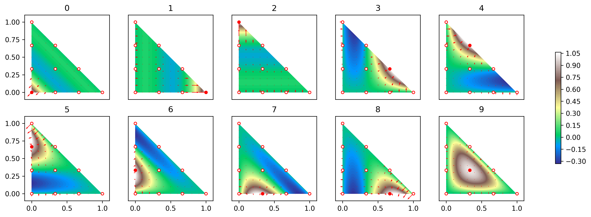

----

*&#169; Eike Mueller, University of Bath 2025. These notes are copyright of Eike Mueller, University of Bath. They are provided exclusively for educational purposes at the University and are to be downloaded or copied for your private study only. Further distribution, e.g. by upload to external repositories, is prohibited. html generated with [pandoc](https://pandoc.org/) using [easy-pandoc-templates](https://github.com/ryangrose/easy-pandoc-templates) under the [GPL-3.0.1 license](https://github.com/ryangrose/easy-pandoc-templates?tab=GPL-3.0-1-ov-file#readme)*

----
# Submission of problem sheets
Please submit your solutions to the problem sheets as per the following instructions. The same submission instructions will be used for the coursework, so make sure you are familiar with the procedure. Being able to efficiently share code with others is an important skill for a scientific programmer. The key question you should ask yourself is: *If someone gave this to solution to me, would I be able to understand it?*

## Files to submit
In general, you need to **submit three files** for each exercise:

1. A single file containing a **zipped version of your source code**
2. A single file containing the **.pdf generated from your source code**
3. A single file which contains your **solution to the written part** of the exercise in .pdf format

For some exercises you might only have to write code or perform a written derivation, in that case you only need to submit a subset of these files.

Details on how to generate the files and what they should contain can be found in the following sections. You might also want to have a look at the step-by-step instructions for the example below.

#### 1. Zipped version of your source code
Keep all source files containing your solution in a single directory, usually a subdirectory of your `ma32070/` directory such as `ma32070/exercise/`. The code in this directory should be complete, i.e. it should be possible to run the code it contains as it is, so please also any necessary input files, if applicable. You can assume that the `finiteelements` library is available, so do not include this in your submission. Change to the `ma32070/` directory and zip the `exercise/` subdirectory into a single file called `exercise.tgz` using the command
```
tar czvf exercise.tgz exercise
```
Do not include temorary files such as those ending in `~`. You can double check the content of the zip file with
```
tar tzvf exercise.tgz
```
It is strongly recommended to do this before uploading the file to moodle.

#### 2. .pdf version of your code
Create a single `.pdf` file called `code_exercise.pdf` which contains all your Python source code, i.e. all `.py` files you wrote. Assuming that the `finitelements` library has been installed (for example on the Notable server), you can use the `code2pdf` tool for this. For example, to generate the file `code_exercise.pdf` from all `.py` files inside the `ma32070/exercise/` directory, change to the `ma32070/` directory and run
```
python -m code2pdf --path ./exercise/ --output code_exercise
```
You can see all available command line options of the `code2pdf` tool by running
```
python -m code2pdf --help
```
You are free to use any other tool, such as a word processor, to create this `.pdf` file as long as the output is formatted correctly and legible.

#### 3. Solution to written part of the exercise
You can upload scans of handwritten solutions or word processed solutions in a single file `solution_exercise.pdf`, as long as the text is clearly readable. Please make sure you number your solutions to the individual exercises correctly. Use concise language and sound mathematical arguments and explain your reasoning.

#### Downloading files from Notable
If you are working on Notable, you can download any files you created to your own computer by right-clicking them in the file browser. The upload the files from your own computer to moodle. 

### Example
The following step-by-step instructions illustrate how to prepare the solution of Exercise 3 for submission (all shell-commands include the prompt `$` which needs to be removed when entering the command):

#### Step 1: Change to correct directory
Change to the `ma32070/` directory, list its contents and the contents of the subdirectory `exercise3` to make sure everything is ready for submission and the `exercise3` directory does not contain any superfluous files:
```
$ cd ma32070
$ ls
exercise3
$ ls exercise3
algorithms.py  driver.py
```

#### Step 2: Zip the source code
Create a zip file from the source code with the `tar` command:
```
$ tar czvf exercise3.tgz exercise3
exercise3/
exercise3/algorithms.py
exercise3/driver.py
```

#### Step 3: Create .pdf from code
Create a `.pdf` file from the source code with
```
$ python -m code2pdf --path ./exercise3 --output code_exercise3
```

#### Step 4: Checking
In addition to the subdirectory `exercise3`, the `ma32070` folder now also contains the files `code_exercise3.pdf` and `exercise3.tgz`:
```
$ ls
code_exercise3.pdf  exercise3  exercise3.tgz
```
Double check that the zip-file has the right content:
```
$ tar tzvf exercise3.tgz
drwxrwxr-x eike/eike         0 2025-09-28 14:36 exercise3/
-rw-rw-r-- eike/eike      6389 2025-09-28 14:36 exercise3/algorithms.py
-rw-rw-r-- eike/eike      5779 2025-09-28 14:36 exercise3/driver.py
```

#### Step 5: Moodle submission
Now upload the files `exercise3.tgz` and `code_exercise3.pdf` together with `solution_exercise3.pdf` to the submission point on moodle.

# Exercise 1: Python warmup practice [not marked]

#### Set: week 1

The following exercises are not marked, but you are strongly encouraged to work through them to familiarise yourself with Python, numpy and sparse linear algebra in PETSc. We will use these techniques in later exercises.

## Classes, inheritance and advanced Python concepts
In this part of the exercise we will use advanced Python concepts such as [classes](https://docs.python.org/3/tutorial/classes.html#a-first-look-at-classes), [inheritance](https://docs.python.org/3/tutorial/classes.html#inheritance), [abstract classes](https://docs.python.org/3/library/abc.html), [list comprehensions](https://docs.python.org/2/tutorial/datastructures.html#list-comprehensions), [dictionary comprehensions](https://docs.python.org/3/tutorial/datastructures.html#dictionaries) and output formatting with [f-strings](https://docs.python.org/3/tutorial/inputoutput.html#formatted-string-literals) to implement different numerical integrator classes.

### Numerical integration
Let $f:[a,b]\rightarrow \mathbb{R}$ be a real-valued function defined on the interval $[a,b]$. We want to compute numerical approximations of the integral
$$
I =\int_{a}^{b} f(x)\;dx
$$
For this, the interval $[a,b]$ is split into $n$ smaller intervals $[x_j,x_{j+1}]$ where $x_{j} = a + h\cdot j$ with $h=x_{j+1}-x_j = \frac{b-a}{n}$ for $j=0,1,\dots,n-1$ such that
$$
I = \sum_{j=0}^{n-1} \underbrace{\int_{x_j}^{x_{j+1}}f(x)\;dx}_{=:I(x_j,x_{j+1})}.
$$
The integrals $I(x_j,x_{j+1}) = \int_{x_j}^{x_{j+1}}f(x)\;dx$ on the small subintervals are approximated numerically. Possible methods are:

* **Midpoint rule**:
  $$
  I(x_-,x_+) \approx I^{\text{(midpoint)}}(x_-,x_+) = (x_+-x_-)\cdot f\left(\frac{x_-+x_+}{2}\right)
  $$
* **Simpson's rule**:
  $$
  I(x_-,x_+) \approx I^{\text{(Simpson)}}(x_-,x_+) = \frac{x_+-x_-}{6}\left(f(x_-)+4f\left(\frac{x_-+x_+}{2}\right)+f(x_+)\right)
  $$

  We say that an integration method is of order $\mu$ if the error in computing $I$ is $\mathcal{O}(h^\mu)$. For example, the midpoint rule is of order $2$ since

$$
\left|I^{\text{(midpoint)}}(n) - I\right| = \mathcal{O}(h^2)\qquad\text{with}\quad I^{\text{(midpoint)}}(n) := \sum_{j=0}^{n-1} I^{\text{(midpoint)}}(x_{j},x_{j+1}).
$$

To implement different numerical integration methods in Python, we define an abstract base class `NumericalIntegration` and then implement derived classes for specific integrators. Since all integrators need to compute the sum
$$
\sum_{j=0}^{n-1} I(x_j,x_{j+1}),
$$
this operation can be implemented in the base class. However, the numerical approximation of $I(x_j,x_{j+1})$ depends on the specific integrator and its definition should be deferred to the derived classes. We define an abstract method `_integrate()` to explicitly declare the required interface for this; each of the derived classes must provide a concrete implementation of `_integrate()`. The constructor of the base class gets passed the interval $[a,b]$, the number of intervals $n$ and (optionally) the order of the method.

```Python
from abc import ABC, abstractmethod

class NumericalIntegration(ABC):
    """Numerically integrate a real-valued function in the interval [a,b]

    Numerically approximate the integral

        int_a^b f(x) dx

    by sub-dividing [a,b] into n subintervals
    """

    def __init__(self, interval, n, order=None):
        """Initialise instance

        :arg interval: interval [a,b]
        :arg n: number of subintervals
        :arg order: order of the integrator
        """

        self._a = interval[0]
        self._b = interval[1]
        self._n = n
        self.order = -1 if order is None else order

    def evaluate(self, f):
        """Numerically approximate the integral int_a^b f(x) dx

        For this, loop over the subintervals [x_j,x_{j+1}], approximate
        the integral in each subinterval and sum the result

        :arg f: function to integrate
        """
        h = (self._b - self._a) / self._n
        # TODO: Compute numerical approximation of integral

    @abstractmethod
    def _integrate(self, f, x_m, x_p):
        """Approximate int_{x_-}^{x_+} f(x)dx

        :arg f: function to integrate
        :arg x_m: lower bound
        :arg x_+: upper bound
        """
```

### Exercises
* Copy the above code to a file `numerical_integration.py` and complete the method `evaluate()`, which should call the `_integrate()` method for all subintervals `[x_j,x_{j+1}]` and sum up the results. Instead of writing a for-loop, can you use a [list-comprehension](https://docs.python.org/3/tutorial/datastructures.html#list-comprehensions) and the [`np.sum() method`](https://numpy.org/doc/stable/reference/generated/numpy.sum.html)?
* In the same file, create two sub-classes `MidpointRule` and `SimpsonRule`, which implement the abstract method `_integrate()`. In the initialise of these methods, call the initialiser of the base class with `order=2` and `order=4` respectively; you can use the [`super()` function](https://docs.python.org/3/library/functions.html#super) for this.
* Write a file `driver.py` which uses the classes `MidpointRule` and `SimpsonRule` to integrate the function $f_\alpha(x) = e^{-\alpha x}$ over the interval $[0,1]$ for fixed $\alpha=0.4$. For this, use the following definition of $f_\alpha$ and fix the parameter $\alpha$ with [`functools.partial`](https://docs.python.org/3/library/functools.html#functools.partial) when passing the function to `evaluate()`:
```Python
def f(x, alpha):
    """Function to integrate f(x,alpha) = exp(-alpha*x)"""
    return np.exp(-alpha * x)
```

* Create a Python dictionary `results` whose keys are the names of the two numerical integrators and whose values are the numerical integrals of the function above with $n=4,8,16,32$:
  
$$
\begin{aligned}
  {\large\{}\texttt{MidpointRule} &: [I^{\text{(midpoint)}}(4),I^{\text{(midpoint)}}(8),I^{\text{(midpoint)}}(16),I^{\text{(midpoint)}}(32)],\\
  \texttt{SimpsonsRule} &: [I^{\text{(Simpson)}}(4),I^{\text{(Simpson)}}(8),I^{\text{(Simpson)}}(16),I^{\text{(Simpson)}}(32)]
  {\large\}}
\end{aligned}
$$

* Print this dictionary with the following code, which you should try to understand:
```Python
I_exact = (1 - np.exp(-alpha)) / alpha # exact value of integral
for integrator, integrals in results.items():
    print(
        f"{integrator}: "
        + ", ".join([f"{abs(I-I_exact):8.4e}" for I in integrals])
    )
```
* Are the methods of the expected order?

### Hints
* The name of a class can be obtained with the `__name__` property, for example:
```Python
label = MidpointRule.__name__
# or
integrator = SimpsonsRule([0, 1],8)
label = type(integrator).__name__
```

## Linear algebra with numpy
Let's now look at different ways of manipulating vector, matrices and tensors in numpy. For this consider the following vectors $\boldsymbol{u},\boldsymbol{v}$, matrices $A,B$ and tensors $T,S,Q$, whose entries are initialised with random values:
```Python
import numpy as np

rng = np.random.default_rng(seed=361847)

u = rng.normal(size=4)
v = rng.normal(size=4)

A = rng.normal(size=(3, 4))
B = rng.normal(size=(4, 3))

T = rng.normal(size=(4, 3, 2))
S = rng.normal(size=(2, 3, 5))
Q = rng.normal(size=(5, 3))
```

### Exercises
In a file `linear_algebra_numpy.py` add the above code for creating the required variables. Then implement the following operations in the same file:

* Compute the matrix-vector product $A\boldsymbol{u}$ in three different ways:
    - with the [`@` operator](https://numpy.org/doc/stable/reference/generated/numpy.matmul.html)
    - by using [`np.dot()`](https://numpy.org/doc/stable/reference/generated/numpy.dot.html)
    - by using [`np.einsum()`](https://numpy.org/doc/stable/reference/generated/numpy.einsum.html)
* Compute the matrix-vector product $AB$ in three different ways:
    - with the [`@` operator](https://numpy.org/doc/stable/reference/generated/numpy.matmul.html)
    - by using [`np.dot()`](https://numpy.org/doc/stable/reference/generated/numpy.dot.html)
    - by using [`np.einsum()`](https://numpy.org/doc/stable/reference/generated/numpy.einsum.html)
* Compute the tensor product $U = \boldsymbol{u}\otimes \boldsymbol{v}$ with $U_{ij}=u_iv_j$ in two different ways:
    - with [`np.tensordot()`](https://numpy.org/doc/stable/reference/generated/numpy.tensordot.html)
    - by using [`np.einsum()`](https://numpy.org/doc/stable/reference/generated/numpy.einsum.html)
* Compute the trace of $AB$ in three different ways:
    - with the [`@` operator](https://numpy.org/doc/stable/reference/generated/numpy.matmul.html), the [`.T` property](https://numpy.org/doc/stable/reference/generated/numpy.transpose.html) (to transpose a matrix) and [`np.sum()`](https://numpy.org/doc/stable/reference/generated/numpy.sum.html)
    - by using [`np.einsum()`](https://numpy.org/doc/stable/reference/generated/numpy.einsum.html)
    - by using [`np.linalg.trace()`](https://numpy.org/doc/stable/reference/generated/numpy.trace.html)
* Compute the tensor $R$ with $R_{ab} = \sum_{ijk} T_{aji}S_{bjk} Q_{kjii}$ by using [`np.einsum()`](https://numpy.org/doc/stable/reference/generated/numpy.einsum.html)

## Linear algebra with PETSc
Write a Python script `linear_algebra_petsc.py` which constructs the $4\times 4$ sparse PETSc matrices $A$, $B$ and the vectors $\boldsymbol{u}, \boldsymbol{w}\in\mathbb{R}^4$ given by

$$
A = \begin{pmatrix}
1.7 & 2.3 & \textcolor{lightgray}{0} & \textcolor{lightgray}{0} \\
\textcolor{lightgray}{0} & -3.4 & \textcolor{lightgray}{0} & 4.5 \\
\textcolor{lightgray}{0} & \textcolor{lightgray}{0} & 8.6 & \textcolor{lightgray}{0} \\
-1.3 & \textcolor{lightgray}{0} & \textcolor{lightgray}{0} & 1.2
\end{pmatrix}
\qquad
B = \begin{pmatrix}
-0.7 & \textcolor{lightgray}{0} & 2.5 & \textcolor{lightgray}{0} \\
\textcolor{lightgray}{0} &8.7 &  \textcolor{lightgray}{0} & \textcolor{lightgray}{0} \\
\textcolor{lightgray}{0} & \textcolor{lightgray}{0} & 3.2 & \textcolor{lightgray}{0} \\
\textcolor{lightgray}{0} & \textcolor{lightgray}{0} & \textcolor{lightgray}{0} & 12.0 
\end{pmatrix}
\qquad
\boldsymbol{v} = \begin{pmatrix}
7.3 \\
-0.7 \\
\textcolor{lightgray}{0} \\
3.2 
\end{pmatrix}
\qquad
\boldsymbol{w} = \begin{pmatrix}
\textcolor{lightgray}{0} \\
\textcolor{lightgray}{0} \\
0.3 \\
2.8 
\end{pmatrix}
$$

By using suitable functions (see documentation of [`petsc4py.Mat`](https://petsc.org/release/petsc4py/reference/petsc4py.PETSc.Mat.html) and [`petsc4py.Vec`](https://petsc.org/main/petsc4py/reference/petsc4py.PETSc.Vec.html)), compute

* $AB$ 
* $AB^\top$
* $A^\top B$
* $A+B^\top$
* $A\boldsymbol{v} + \boldsymbol{w}$
* $B^\top\boldsymbol{w}$

and print out the result of each calculation (for this, convert any sparse matrices to dense matrices first). Some of the operations can be implemented in different ways.

# Exercise 2: Cubic Lagrange element 

#### Set: week 2
#### Due: at the end of week 4

## Task
Implement the cubic Lagrange element ($p=3$) in the class `CubicElement` by subclassing the abstract base class `FiniteElement`. The $\nu=10$ Lagrange points are in this order (see also figure below):

$$
\{\xi^{(j)}\}_{j=0}^{9}=
\left\{
\underbrace{
\begin{pmatrix}0\\[1ex]0\end{pmatrix},
\begin{pmatrix}1\\[1ex]0\end{pmatrix},
\begin{pmatrix}0\\[1ex]1\end{pmatrix}}_{\text{vertices}},
\underbrace{\begin{pmatrix}\frac{2}{3}\\[1ex]\frac{1}{3}\end{pmatrix},
\begin{pmatrix}\frac{1}{3}\\[1ex]\frac{2}{3}\end{pmatrix},
\begin{pmatrix}0\\[1ex]\frac{2}{3}\end{pmatrix},
\begin{pmatrix}0\\[1ex]\frac{1}{3}\end{pmatrix},
\begin{pmatrix}\frac{1}{3}\\[1ex]0\end{pmatrix},
\begin{pmatrix}\frac{2}{3}\\[1ex]0\end{pmatrix}}_{\text{facets}},
\underbrace{\begin{pmatrix}\frac{1}{3}\\[1ex]\frac{1}{3}\end{pmatrix}}_{\text{interior}}\right\}
$$


The corresponding nodal basis functions with $\phi_\ell(\xi^{(k)}) = \delta_{jk}$ are
$$
\begin{aligned}
\phi_0(x) &= 1 - \frac{11}{2} (x_0 + x_1) + 9 (x_0 + x_1)^2 - \frac{9}{2} (x_0 + x_1)^3,\\
\phi_1(x) &= x_0\left(1 - \frac{9}{2} x_0 + \frac{9}{2} x_0^2 \right),\\
\phi_2(x) &= x_1\left(1 - \frac{9}{2} x_1 + \frac{9}{2} x_1^2\right),\\
\phi_3(x) &= -\frac{9}{2} x_0 x_1 (1 - 3 x_0),\\
\phi_4(x) &= -\frac{9}{2} x_0 x_1  (1 - 3 x_1),\\
\phi_5(x) &= -\frac{9}{2} x_1 (1 - x_0 - 4 x_1 + 3 x_1 * (x_0 + x_1)),\\
\phi_6(x) &= \frac{9}{2} x_1 (2 - 5 (x_0 + x_1) + 3 (x_0 + x_1)^2),\\
\phi_7(x) &= \frac{9}{2} x_0 (2 - 5 (x_0 + x_1) + 3 (x_0 + x_1)^2),\\
\phi_8(x) &= -\frac{9}{2} x_0 (1 - x_1 - 4 x_0 + 3 x_0 (x_0 + x_1)),\\
\phi_9(x) &= 27 x_0 x_1 (1 - x_0 - x_1)
\end{aligned}
$$



You should use the following 10 monomials for the construction of the Vandermonde matrix:

$$
\{\theta_\ell(x)\}_{\ell=0}^{9} = \{1,x_0,x_1,x_0^2,x_0x_1,x_1^2,x_0^3,x_0^2x_1,x_0x_1^2,x_1^3\}
$$

## Requirements
* Your class should store the Lagrange points in an attribute `_nodal_points`, this can be done for example in the `__init__()` method.
* Your class should contain a method `_vandermonde_matrix(zeta,grad=False)` which accepts as an argument a $n\times 2$ array of $n$ two-dimensional points. The method should compute the $n\times \nu$ matrix $V(\boldsymbol{\zeta})$ defined in the lectures if `grad=False` and the $n\times \nu\times 2$ tensor $V^\partial(\boldsymbol{\zeta})$ if `grad=True`. If only a single point is passed to the method, it should return a vector of length $\nu$ for `grad=False` and an $\nu\times 2$ array for `grad=True`.
* In the `__init__()` method, use the `_vandermonde_matrix()` method together with `_nodal_points` to construct the coefficient matrix $C$ defined in the lectures. Store this matrix in a class attribute `_coefficients`
* Use `_coefficients` and the `_vandermonde_matrix()` method to tabulate the basis functions and their gradients in the `tabulate()` and `tabulate_gradient()` methods. You might find the [`numpy.einsum()`](https://numpy.org/doc/2.2/reference/generated/numpy.einsum.html) method useful to compute $T^\partial(\boldsymbol{\zeta})$
* Make sure you implement all other methods/properties that are marked as abstract in the base class.
  
Your code should pass the tests below, which verify correctness for special cases. Use [pytest](https://docs.pytest.org/) to add further tests which verify that your implementation is correct. In particular, you should check that

* `tabulate()` correctly computes $\phi_\ell(\xi^{(k)}) = \delta_{\ell k}$ where $\xi^{(k)}$ are the nodal points.
* `tabulate_dofs()` correctly computes $\lambda_\ell(\phi_k) = \delta_{\ell k}$.
* The method `inverse_dofmap()` which is inherited from the abstract base class, behaves as expected. 
  
## Practicalities
* Save your implementation in the file `cubicelement.py` and the tests in `test_cubicelement.py` in the same directory `ma32070/exercise2`.
* Zip the directory which contains `cubicelement.py` and `test_cubicelement.py`. For this, change to `ma32070/` and run `tar czvf exercise2.tgz exercise2`.
* Create a single file `code_exercise2.pdf` from your source code. This can be done with the `code2pdf` tool from the `finiteelements` library by running the following command while in the `ma32070/` directory:
```
python -m code2pdf --path ./exercise2/ --output code_exercise2
```
* Upload the following **two** files to the submission point on moodle:
  - The zip file `exercise2.tgz` with your source code
  - The file `code_exercise2.pdf` generated from your source code

## Tests
```python
def test_ndof_per_vertex():
    """Check that the number of unknowns per vertex is set correctly"""
    element = CubicElement()
    assert element.ndof_per_vertex == 1


def test_ndof_per_facet():
    """Check that the number of unknowns per facet is set correctly"""
    element = CubicElement()
    assert element.ndof_per_facet == 2


def test_ndof_per_interior():
    """Check that the number of unknowns in the interior is set correctly"""
    element = CubicElement()
    assert element.ndof_per_interior == 1


def test_tabulate_dofs():
    """Check that dof-tabulation of exp(-x)*(2+sin(x)) is correct"""
    element = CubicElement()
    expected = [
        2.00000000, 0.73575888, 2.84147098, 1.19482160, 1.87614395,
        2.61836980, 2.32719470, 1.43306262, 1.02683424, 1.66750787,
    ]
    tabulated = element.tabulate_dofs(
        lambda x: np.exp(-x[..., 0]) * (2 + np.sin(x[..., 1]))
    )
    assert np.allclose(expected, tabulated, rtol=1.0e-8)


def test_tabulate_single_point():
    """Check that tabulation of all dofs at a single point is correct"""
    element = CubicElement()
    zeta = [0.18, 0.43]
    expected = [
        -0.0275145, 0.060444, -0.0442685, -0.160218, 0.101007,
        0.2188485, 0.1282905, 0.053703, -0.145314, 0.815022,
    ]
    tabulated = element.tabulate(zeta)
    assert np.allclose(tabulated, expected, rtol=1.0e-12)


def test_tabulate_multiple_points():
    """Check that tabulation of all dofs at multiple points is correct"""
    element = CubicElement()
    zeta = [[0.18, 0.43], [0.72, 0.21], [0.4, 0.31]]
    tabulated = element.tabulate(zeta)
    expected = [
        [
            -0.0275145, 0.060444, -0.0442685, -0.160218, 0.101007,
            0.2188485, 0.1282905, 0.053703, -0.145314, 0.815022,
        ],
        [
            0.0494935, 0.066816, 0.0532245, 0.789264, -0.251748,
            -0.0244755, -0.0522585, -0.179172, 0.263088, 0.285768,
        ],
        [
            0.0213005, -0.032, 0.0116095, 0.1116, -0.03906,
            -0.0283185, -0.0525915, -0.06786, 0.1044, 0.97092,
        ],
    ]
    assert np.allclose(tabulated, expected, rtol=1.0e-12)


def test_tabulate_gradient_single_point():
    """Check that tabulation of gradient of all dofs at a single point is correct"""
    element = CubicElement()
    zeta = [0.18, 0.43]
    tabulated = element.tabulate_gradient(zeta)
    expected = [
        [0.45665, 0.45665], [-0.1826, 0.0],
        [0.0, -0.37385], [0.1548, -0.3726],
        [0.56115, 1.2798], [-0.56115, 2.21175],
        [-2.5929, -2.29455], [-0.78705, -1.0854],
        [0.513, 0.3726], [2.4381, -0.1944],
    ]
    assert np.allclose(tabulated, expected, rtol=1.0e-12)


def test_tabulate_gradient_multiple_points():
    """Check that tabulation of gradient of all dofs at multiple points is correct"""
    element = CubicElement()
    zeta = [[0.18, 0.43], [0.72, 0.21], [0.4, 0.31]]
    tabulated = element.tabulate_gradient(zeta)
    expected = [
        [
            [0.45665, 0.45665], [-0.1826, 0.0],
            [0.0, -0.37385], [0.1548, -0.3726],
            [0.56115, 1.2798], [-0.56115, 2.21175],
            [-2.5929, -2.29455], [-0.78705, -1.0854],
            [0.513, 0.3726], [2.4381, -0.1944],
        ],
        [
            [-0.43615, -0.43615], [1.5184, 0.0],
            [-0.0, -0.29465], [3.1374, 3.7584],
            [-0.34965, 0.8424], [0.34965, 0.43155],
            [0.5481, 0.29925], [1.63035, 1.8792],
            [-2.7126, -3.7584], [-3.6855, -2.7216],
        ],
        [
            [0.47465, 0.47465], [-0.44, 0.0],
            [0.0, -0.49265], [1.953, 0.36],
            [-0.09765, 1.548], [0.09765, 1.21995],
            [-1.0323, -1.20195], [-1.50165, -1.332],
            [1.467, -0.36], [-0.9207, -0.216],
        ],
    ]
    assert np.allclose(tabulated, expected, rtol=1.0e-12)
```

# Exercise 3: Local assembly on the reference triangle

#### Set: week 3

#### Due: end of week 5
The purpose of this exercise is to assemble the stiffness matrix $A^{(h)}$ and right hand side vector $\boldsymbol{b}^{(h)}$ for the linear algebra problem
$$
A^{(h)}\boldsymbol{u}^{(h)} = \boldsymbol{b}^{(h)}
$$
which arises in the finite element discretisation on the reference triangle $\widehat{K}$. Recall that
$$
\begin{aligned}
A^{(h)}_{\ell k} &= \int_{\widehat{K}} \left(\kappa \sum_{a=0}^{d-1}\frac{\partial\phi_\ell}{\partial x_a}(x) \frac{\partial\phi_k}{\partial x_a}(x) + \omega\; \phi_\ell(x) \phi_k(x)\right)\;dx\\
b^{(h)}_\ell  &= \int_{\widehat{K}} f(x)\phi_\ell(x)\;dx + \int_{\partial \widehat{K}} g(x)\phi_\ell(x)\;dx
\end{aligned}
$$
and see the lecture notes for further details. The accuracy of the method will be quantified with the error given by
$$
\|e_h\|_{L_2(\widehat{K})} = \left(\int_{\widehat{K}}(u_{\text{exact}}-u_h)^2\;dx\right)^{1/2}.
$$

## Tasks
### Implementation
* Implement a method `assemble_lhs(element, n_q)` which assembles the stiffness matrix $A^{(h)}$ using the Gauss-Legendre quadrature rule. The method should be passed:
  - An instance `element` of a subclass of `FiniteElement`
  - The number of points `n_q` used for the Gauss-Legendre quadrature
* Implement a method `assemble_rhs(f, g, element, n_q)` which assembles the right-hand side vector $\boldsymbol{b}^{(h)}$ using the Gauss-Legendre quadrature rule. The method should be passed:
  - The function `f` which describes the right-hand side function $f$
  - The function `g` which describes the Neumann boundary function $g$
  - An instance `element` of a subclass of `FiniteElement`
  - The number of points `n_q` used for the Gauss-Legendre quadrature
* Implement a method `error_nrm(u_numerical, u_exact, element, n_q)` which computes the $L_2$ error norm $\|e_h\|_{L_2(\widehat{K})}$ by using the approximation from the lecture. The method should be passed:
  - The vector `u_numerical` which is the dof-vector $\boldsymbol{u}^{(h)}$ that represents the function $u_h$ 
  - A function `u_exact` which represents the exact solution $u_{\text{exact}}$ and which can be evaluated at arbitrary points $\zeta\in \widehat{K}$
  - An instance `element` of a subclass of `FiniteElement`
  - The number of points `n_q` used for the Gauss-Legendre quadrature

Use the methods `assemble_lhs()`, `assemble_lhs()` and `error_nrm()` in a main program which

* assembles the matrix $A^{(h)}$ and right hand $\boldsymbol{b}^{(h)}$,
* solves the linear system $A^{(h)}\boldsymbol{u}^{(h)}=\boldsymbol{b}^{(h)}$ for the vector $\boldsymbol{u}^{(h)}$ by using [`numpy.linalg.solve()`](https://numpy.org/doc/2.0/reference/generated/numpy.linalg.solve.html)
* computes the error norm $\|e_h\|_{L_2(\widehat{K})}$,
* visualises the solution and error.

### Numerical experiments

Study the accuracy of the solution for different polynomial degrees $p$. As the exact solution, pick a Gaussian
$$
u_{\text{exact}}(x) = \exp\left[-\frac{1}{2\sigma^2}\left\|\boldsymbol{x}-\boldsymbol{x}_0\right\|_2^2\right]
$$
with a peak of width $\sigma = 0.5$ centred at $x_0 = (0.6, 0.25)^\top$.

In the weak form which defines the PDE $-\nabla (\kappa \nabla u) + \omega u = f$, use the parameters $\kappa = 0.9$ and $\omega = 0.4$.

Compute the error norm $\|e_h\|_{L_2(\widehat{K})}$ and visualise the solution and error for polynomial degrees $p=1$ and $p=3$.

## Hints
* You can import the `LinearElement` and quadrature rules provided in the finite element library with 
 
```Python
from fem.linearelement import LinearElement
from fem.quadrature import (
    GaussLegendreQuadratureLineSegment,
    GaussLegendreQuadratureReferenceTriangle,
)
```
* The method `plot_solution(u_numerical, u_exact, element, filename)` in [fem/utilities.py](https://github.com/eikehmueller/finiteelements/blob/main/src/fem/utilities.py) can be used to visualise the solution and the error; the result is written to a file. Look at the documentation of the method to understand how it is used.
* You can use the Python implementations of the functions $u_{\text{exact}}$, $f$ and $g$ given below. Note that the argument `x` can be a vector representing a single two-dimensional point or an array of shape $2\times n$ which represents a collection of $n$ two-dimensional points.

```Python
def u_exact(x, sigma, x0):
    """Analytical solution

    :arg x: point at which the function is evaluated
    :arg sigma: width of peak
    :arg x0: location of peak"""
    return np.exp(-1 / (2 * sigma**2) * ((x[0] - x0[0]) ** 2 + (x[1] - x0[1]) ** 2))


def f(x, kappa, omega, sigma, x0):
    """function to interpolate

    :arg x: point at which the function is evaluated
    :arg kappa: coefficient of diffusion term
    :arg omega: coefficient of zero-order term
    :arg sigma: width of peak
    :arg x0: location of peak
    """
    x_sq = (x[0] - x0[0]) ** 2 + (x[1] - x0[1]) ** 2
    return (2 * kappa / sigma**2 + omega - kappa / sigma**4 * x_sq) * u_exact(
        x, sigma, x0
    )


def g(x, kappa, sigma, x0):
    """boundary function

    :arg x: point at which the function is evaluated
    :arg kappa: coefficient of diffusion term
    :arg sigma: width of peak
    :arg x0: location of peak
    """
    if np.all(x[1]) < 1e-12:
        # facet F_1
        n_dot_x = -(x[1] - x0[1])
    elif np.all(x[0]) < 1e-12:
        # facet F_2
        n_dot_x = -(x[0] - x0[0])
    else:
        # facet F_0
        n_dot_x = (x[0] - x0[0] + x[1] - x0[1]) / np.sqrt(2)
    return -kappa / sigma**2 * n_dot_x * u_exact(x, sigma, x0)
```

To pass these functions to a method which expects a function $f(x)$ with a single argument $x$ you can use [`functools.partial`](https://docs.python.org/3/library/functools.html#functools.partial):

```Python
import functools
f_star = functools.partial(f, kappa=0.9, omega=0.4, sigma=0.5, x0=[0.6, 0.25])
```

We can now call the function $f^*(x)$ with a single argument $x$:
```Python
x = np.asarray([0.4,0.7])
f_star(x)
```

## Practicalities

* Implement the methods `assemble_lhs()`, `assemble_rhs()` and `error_nrm()` in the file `algorithms.py` in the directory `ma32070/exercise3`
* Use these methods in the file `driver.py` in the same directory
* Zip the directory which contains `algorithms.py` and `driver.py`. For this, change to `ma32070/` and run `tar czvf exercise3.tgz exercise3`
* Create a single file `code_exercise3.pdf` from your source code. This can be done with the `code2pdf` tool from the `finiteelements` library by running the following command while in the `ma32070/` directory:
```
python -m code2pdf --path ./exercise3/ --output code_exercise3
```
* Create a file `solution_exercise3.pdf` file with the following content:
    - a brief description of how you implemented and tested your code
    - a table which lists $\|e_h\|_{L_2(\widehat{K})}$ for $p=1$ and $p=3$
    - plots of the solution and error for $p=1$ and $p=3$
* Upload the following **three** files to the submission point on moodle:
    - The zip file `exercise3.tgz` with your source code
    - The file `code_exercise3.pdf` generated from your source code
    - The file `solution_exercise3.pdf` with your written solution

# Exercise 4: Three point quadrature [not marked]

#### Set: week 3

## Task
Consider the following three-point quadrature on the reference triangle $\widehat{K}$:

$$
\begin{aligned}
w_0 &= \frac{1}{6}, & w_1 &= \frac{1}{6}, & w_2 &= \frac{1}{6}\\
\xi^{(0)} &= \begin{pmatrix}\frac{1}{6} \\[1.5ex] \frac{1}{6}\end{pmatrix}, &
\xi^{(1)} &= \begin{pmatrix}\frac{2}{3} \\[1.5ex] \frac{1}{6}\end{pmatrix}, &
\xi^{(2)} &= \begin{pmatrix}\frac{1}{6} \\[1.5ex] \frac{2}{3}\end{pmatrix}
\end{aligned}
$$

The degree of precision of this rule is $2$, i.e. it is exact for polynomials of the form
$$
p(x_0,x_1) = \sum_{\substack{s_0,s_1\\s_0+s_1\le 2}} a_{s_0,s_1} x_0^{s_0} x_1^{s_1}
$$

### Implementation
Implement this quadrature rule in the class `ThreePointQuadratureReferenceTriangle`, which should be a subclass of the abstract base class `Quadrature`. You should check that your implementation is correct. For this, observe that

$$
\int_{\widehat{K}} x_0^{s_0} x_1^{s_1}\;dx_0\;dx_1 = \int_0^1 \int_0^{1-x_1} x_0^{s_0}x_1^{s_1}\;dx_0\;dx_1=\frac{1}{s_0+1}\int_0^1 (1-x_1)^{s_0+1}x_1^{s_1}\;dx_1=\frac{s_0!s_1!}{(s_0+s_1+2)!}.
$$

Use the [`@pytest.mark.parametrize`](https://docs.pytest.org/en/stable/example/parametrize.html) decorator to write a suitable, parametrised test which verifies this for all monomials $x_0^{s_0}x_1^{s_1}$:

```python
import pytest

@pytest.mark.parametrize(
    "s, expected",
    [
        [[0, 0], 1 / 2],
        # Add more cases here
    ],
)
def test_threepoint_quadrature_monomial(s, expected):
    """Check that three point quadrature is exact for monomial x_0^{s_0} x_1^{s_1}
    
    :arg s: (s_0,s_1) = powers of x_0,x_1
    :arg expected: exact result s_0! s_1! / (s_0+s_1+2)!
    """
    # Add your own test code here
```
Here the tuple $s=(s_0,s_1)$ represents the two powers $s_0$ and $s_1$ of the monomial and `expected` is the expected result according to the above formula.
### Theory
Confirm that the quadrature rule is exact for polynomials of degree less than or equal 2, i.e. that

$$
\sum_{q=0}^{2} w_q (\xi_0^{(q)})^{s_0}(\xi_1^{(q)})^{s_1}= \int_{\widehat{K}} x_0^{s_0} x_1^{s_1}\;dx_0\;dx_1\qquad \text{for $s_0,s_1\ge 0$ and $s_0+s_1\le 2$}.
$$

## Practicalities
* Implement `ThreePointQuadratureReferenceTriangle` in a file `threepointquadrature.py` in the directory `ma32070/exercise4`
* Implement the tests in `test_threepointquadrature.py` in the same directory

# Exercise 5: Computation of global $L_2$-error

#### Set: week 6
#### Due: end of week 7

## Task
As for the simplified case where the domain $\Omega$ is the reference triangle $\widehat{K}$ (see Exercise 3), the error $e_h(x)=u_{\text{exact}}(x)-u_h(x)$ is the difference between the exact solution $u_{\text{exact}}(x)$ and numerical solution $u_h(x)$. Expanding $u_h(x)$ in terms of the basis functions $\Phi_{\ell_{\text{global}}}^{(h)}(x)$, we can write the error $e_h(x)$ as

$$
e_h(x) = u_{\text{exact}}(x) - \sum_{\ell_{\text{global}}=0}^{n_{\text{dof}}-1} u^{(h)}_{\ell_{\text{global}}} \Phi^{(h)}_{\ell_{\text{global}}}(x).
$$

The square of the $L_2$ norm of the error can be computed by summing over all triangles in the mesh

$$
\begin{aligned}
\|e_h\|_{L_2(\Omega)}^2 &= \int_{\Omega}\left(u_{\text{exact}}(x)-u_h(x)\right)^2\;dx\\
&= \int_{\Omega} \left(u_{\text{exact}}(x) - \sum_{\ell_{\text{global}}=0}^{n_{\text{dof}}-1} u^{(h)}_{\ell_{\text{global}}} \Phi_{\ell_{\text{global}}}^{(h)}(x)\right)^2\;dx\\
&= \sum_{K\in\Omega_h} \int_{K} \left(u_{\text{exact}}(x) - \sum_{\ell=0}^{\nu-1} u^{(h)}_{\ell_{\text{global}}} \Phi^{(h)}_{\ell_{\text{global}}}(x)\right)^2\;dx\\
\end{aligned}
$$

Changing variables to integrate over the reference cell $\widehat{K}$ this leads to

$$
\begin{aligned}
\|e_h\|_{L_2(\Omega)}^2 &= \sum_{K\in\Omega_h} \int_{\widehat{K}} \left(\widehat{u}_{K,\text{exact}}(\widehat{x}) - \sum_{\ell=0}^{\nu-1} u^{(h)}_{\ell_{\text{global}}} \phi_{\ell}(\widehat{x})\right)^2\left|\det{J(\widehat{x})}\right|\;d\widehat{x}
\end{aligned}
$$

with $\ell_{\text{global}}=\ell_{\text{global}}(\alpha,\ell)$ the global index corresponding to the local dof-index $\ell$ in the cell with index $\alpha$ and $\widehat{u}_{K,\text{exact}} = u_{\text{exact}}\circ X_K$ the pullback of the exact solution to the reference triangle $\widehat{K}$. 

Finally, we approximate the integration by numerical quadrature to obtain

$$
\begin{aligned}
\|e_h\|_{L_2(\Omega)}^2 &\approx 
\sum_{K\in\Omega_h}\sum_{q=0} ^{N_q-1} w_q \left(\widehat{u}_{K,\text{exact}}(\zeta^{(q)}) - \sum_{\ell=0}^{\nu-1} u^{(h)}_{\ell_{\text{global}}} \phi_\ell(\zeta^{(q)})\right)^2 \left|\det{J(\zeta^{(q)})}\right|.
\end{aligned}
$$

where $\mathcal{Q}_{n_q}^{(\widehat{K})}=\{w_q,\zeta^{(q)}\}_{q=0}^{N_q-1}$ is a suitable quadrature rule on $\widehat{K}$.

This leads to the following procedure:

**Algorithm: Computation of global $L_2$ error**

1. Initialise $S \gets 0$
2. **for** all cells $K$ **do**:
3. $~~~~$ Extract the coordinate dof-vector $\overline{\boldsymbol{X}}$ with $\overline{X}_{\ell^\times} = X_{\ell^\times_\text{global}(\alpha,{\ell^\times})}$ where $\alpha$ is the index of cell $K$
4. $~~~~$ Extract the local dof-vector $\overline{\boldsymbol{u}}$ with $\overline{u}_{\ell} = u^{(h)}_{\ell_\text{global}(\alpha,\ell)}$
5. $~~~~$ **for** all quadrature points $q$ **do**:
6. $~~~~~~~~$ Compute the determinant $D_q$ of the Jacobian $J(\xi^{(q)})$ with $J_{ab}(\xi^{(q)}) = \sum_{\ell^\times} \overline{X}_{\ell^\times} T^{\times\partial}_{q\ell^\times ab}$
7. $~~~~~~~~$ Compute $(x_K^{(q)})_a = \sum_{\ell^\times} T^\times_{q\ell^\times a} \overline{X}_{\ell^\times}$ and evaluate $u^{\text{(exact)}}_q = \widehat{u}_{K,\text{exact}}(\xi^{(q)}) = u_{\text{exact}}(x_K^{(q)})$
8. $~~~~~~~~$ Compute $e_q = u^{\text{(exact)}}_q - \sum_{\ell=0}^{\nu-1}T_{q\ell} \overline{u}_\ell$
9. $~~~~~~~~$ Update $S \gets S + w_q e_q^2 D_q$
10. $~~~~$ **end for**
11. **end for**

### Implementation
Write a method `error_nrm(u_h, u_exact, quad)` which implements the above algorithm. Your method should accept the following arguments:
* An object `u_h` of class `Function` which represents the numerical solution $u_h$
* A Python function `u_exact` which can represents the exact solution $u_{\text{exact}}(x)$ and which be evaluated at arbitrary points $x\in \Omega$ 
* A suitable quadrature rule `quad`

You can use the following main program, which solves the PDE $-\nabla(\kappa\nabla) u + \omega u=f$ for $\kappa=0.9$, $\omega=0.4$ with the right hand side $f(x)$ chosen such that the exact solution is

$$
u_{\text{exact}}(x) = \cos(2\pi x_0)\cos(4\pi x_1)
$$

```Python
"""Solve finite element model problem and compute global L2 error"""

import numpy as np

from fem.utilitymeshes import RectangleMesh
from fem.linearelement import LinearElement
from fem.utilities import measure_time
from fem.functionspace import FunctionSpace
from fem.function import Function, CoFunction
from fem.algorithms import assemble_rhs, assemble_lhs
from fem.quadrature import GaussLegendreQuadratureReferenceTriangle
from algorithms import error_nrm

def f(x):
    """Right hand side

    :arg x: point at which to evaluate the function
    """
    return (
        ((2**2 + 4**2) * np.pi**2 * kappa + omega)
        * np.cos(2 * np.pi * x[0])
        * np.cos(4 * np.pi * x[1])
    )


def u_exact(x):
    """Exact solution

    :arg x: point at which to evaluate the function
    """
    return np.cos(2 * np.pi * x[0]) * np.cos(4 * np.pi * x[1])


# Number of mesh refinements
nref = 5
# Coeffcient of diffusion term
kappa = 0.9
# Coefficient of zero order term
omega = 0.4

# Finite element
element = LinearElement()

# Mesh
mesh = RectangleMesh(Lx=1, Ly=1, nref=nref)
# Function space
fs = FunctionSpace(mesh, element)
print(f"nref = {nref}")
print(f"grid spacing h = {np.sqrt(2)/2**nref}")
print(f"number of unknowns = {fs.ndof}")
# Quadrature rule
quad = GaussLegendreQuadratureReferenceTriangle(2)

# Construct right hand side
# (s_0^2 + s_1^2)*pi^2*u(x)
b_h = CoFunction(fs)
with measure_time("assemble_rhs()"):
    assemble_rhs(f, b_h, quad)

# Numerical solution
u_h = Function(fs, "u_numerical")

# Stiffness matrix
with measure_time("assemble_lhs()"):
    stiffness_matrix = assemble_lhs(fs, quad, kappa, omega)

# Solve linear system A^{(h)} u^{(h)} = b^{(h)}
with measure_time("solve()"):
    u_h.data[:] = np.linalg.solve(stiffness_matrix, b_h.data)

error_norm = error_nrm(u_h, u_exact, quad)

print()
print(f"error = {error_norm}")
```

### Numerical experiments
Run your code for different problem sizes by setting $n_{\text{ref}} = 3,4,5,6,7$.

#### Runtime measurements
Produce a table which shows the time spent in the following parts of the code
* Assembly of stiffness matrix $A^{(h)}$ in `assemble_lhs()`
* Assembly of right-hand side $\boldsymbol{b}^{(h)}$ in `assemble_rhs()`
* Solution of the linear system $A^{(h)}\boldsymbol{u}^{(h)}=\boldsymbol{b}^{(h)}$ with `np.linalg.solve()`
  
as a function of the number of unknowns $n_{\text{dof}}$, which can be obtained as `fs.ndof` if `fs` is an instance of `FunctionSpace`. In the above main program, the `measure_time` decorator defined in [fem.utilities](https://github.com/eikehmueller/finiteelements/blob/main/src/fem/utilities.py) is used to time specific components of the code.

How does the time spent in different parts of the code increase as a function of $n_{\text{dof}}$?

#### Convergence
Visualise the norm $\|e_h\|_{L_2(\Omega)}$ of the $L_2$ error as a function of the grid spacing $h=\sqrt{2}\cdot 2^{-n_{\text{ref}}}$ in a log-log plot. 

Repeat this experiment for the `CubicElement` and $n_{\text{ref}}=3,4,5,6$; remember to adapt the order of the quadrature appropriately.

Assuming that for $h\ll 1$ we have
$$
\|e_h\|_{L_2(\Omega)}\approx C h^{\alpha}
$$
for some constant $C$, which empirical rate of convergence $\alpha$ do you observe in the two cases?

## Practicalities
* Save your implementation of `error_nrm()`in the file `algorithms.py` and the main program (copied from above) in `driver.py` in the same directory `ma32070/exercise5`
* Zip the directory which contains `algorithms.py` and `driver.py`. For this, change to `ma32070/` and run `tar czvf exercise5.tgz exercise5`
* Create a single file `code_exercise5.pdf` from your source code. This can be done with the `code2pdf` tool from the `finiteelements` library by running the following command while in the `ma32070/` directory:
```
python -m code2pdf --path ./exercise5/ --output code_exercise5
```
* Write a brief report (no more than 2 pages) which describes your implementation and presents and discusses your numerical results. Include this as a single `.pdf` file called `solution_exercise5.pdf`
* Upload the following **three** files to the submission point on moodle:
    - The zip file `exercise5.tgz` with your source code
    - The file `code_exercise5.pdf` generated from your source code
    - The file `solution_exercise5.pdf` with your written solution

   
# Exercise 6: Computational cost of backsubstitution

#### Set: week 7
#### Due: end of week 8

## Solution of upper triangular systems
Consider a $n\times n$ upper triangular system, such as in the following example ($n=5$):
$$
\begin{aligned}
A &=  \begin{pmatrix}
1.096 & 0.3391 & 0.0632 & 0.0555 & 0.2176\\
\textcolor{lightgray}{0} & 1.197 & 0.06495 & 0.3045 & 0.01172\\
\textcolor{lightgray}{0} & \textcolor{lightgray}{0} & 1.127 & 0.0008768 & 0.1785\\
\textcolor{lightgray}{0} & \textcolor{lightgray}{0} & \textcolor{lightgray}{0} & 1.263 & 0.3005\\
\textcolor{lightgray}{0} & \textcolor{lightgray}{0} & \textcolor{lightgray}{0} & \textcolor{lightgray}{0} & 1.047
\end{pmatrix} &
    b &=  \begin{pmatrix}
0.23\\
0.4326\\
0.1808\\
0.7749\\
0.7747
\end{pmatrix}
\end{aligned}
$$

More generally, an upper triangular matrix satisfies $A_{ij} = 0$ for all $i>j$; we also assume that $A_{ii}\neq 0$. To compute the solution $\boldsymbol{u}$ of the linear system $A\boldsymbol{u} = \boldsymbol{b}$ for a given right hand side $\boldsymbol{b}$, we can proceed as follows:

1. Use the final row to compute $u_{n-1} = b_{n-1}/A_{n-1,n-1}$
2. With the knowledge of $u_{n-1}$, compute $u_{n-2} = \left(b_{n-2} - A_{n-2,n-1}u_{n-1}\right)/A_{n-2,n-2}$
3. With the knowledge of $u_{n-1}$ and $u_{n-2}$, compute $u_{n-3} = \left(b_{n-3} - A_{n-3,n-2}u_{n-2} A_{n-3,n-1}u_{n-1}\right)/A_{n-3,n-3}$
4. Continue in the same way to compute $u_{n-4}, u_{n-5}, \dots, u_0$.

## Tasks
### Pseudocode
Write down the algorithm for solving $A\boldsymbol{u}=\boldsymbol{b}$

### Computational complexity
Show that the solution of an $n\times n$ upper triangular system requires $n^2$ arithmetic operations.

### Tridiagonal matrix
Now let $A$ be a **triangular** matrix with $A_{ij}=0$ for $|i-j|>1$. Here is an example for $n=5$:
$$
\begin{aligned}
A &=  \begin{pmatrix}
1.096 & 0.3391 & \textcolor{lightgray}{0} & \textcolor{lightgray}{0} &\textcolor{lightgray}{0} \\
0.0632 & 1.197 & 0.06495 & \textcolor{lightgray}{0} & \textcolor{lightgray}{0}\\
\textcolor{lightgray}{0} & 0.0555 & 1.127 & 0.0008768 & \textcolor{lightgray}{0}\\
\textcolor{lightgray}{0} & \textcolor{lightgray}{0} & 0.2176 & 1.263 & 0.3005\\
\textcolor{lightgray}{0} & \textcolor{lightgray}{0} & \textcolor{lightgray}{0} & 0.3045 & 1.047
\end{pmatrix}
\end{aligned}
$$

* How many operations are required to reduce this to an upper triangular system and modify the right hand side vector $\boldsymbol{b}$ accordingly if the procedure in the lecture is followed, but the zeros are taken into account?
* What is the structure of the resulting upper triangular system?
* How many operations are required to solve this system?
* What is the computational complexity for solving the linear system $A\boldsymbol{u}=\boldsymbol{b}$ is $A$ if a triangular matrix?

## Practicalities
* Write down your solution and save it as a `.pdf` file `solution_exercise6.pdf`. You do not have to typeset your solution and can also submit scans of handwritten workings, provided they are legible.
* Make sure you explain your thinking.
* Upload the file `solution_exercise6.pdf` to the submission point on moodle

# Exercise 7: PETSc sparse matrices and linear solvers

#### Set: week 9
#### Due: end of week 10

## PETSc solver options
For this exercise we consider the $n\times n$ matrix $A$ which is of the following form

$$
A_{ij} = \begin{cases}
2 + h^2 & \text{if $i=j$}\\
-1 & \text{if $j=i\pm 1$ } \\
-1 & \text{if ($i=0$ and $j=n-1$) or ($i=n-1$ and $j=0$)}
\end{cases}
$$

where $h=1/n$. In other words, the entries on the main diagonal are $2+h^2$ while the entries on the first two sub-diagonals and in the upper right and lower right corner are $-1$.

An example for $n=8$ is shown here:
$$
A = \begin{pmatrix}
  2+h^2 &  -1 & \textcolor{lightgray}{0} & \textcolor{lightgray}{0} & \textcolor{lightgray}{0} & \textcolor{lightgray}{0} & \textcolor{lightgray}{0} &  -1\\
 -1 &   2+h^2 &  -1 & \textcolor{lightgray}{0} & \textcolor{lightgray}{0} & \textcolor{lightgray}{0} & \textcolor{lightgray}{0} & \textcolor{lightgray}{0}\\
\textcolor{lightgray}{0} &  -1 &   2+h^2 &  -1 & \textcolor{lightgray}{0} & \textcolor{lightgray}{0} & \textcolor{lightgray}{0} & \textcolor{lightgray}{0}\\
\textcolor{lightgray}{0} & \textcolor{lightgray}{0} &  -1 &   2+h^2 &  -1 & \textcolor{lightgray}{0} & \textcolor{lightgray}{0} & \textcolor{lightgray}{0}\\
\textcolor{lightgray}{0} & \textcolor{lightgray}{0} & \textcolor{lightgray}{0} &  -1 &   2+h^2 &  -1 & \textcolor{lightgray}{0} & \textcolor{lightgray}{0}\\
\textcolor{lightgray}{0} & \textcolor{lightgray}{0} & \textcolor{lightgray}{0} & \textcolor{lightgray}{0} &  -1 &   2+h^2 &  -1 & \textcolor{lightgray}{0}\\
\textcolor{lightgray}{0} & \textcolor{lightgray}{0} & \textcolor{lightgray}{0} & \textcolor{lightgray}{0} & \textcolor{lightgray}{0} &  -1 &   2+h^2 &  -1\\
 -1 & \textcolor{lightgray}{0} & \textcolor{lightgray}{0} & \textcolor{lightgray}{0} & \textcolor{lightgray}{0} & \textcolor{lightgray}{0} &  -1 &   2+h^2
\end{pmatrix}
$$

In this exercise we will use different PETSc solvers and preconditioners to solve the linear system

$$
A \boldsymbol{u} = \boldsymbol{b}
$$

for a given right hand side $\boldsymbol{b}$.

### Implementation
Write a Python script `linear_solver.py` which constructs the matrix $A$ in PETSc CSR format. The required arrays $I$ (= `row_start`), $J$ (= `col_indices`) and $V$ (= `values`) can be constructed as follows:
```Python

h_sq = 1 / n**2

col_indices = list(
    np.asarray(
        [[(row + col) % n for col in range(-1, 2)] for row in range(n)]
    ).flatten()
)
row_start = list(np.arange(0, n * 3, 3)) + [3 * n]
values = n * [-1, 2 + 1 * h_sq, -1]
```

The vector $\boldsymbol{b}\in\mathbb{R}^n$ should be represented by a PETSc vector. It should contain normally distributed random values; a numpy array with this content can be created as follows:
```Python
rng = np.random.default_rng(seed=1241773)
array = rng.normal(size=n)
```

Create a PETSc `KSP` object, which can be configured with PETSc options passed from the command line. Your code should solve the linear system $A\boldsymbol{u}=\boldsymbol{b}$ to a relative tolerance of $10^{-6}$ on the preconditioned residual.

### Numerical experiments
Solve the system for different problem sizes $n=16,32,64,128,256,512$ to a (relative) tolerance of $10^{-6}$ on the preconditioned residual, while using the Richardson iteration preconditioned with the Jacobi method. Create a table which lists the number of iterations for different values of $n$. If you include the command line `-ksp_converged_reason`, PETSc will print out information on whether the solver has converged and how many iterations this required. You might have to increase the maximum number of solver iterations to a sufficiently large value for the larger problem sizes $n$.

Verify that the correct solver options have been used by passing the `-ksp_view` flag and inspect the output.

You might want to pass the value of $n$ to the script by using the `sys` module
```Python
import sys
n = int(sys.argv[1])
print(" n = ", n)
```
This allows running the script as

```
python linear_solve.py N
```
where `N` is the numerical value of $n$.

#### Gauss Seidel iteration (SOR)
Recall that the Jacobi method uses $P=D$ as the preconditioner, where $D$ is the diagonal of the diagonal of the matrix $A$: to apply the preconditioner, the linear system $D\boldsymbol{z}=\boldsymbol{r}$ is solved. Instead, we could also use the lower triangular part of $A$ and set $P=D+L$ where
$$
L = \begin{cases}
A_{ij} & \text{if $i<j$} \\
0 & \text{otherwise}
\end{cases}
$$
Convince yourself that for a given vector $\boldsymbol{r}$ the equation $(D+L)\boldsymbol{z}=\boldsymbol{r}$ can be solved row-by-row, i.e. by computing first $z_0 = r_0/A_{00}$, then computing $z_1 = (r_1 - A_{10}z_0)/A_{11}$, $z_2=(r_2 - A_{20}z_0 - A_{21}z_1)/A_{22}$ and so on. The corresponding preconditioner is also known as the successive overrelaxation (SOR) method. It can be chosen by setting `-pc_type sor` (in fact, in this setup PETSc will use a symmetric version of the Gauss-Seidel iteration by preconditioning with both $D+L$ and $D+L^\top$).

For [technical reasons](https://petsc.org/release/manualpages/PC/PCSOR/), it is necessary to add the option `-ksp_monitor` (or `-ksp_monitor :/dev/null` to suppress output) when using PETSc's SOR preconditioner.

Run the code with this preconditioner - how does the number of iterations change? Record this in your table.

#### Other solver-  and preconditioner configurations
Repeat the above numerical experiment with the following solvers

* Conjugate Gradient (CG): `-ksp_type cg` 
* Generalised minimal residual (GMRES): `-ksp_type gmres`
* Richardson iteration: `-ksp_type richardson`

and preconditioners

* Jacobi: `-ksp_type jacobi`
* Successive overrelaxation (SOR): `-ksp_type sor`
* [Incomplete LU factorisation](https://scispace.com/pdf/approximate-and-incomplete-factorizations-39yegl2sg5.pdf) (ILU(0)): `-ksp_type ilu`
* Incomplete Cholesky factorisation (ICC): `-ksp_type icc`
* Algebraic multigrid ([GAMG](https://petsc.org/release/manualpages/PC/PCGAMG/)): `-ksp_type gamg`

There should $3\times 5=15$ different solver/preconditioner combinations in total, do all of these work as expected? 

In addition to the number of iterations, also measure the time spent in the solve step by using the `meausure_time` decorator from `fem.utilities`:
```Python
from fem.utilities import measure_time

with measure_time("solve"):
    # call solver here
```
Visualise the results. For this plot the following quantities as a function of the problem size:

* number of solver iterations
* total solution time
* time per solver iteration

Comment on your results: which solver gives the best performance?

### Practicalities
* Save your implementation in the files `linear_algebra.py` and `linear_solve.py` in the same directory `ma32070/exercise7`
* Zip the directory which contains `linear_algebra.py` and `linear_solve.py`. For this, change to `ma32070/` and run `tar czvf exercise7.tgz exercise7`
* Create a single file `code_exercise7.pdf` from your source code. This can be done with the `code2pdf` tool from the `finiteelements` library by running the following command while in the `ma32070/` directory:
```
python -m code2pdf --path ./exercise7/ --output code_exercise7
```
* Create a file `solution_exercise7.pdf` with the following content:
  - a table with the number of iterations for the Jacobi and SOR preconditioner for different problem sizes $n$
  - plots which illustrate the performance of differ solver/preconditioner combinations
  - a critical discussion of your results
* Upload the following **three** files to the submission point on moodle:
  - The zip file `exercise7.tgz` with your source code
  - The file `code_exercise7.pdf` generated from your source code