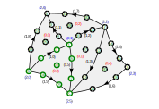

# Function spaces

## Grid cells and reference elements
We can now construct a function space $V_h\subset H^1(\Omega_h)$ on the domain $\Omega_h$ defined by the mesh as follows:
$$
V_h := \{u\in H^1(\Omega_h): u|_K(x) = \widehat{u}_K(\widehat{x})\quad \text{for some $\widehat{u}_K\in\mathcal{P}_p(\widehat{K})$ with $x=X_K(\widehat{x})$ for all cells $K\in\Omega_h$}\}
$$

In other words, in each grid cell the pullback of the function $u$ to the reference element is a polynomial. We can now use the basis for $\mathcal{P}_p(\widehat{K})$ that we constructed in one of the previous lectures to represent the functions $\widehat{u}_K$. However, care has to be taken to ensure that the function is continuous across facets and at the vertices.

### Arrangement of unknowns
Assume that we have a finite element with $n^{(\text{vertex})}$ unknowns per vertex, $n^{(\text{facet})}$ unknowns per facet and $n^{(\text{cell})}$ unknowns per cell. 
Let $N_{\text{vertex}} = n_{\text{vertices}}\cdot n^{(\text{vertex})}$, $N_{\text{facet}} = n_{\text{facets}}\cdot n^{(\text{facet})}$ be the total number of unknowns associated with vertices and facets respectively.

We number the unknowns such that

* unknowns with indices $k\cdot n^{(\text{vertex})},\dots,(k+1)\cdot n^{(\text{vertex})}-1$ are associated with the $k$-th vertex
* unknowns with indices $N_{\text{vertex}}+j\cdot n^{(\text{facet})},\dots,N_{\text{vertex}}+(j+1)\cdot n^{(\text{facet})}-1$ are associated with the $j$-th facet
* unknowns with indices $N_{\text{vertex}}+N_{\text{facet}}+i\cdot n^{(\text{cell})},\dots,N_{\text{vertex}}+N_{\text{facet}}+(i+1)\cdot n^{(\text{cell})}-1$ are associated with the $i$-th cell

The facet-unknowns are ordered along the orientation of each edge.

The following figure shows an example for the $p=3$ Lagrange element:

### Local-to-global map
On each cell with index $i$ we need to map the $\ell$-th local dof-index to the global dof-index $\ell_{\text{global}}$. Note that this map is surjective but not injective since the unknowns associated with the facets and vertices are shared.

The map $(i,\ell) \mapsto \ell_{\text{global}}$ is realised in two steps:

1. For the given $\ell$, we first work out the entity-type $E$ (cell, facet, vertex) it is associated with, as well as the index $i$ of this entity on the reference triangle and the index $k$ of the dof on that reference entity. This information we can get from the `FiniteElement` object.
2. Next, we map this to the global index
   1. If $E=\text{vertex}$: $\ell_{\text{global}} = v\cdot n^{(\text{vertex})}+k$ where $v=I^{v\gets K}_{ij}$
   2. If $E=\text{facet}$: $\ell_{\text{global}} = N_{\text{vertex}}+f\cdot n^{(\text{facet})}+\widetilde{k}$ where $f=I^{F\gets K}_{ij}$ and
$$
\tilde{k} = \begin{cases}
k & \text{if the orientation of the facet matches the orientation on the reference cell}\\
n^{(\text{facet})-1-k} & \text{otherwise}
\end{cases}
$$
   1. If $E=\text{cell}$: $\ell_{\text{global}} = N_{\text{vertex}}+N_{\text{facet}}+i\cdot n^{(\text{cell})}+j$

## Encoding geometry information
## Implementation in Python