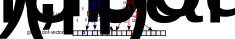

# Global assembly
We are now ready to assemble the stiffness matrix $A^{(h)}$ and the right hand side vector $\boldsymbol{b}^{(h)}$ which define the linear system
$$
A^{(h)} \boldsymbol{u}^{(h)} = \boldsymbol{b}^{(h)}.
$$
With knowledge of the dof-vector $\boldsymbol{u}^{(h)}$ we can reconstruct the finite element solution $u_h(x) = \sum_{\ell=0}^{n-1} u^{(h)}_\ell \Phi^{(h)}_\ell(x)$. Recall that the entries of the right hand side vector and stiffness matrix are given by $b^{(h)}_\ell:=b(\Phi^{(h)}_\ell)$ and $A^{(h)}_{\ell k}:= a\left(\Phi^{(h)}_\ell,\Phi^{(h)}_k\right)$. 
## Assembly of RHS vector
Since $b(v) = \int_\Omega f(x)v(x)\;dx$ we compute the entries of the vector $b^{(h)}$ by splitting the integral over the domain $\Omega$ into the sum of integrals over the cells $K$:
$$
\begin{aligned}
b^{(h)}_{\ell_{\text{global}}} &= \int_\Omega f(x) \Phi_{\ell_{\text{global}}}(x)\;dx\\
&= \sum_{K\in \Omega_h} \int_K f(x) \Phi_{\ell_{\text{global}}}(x) \; dx\\
\end{aligned}
$$
If $i$ is the index of cell $K$, we can identify the *global* index $\ell_{\text{global}}$ with the corresponding cell-*local* index $\ell$, transform variables to integrate over the reference cell $\widehat{K}$ and write 
$$
\begin{aligned}
b^{(h)}_{\ell_{\text{global}}} &= \sum_{K\in \Omega_h}\int_{\widehat{K}} \widehat{f}_K(\widehat{x}) \phi_\ell(\widehat{x})\;|\det{J}(\widehat{x})|\;d\widehat{x}
\end{aligned}
$$
where $\widehat{f}_K(\widehat{x}) := f(x)$. Note that for degrees of freedom which are shared between neighbouring cells, there can be contributions different cells since several $(i,\ell)$ can correspond to the same $\ell_{\text{global}}$.

Next, replace the integration by numerical quadrature and use the tabulated basis functions $T_{q\ell}=\phi_\ell(\xi^{(q)})$ to obtain
$$
\begin{aligned}
b^{(h)}_{\ell_{\text{global}}} &\approx \sum_{K\in \Omega_h} \sum_q w_q \widehat{f}_K(\xi^{(q)}) \phi_\ell(\xi^{(q)})\;|\det{J}(\xi^{(q)})|\\
&= \sum_{K\in \Omega_h} \sum_q w_q \widehat{f}_K(\xi^{(q)}) T_{q\ell}\;|\det{J}(\xi^{(q)})|.
\end{aligned}
$$
To evaluate the cell-local function $\widehat{f}_K$ at the quadrature point we need to work out the global coordinate $x_K^{(q)}$ which corresponds to this point and use
$$
\widehat{f}_K(\xi^{(q)}) = f(x_K^{(q)})
$$
Next, we use the fact that in each cell $x_K$ can be expanded in terms of vector-valued basis functions as
$$
(x_K^{(q)})_a = (X_K(\xi^{(q)}))_a = \sum_{\ell^\times} (\phi^\times_{\ell^\times}(\xi^{(q)}))_a X_{\ell_{\text{global}}} = \sum_{\ell^\times} T^\times_{q\ell^\times a} \overline{X}_{\ell^\times}
$$
where $\ell^\times_{\text{global}}$ is the global dof-index of the coordinate field which corresponds to the cell index $i$ and the local dof-index $\ell^\times$. $\overline{\boldsymbol{X}}$ is the cell-local dof-vector with $\overline{X}_{\ell^\times} = X_{\ell_{\text{global}}^\times}$.

The Jacobian is given by
$$
J_{ab}(\xi^{(q)}) = \frac{\partial (x_K^{(q)})_a }{\partial x_b} = \frac{\partial (X_K)_a }{\partial x_b}(\xi^{(q)})
= \sum_{\ell^\times} X_{\ell^\times_{\text{global}}} \frac{\partial (\phi^\times_{\ell^\times})_a }{\partial x_b}(\xi^{(q)})
= \sum_{\ell^\times} \overline{X}_{\ell^\times} T^{\times\partial}_{q\ell^\times ab}
$$
Putting everything together, we arrive at the following procedure:

### Algorithm: assembly of right-hand-side vector $\boldsymbol{b}^{(h)}$
1. Initialise $\boldsymbol{b}^{(h)} \gets \boldsymbol{0}$
1. For all cells $K$ **do**:
1. $~~~~$ Extract the coordinate dof-vector $\overline{\boldsymbol{X}}$ with $\overline{X}_{\ell^\times} = X_{\ell^\times_\text{global}(i,{\ell^\times})}$ where $i$ is the index of cell $K$
1. $~~~~$ For all quadrature points $q$ **do**:
1. $~~~~~~~~$ Compute the determinant $D_q$ of the Jacobian $J(\xi^{(q)})$ with $J_{ab}(\xi^{(q)}) = \sum_{\ell^\times} \overline{X}_{\ell^\times} T^{\times\partial}_{q\ell^\times ab}$
1. $~~~~~~~~$ Compute $(x_K^{(q)})_a = \sum_{\ell^\times} T^\times_{q\ell^\times a} \overline{X}_{\ell^\times}$ and evaluate $F_q = f(x_K^{(q)})$
1. $~~~~$ **end do**
2. $~~~~$ Construct the local dof-vector $\boldsymbol{b}^{(h),\text{local}}$ with
$$b^{(h),\text{local}}_{\ell} = \sum_q w_q F_q T_{q\ell} D_q$$
3. $~~~~$ For all local dof-indices $\ell$ **do**:
4. $~~~~~~~~$ Increment $b_{\ell_{\text{global}}}^{(h)}\gets b_{\ell_{\text{global}}}^{(h)} + b^{(h),\text{local}}_\ell$ with $\ell_{\text{global}} = \ell_{\text{global}}(i,\ell)$
5. $~~~~$ **end do**
6. **end do**

#### Illustration
The following figure visualises the assembly of the global vector $\boldsymbol{b}^{(h)}$. The two cells have global indices $\ell_{\text{global}}=[2,4,8]$ and $\ell_{\text{global}}=[8,11,16]$ respectively. Note that both cells contribute to the global vector entry $b^{(h)}_8$.


#### Implementation
The summation $\sum_q w_q F_q T_{q\ell} D_q$ of the local vector entries can be realised with numpy's [`einsum()`](https://numpy.org/doc/stable/reference/generated/numpy.einsum.html) method.

To insert the entries of the local vector $\boldsymbol{b}^{(h),\text{local}}$ into the global vector $\boldsymbol{b}^{(h)}$ we can use slicing notation, i.e. write
```
b_h[ell_global] = b_h_local[:]
```
where `ell_global` is the list of global dof-indices that correspond to the local dof-indices in the cell. In the code, this list can be constructed as
```
ell_global = fs.local2global(i,range(ndof))
```
In this expression `fs` is a `FunctionSpace` object and `ndof` is the number of local unknowns in each cell.
## Assembly of LHS matrix
To assemble the stiffness matrix, we again split the integral into a sum of integrals over grid cells $K$:
$$
\begin{aligned}
A^{(h)}_{\ell_{\text{global}},k_{\text{global}}} &= \int_\Omega \left(\kappa \nabla \Phi^{(h)}_{\ell_{\text{global}}}(x) \cdot\nabla\Phi^{(h)}_{k_{\text{global}}}(x)+\omega \Phi^{(h)}_{\ell_{\text{global}}}(x)\Phi^{(h)}_{k_{\text{global}}}(x)\right)dx\\
&= \sum_{K\in\Omega_h}\int_K \left(\kappa \nabla \Phi^{(h)}_{\ell_{\text{global}}}(x) \cdot\nabla\Phi^{(h)}_{k_{\text{global}}}(x)+\omega \Phi^{(h)}_{\ell_{\text{global}}}(x)\Phi^{(h)}_{k_{\text{global}}}(x)\right)dx
\end{aligned}
$$
Next, we change variables in each cell to convert the integrals into integrals over the reference cell $K$. For this, note that the global basis functions and their derivatives transform as follows:
$$
\begin{aligned}
\Phi^{(h)}_{\ell_{\text{global}}}(x) &= \phi_\ell(\widehat{x})\\
\nabla \Phi^{(h)}_{\ell_{\text{global}}}(x) &= J^{-\top}(\widehat{x}) \widehat{\nabla}\phi_\ell(\widehat{x})
\end{aligned}
$$
Here $\ell_{\text{global}}$ is the global dof-index that is associated with the local dof-index $\ell$ in the cell with index $i$. The second identity can be easily verified by using the chain rule. With this we find
$$
\begin{aligned}
A^{(h)}_{\ell_{\text{global}},k_{\text{global}}} &= \sum_{K\in \Omega_h}\int_K \left(\kappa J^{-\top}(\widehat{x}) \widehat{\nabla} \phi_\ell (\widehat{x})\cdot J^{-\top}(\widehat{x})\widehat{\nabla}\phi_k(\widehat{x}) + \omega\phi_\ell(\widehat{x})\phi_k(\widehat{x})\right)|\det{J}(\widehat{x})|d\widehat{x}.
\end{aligned}
$$
Next, approximate the integrals by numerical quadrature and use the tabulated basis functions $T_{q\ell} = \phi_\ell(\xi^{(q)})$, $T^\partial_{q\ell a} = \frac{\partial\phi_\ell}{\partial \widehat{x}_a}(\xi^{(q)})$ to obtain
$$
\begin{aligned}
A^{(h)}_{\ell_{\text{global}},k_{\text{global}}} &\approx \sum_{K\in \Omega_h}\int_K  w_q \left(\kappa \widehat{\nabla} \phi_\ell(\xi^{(q)})(J^{\top}(\xi^{(q)}) J(\xi^{(q)}))^{-1}\phi_k(\xi^{(q)}) + \omega\phi_\ell(\xi^{(q)})\phi_k(\xi^{(q)})\right)|\det{J}(\xi^{(q)})|d\widehat{x} \\
&= \sum_{K\in \Omega_h} \sum_q w_q  \left(\kappa T^\partial_{q\ell a}(J^{(-2)}_q)_{ab} T^\partial_{qkb} +\omega T_{q\ell}T_{qk}\right)|\det{J}(\xi^{(q)})|
\end{aligned}
$$
with the $2\times 2$ matrix
$$
J^{(-2)}_{q} =  \left(J^{\top}(\xi^{(q)}) J(\xi^{(q)})\right)^{-1} = \left(J^{(2)}\right)^{-1}.
$$
The value $J(\xi^{(q)})$ of the Jacobian at the quadrature points can be computed as above.

Putting everything together we arrive at the following procedure:

### Algorithm: assembly of stiffness matrix $A^{(h)}$
1. Initialise $A^{(h)} \gets 0$
1. For all cells $K$ **do**:
2. $~~~~$ Extract the coordinate dof-vector $\overline{\boldsymbol{X}}$ with $\overline{X}_{\ell^\times} = X_{\ell^\times_\text{global}(i,\ell^\times)}$
3. $~~~~$ For all quadrature points $q$ **do**:
4. $~~~~~~~~$ Compute the Jacobian $J(\xi^{(q)})$ with $J_{qab} = J_{ab}(\xi^{(q)}) = \sum_{\ell^\times} \overline{X}_{\ell^\times} T^{\times\partial}_{q\ell^{\times}ab}$
5. $~~~~~~~~$ Compute the determinant $D_q$ of $J(\xi^{(q)})$
6. $~~~~~~~~$ Compute the matrix $J^{(2)}_q = J^{\top}(\xi^{(q)}) J(\xi^{(q)})$ with $J^{(2)}_{qab} = \sum_{c} J_{qca}J_{qcb}$ and invert it to obtain $J^{(-2)}_{q} = \left(J^{(2)}_q\right)^{-1}$
7. $~~~~$ **end do**
8. $~~~~$ Construct the local stiffness matrix $A^{(h),\text{local}}$ with
$$A^{(h),\text{local}}_{\ell k} = \kappa \sum_{qab}w_q  T^\partial_{q\ell a}(J^{(-2)}_q)_{ab} T^\partial_{qkb} D_q + \omega \sum_{q} w_q  T_{q\ell}T_{qk} D_q$$
9. $~~~~$ For all local dof-indices $\ell$ **do**:
10. $~~~~~~~~$ For all local dof-indices $k$ **do**:
11. $~~~~~~~~~~~~$ Increment $A^{(h)}_{\ell_{\text{global}},k_{\text{global}}}\gets A^{(h)}_{\ell_{\text{global}},k_{\text{global}}} + A^{(h),\text{local}}_{\ell k}$ with $\ell_{\text{global}} = \ell_{\text{global}}(i,\ell)$ and $k_{\text{global}} = k_{\text{global}}(i,k)$ the global dof-indices corresponding to the local dof-indices $\ell$, $k$ in the cell with index $i$
12. $~~~~~~~~$ **end do**
13. $~~~~$ **end do**
14. **end do**

#### Illustration
The following figure visualises the assembly of the stiffness matrix $A^{(h)}$. The two cells have global indices $\ell_{\text{global}}=[2,4,8]$ and $\ell_{\text{global}}=[8,11,16]$ respectively. Note that both cells contribute to the global matrix entry $A^{(h)}_{8,8}$.


#### Implementation
Again, the summation $\sum_{c} J_{qca}J_{qcb}$ to compute the matrix entries of $J^{(2)}_q$ and the sums $\sum_{qab}w_q  T^\partial_{q\ell a}(J^{(2)}_q)_{ab} T^\partial_{qkb} D_q$, $\sum_{q}w_q  T_{q\ell}T_{qk} D_q$ required for the construction of the local matrix entries can be realised with numpy's [`einsum()`](https://numpy.org/doc/stable/reference/generated/numpy.einsum.html) method.

To insert the entries of the local stiffness matrix $A^{(h),\text{local}}$ into the global stiffness matrix $A^{(h)}$ we can again use slicing notation. Naively, one would expect to be able to do this with `A_h[ell_global, ell_global] += A_h_local[:,:]` where `ell_global = fs.local2global(i,range(ndof))` as above. however this does not work since we first need to construct the "product" $\ell_{\text{global}}\times \ell_{\text{global}}$ before we can use this to slice a matrix. This can be done with the numpy [`ix_()`](https://numpy.org/doc/2.2/reference/generated/numpy.ix_.html) method, i.e. write
```
A_h[np.ix_(ell_global, ell_global)] += A_h_local[:,:]
```

## Interpolation
The final operation we need is interpolation of a given function $u$ onto a function $u^{(h)}=\mathcal{I}_h(u)\in V_h$ such that $u^{(h)}\approx u$. This can be achieved by setting the entries of the dof-vector $\boldsymbol{u}^{(h)}$ which represents $u^{(h)}$ to
$$
u^{(h)}_{\ell_{\text{global}}} = \lambda^{(h)}_{\ell_{\text{global}}}(u)
$$
where $\lambda^{(h)}_{\ell_{\text{global}}}$ is the degree of freedom with index $\ell_{\text{global}}$. To see why this is a sensible definition, consider the case where $f=u^{(h)}\in V_h$, i.e. 
$$
u^{(h)}(x) = \sum_{\ell_{\text{global}}} u^{(h)}_{\ell_{\text{global}}} \Phi^{(h)}_{\ell_{\text{global}}}(x)
$$
then
$$
\begin{aligned}
\lambda^{(h)}_{\ell_{\text{global}}}\left(\sum_{k_{\text{global}}} u^{(h)}_{k_{\text{global}}} \Phi^{(h)}_{k_{\text{global}}}(x)\right) &= \sum_{k_{\text{global}}} u^{(h)}_{k_{\text{global}}} \lambda^{(h)}_{\ell_{\text{global}}}\left( \Phi^{(h)}_{k_{\text{global}}}(x)\right)\\
&= \sum_{k_{\text{global}}} u^{(h)}_{k_{\text{global}}} \delta_{\ell_{\text{global}},k_{\text{global}}}\\
&= u^{(h)}_{\ell_{\text{global}}}.
\end{aligned}
$$
In other words, the interpolation operation returns the same function:
$$
u^{(h)} \in V_h \quad\Rightarrow\quad \mathcal{I}_h(u^{(h)}) = u^{(h)}
$$
Observe in particular that if $\lambda^{(h)}_{\ell_\text{global}}$ correspond to point evaluations $\lambda^{(h)}_{\ell_\text{global}}(u) = u(x_{\ell_{\text{global}}})$, then we have that
$$
u^{(h)}(x_{\ell_{\text{global}}}) = u(x_{\ell_{\text{global}}}).
$$
Again, we implement the global interpolation by looping over all cells and using the local assembly operation. For this, we construct a function $\widehat{u}_K(\widehat{x})=u(x)$ on each cell and compute
$$
u^{(h)}_{\ell_{\text{global}}} = \lambda_\ell (\widehat{u}_K)
$$
with the cell-local degrees of freedom $\lambda_\ell$ on the reference cell $\widehat{K}$. The function $\widehat{u}_K(\widehat{x})$ is given by
$$
\widehat{u}_K(\widehat{x}) = u\left(\sum_{\ell^\times}\overline{X}_{\ell^\times} \phi^\times_{\ell^\times}(\widehat{x})\right)
$$
This leads to the following procedure:

### Algorithm: interpolation on $V_h$
1. For all cells $K$ **do**:
2. $~~~~$ Extract the coordinate dof-vector $\overline{\boldsymbol{X}}$ with $\overline{X}_{\ell^\times} = X_{\ell^\times_\text{global}(i,\ell^\times)}$
3. $~~~~$ Construct the function $\widehat{u}_K(\widehat{x}) = u\left(\sum_{\ell^\times}\overline{X}_{\ell^\times} \phi^\times_{\ell^\times}(\widehat{x})\right)$
4. $~~~~$ Construct the local vector $u^{(h),\text{local}}_\ell = \lambda_\ell(\widehat{u}_K)$
5. $~~~~$ For all local indices $\ell$ **do**
6. $~~~~~~~~$ Set $u^{(h)}_{\ell_{\text{global}}} = u^{(h),\text{local}}_\ell$
7. $~~~~$ **end do**
8. **end do**

### Interpolation error
It is possible to derive bounds for the difference $u-\mathcal{I}_h(u)$, which in general depend on the particular choice of finite element discretisation. We will only present one result here, which applies to piecewise polynomial finite elements of degree $p$. There is a constant $D$, independent of $h$ such that

$$
\|u-\mathcal{I}_h(u)\|_{L_2(\Omega)} \le D h^{p+1} \|u\|_{H^{p+1}(\Omega)}
$$
where $h$ is the maximum diameter of all grid cells and $\|\cdot \|_{H^{p+1}(\Omega)}$ is a suitable norm that we will not discuss further here. Crucially, the interpolation error descreases with a power of the grid spacing and higher-order discretisations lead to smaller interpolation errors. See Section 11 of [Patrick Farrell's excellent lecture notes on Finite element methods](https://people.maths.ox.ac.uk/farrellp/femvideos/notes.pdf) for more details.

It should be stressed, however, that in general interpolation is not the same as $L_2(\Omega)$ projection, i.e.
$$
\mathcal{I}(u) \neq \argmin_{v^{(h)}\in V_h} \|u-v^{(h)}\|_{L_2(\Omega)}
$$
