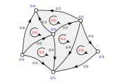

# Unstructured meshes
*&#169; Eike Mueller, University of Bath 2025. These lecture notes are copyright of Eike Mueller, University of Bath. They are provided exclusively for educational purposes at the University and are to be downloaded or copied for your private study only. Further distribution, e.g. by upload to external repositories, is prohibited.*

In general, we might want to solve PDEs on a $d$-dimensional manifold $\Omega\subset \mathbb{R}^D$ that is embedded in $D$ dimensional space. For example, we might want to solve the Navier-Stokes equations on the surface of a sphere. The manifold is then approximated by a mesh, which can be described as a collection of topological entities. For example, if $d=2$, the mesh will consist of zero-dimensional vertices, one-dimensional edges and two-dimensional triangular cells (although it is also possible to use more general polygonal cells we do not consider this here). In general, the co-dimension $c$ of a $d'$-dimensional mesh entity is given by $c=d-d'$. In the following we will only consider the case $d=D=2$. In this case we have:

| topological entity  | dimension $d'$ | co-dimension $c$ |
| ------------------- | -------------- | ---------------- |
| cell (triangle) $K$ | $2$            | $0$              |
| facet (edge) $F$    | $1$            | $1$              |
| vertex $v$          | $0$            | $2$              |

The following figure shows a two-dimensional mesh with $n_{\text{vertex}}=6$ vertices, $n_{\text{facet}}=10$ facets and $n_{\text{cell}}=5$ cells in which all topological entities are labelled by their co-dimension and a unique number.

## Topology
The mesh topology is defined by which entities are connected to which other entities. For example, each cell has exactly three facets and each facet is defined by exactly two vertices.

This information can be encoded in two matricies: An $n_{\text{cell}}\times 3$ matrix $I^{F\gets K}$ with

$$
I^{F\gets K}_{ij} = \text{index of $j$-th facet of cell $i$}
$$

and an $n_{\text{facet}}\times 2$ matrix $I^{v\gets F}$ with

$$
I^{v\gets F}_{jk} = \text{index of $k$-th vertex of facet $j$}.
$$

Note that there is some freedom as to how we number the facets associated each cell; the numbering we adopt here is one in which for each cell $i$ the facets with indices $I^{F\gets K}_{i0}$, $I^{F\gets K}_{i1}$ and $I^{F\gets K}_{i2}$ are arranged in a counter-clockwise fashion (note that there are three possible orderings that satisfy this condition). Similarly, we adapt an ordering of the vertices associated with each facet such that for each facet $j$ we have that $I^{v\gets F}_{j0} < I^{v\gets F}_{j1}$.

For convenience, we can also use $I^{F\gets K}$ and $I^{v\gets F}$ to construct the $n_{\text{cell}}\times 3$ matrix $I^{v\gets K}$ with

$$
I^{v\gets K}_{ik} = \text{index of $k$-th vertex of cell $i$}
$$

In each cell $i$, we number the vertices in a counter-clockwise fashion such that the $k$-th vertex lies opposite the $k$-the edge of the cell:

$$
\begin{aligned}
I^{v\gets K}_{ik} \not\in \{I^{v\gets F}_{j0},I^{v\gets F}_{j1}\}\quad\text{for $j =I^{F\gets K}_{ik}$}
\end{aligned}
$$

Note that the counter-clockwise numbering of the facets and vertices in each cell is consistent with the numbering of unknown on the reference triangle.

For example, the matrices $I^{F\gets K}$, $I^{v\gets F}$ and $I^{v\gets K}$ for the simple mesh shown above are given by

$$
\begin{aligned}
I^{F\gets K} &= \begin{pmatrix}
0 & 3 & 1 & 0 & 3 \\
1 & 2 & 2 & 9 & 6 \\
8 & 5 & 7 & 5 & 4
\end{pmatrix}^{\top}\\
I^{v\gets F} &= \begin{pmatrix}
0 & 1 & 1 & 2 & 2 & 1 & 3 & 2 & 0 & 0 \\
1 & 4 & 2 & 5 & 3 & 5 & 5 & 4 & 4 & 5
\end{pmatrix}^{\top}\\
I^{v\gets K} &= \begin{pmatrix}
4 & 1 & 2 & 5 & 3 \\
0 & 5 & 4 & 1 & 2 \\
1 & 2 & 1 & 0 & 5
\end{pmatrix}^{\top}
\end{aligned}
$$

In addition, we store a $n_{\text{vertices}}\times 2$ matrix $v$ such that the $k$-th column of $v$ contains the coordinates of the $k$-th vertex in the mesh.

### Implementation
The abstract class `Mesh` encodes the mesh. It has the following members

* properties `ncells`, `nfacets` and `nvertices` which give the total number of cells ($=n_{\text{cell}}$), facets ($=n_{\text{facet}}$) and vertices ($=n_{\text{vertex}}$) respectively
* `cell2facet`: a list such that `cell2facet[i][j]` $= I^{F\gets K}_{ij}$
* `facet2vertex`: a list such that `facet2vertex[j][k]` $= I^{v\gets F}_{jk}$
* `cell2vertex`: a list such that `cell2vertex[i][k]` $= I^{v\gets K}_{ik}$. Since $I^{v\gets K}_{ik}$ can be derived from $I^{F\gets K}_{ij}$ and $I^{v\gets F}_{jk}$, `cell2vertex` is implemented as a `@cached_property`.
* an array `coordinates` of shape $(n_{\text{vertex}},2)$ whose columns contain the two-dimensional coordinates of the mesh vertices

The class also contains a method `refine(nref)` which can be used to construct a refined mesh from given mesh.

Two concrete classes are derived from this class:

* `RectangleMesh(Lx=1.0, Ly=1.0, nref=0)` is a triangulation of the domain $[0,L_x]\times[0,L_y]$ with a given number of refinements $n_{\text{ref}}$. The number of cells is $n_{\text{cells}} = 2^{n_{\text{ref}}+1}$
* `TriangleMesh(corners=None, nref=0)` is a triangulation of the domain triangle defined by the array `corners` (if this is `None`, the reference triangle us used) with a given number of refinements $n_{\text{ref}}$. The number of cells is $n_{\text{cells}} = 2^{n_{\text{ref}}}$

