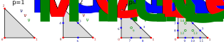
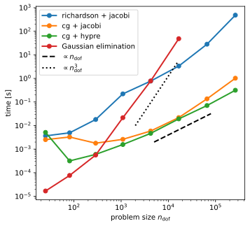
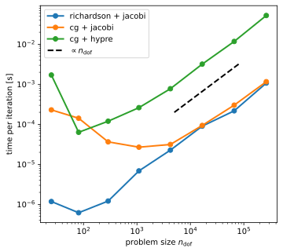

<div align="center">
  <p style="font-size:32px;">MA32070 lecture notes</p>
</div>

----

*&#169; Eike Mueller, University of Bath 2025. These notes are copyright of Eike Mueller, University of Bath. They are provided exclusively for educational purposes at the University and are to be downloaded or copied for your private study only. Further distribution, e.g. by upload to external repositories, is prohibited. html generated with [pandoc](https://pandoc.org/) using [easy-pandoc-templates](https://github.com/ryangrose/easy-pandoc-templates) under the [GPL-3.0.1 license](https://github.com/ryangrose/easy-pandoc-templates?tab=GPL-3.0-1-ov-file#readme)*

----

# Mathematical background
In the following we will give a brief overview of the finite element method and review some of the fundamental ideas as to why it works. The details will be discussed in later lectures.

## Model problem
In this course we will focus on the following partial differential equation (PDE) of the diffusion-reaction type in some bounded domain $\Omega\subset \mathbb{R}^2$:
$$
-\nabla \cdot (\kappa \nabla  u(x)) + \omega\; u(x) = f(x) \qquad \text{for $x\in \Omega$}\qquad:eqn:pde_continuum
$$
with boundary condition $\kappa\; n\cdot \nabla u(x)=g(x)$ for $x\in\partial \Omega$. We assume that $\omega, \kappa>0$ are positive constants and $f(x)$, $g(x)$ are given functions. Using zero-based indexing (as is used in Python) we will write $x=(x_0,x_1)\in\mathbb{R}^2$ such that $\nabla=(\frac{\partial}{\partial x_0},\frac{\partial}{\partial x_1})^\top$ is the nabla-operator.

Note that in the case $\kappa=1$, $\omega=0$ the problem would reduce to the Poisson equation $-\Delta u(x)=f(x)$. Unfortunately, for the given boundary condition the solution of the Poisson equation is not unique (if $u(x)$ is a solution then so is $u(x)+C$ for an arbitrary constant $C$), which is why we do not consider this case here. However, the methods developed in this course can be readily applied to this setup, provided we extend them to treat Dirichlet boundary conditions of the form $u(x)=\widetilde{g}(x)$ for $x\in\partial \Omega$ and some given function $\widetilde{g}(x)$.

## Weak solutions
To solve @eqn:pde_continuum, we seek solutions $u(x)$ in some function space $\mathcal{V}$; we will discuss suitable choices for $\mathcal{V}$ below. In a finite element setting we usually only aim to determine the solution in the **weak sense**: Find $u(x)\in \mathcal{V}$ such that
$$
\int_\Omega \left(-v(x)\nabla \cdot(\kappa \nabla  u(x)) + \omega\; v(x) u(x)\right)\;dx = \int_\Omega f(x) v(x)\;dx \qquad \text{for all $v(x)\in \mathcal{V}$}.
$$
The function $v(x)$ is often called a *test function*. Observe that in contrast to @eqn:pde_continuum we no longer require that the equation is satisfied at every point $x$. Discussing in which sense these weak solutions are equivalent to solutions of @eqn:pde_continuum (which is sometimes also referred to as the **"strong"** form of the equation) is beyond the scope of this course.
 
After integrating the first term under the integral on the left-hand side by parts, the weak form becomes
$$
\int_\Omega \left(\kappa \nabla v(x) \cdot \nabla  u(x) + \omega\; v(x) u(x)\right)\;dx - \int_{\partial \Omega } \kappa\;v(x) n\cdot \nabla(u)\;ds = \int_\Omega f(x) v(x)\;dx.
$$
Crucially, only first derivatives of the solution $u(x)$ and test function $v(x)$ are required now. Using the boundary condition $\kappa\; n\cdot \nabla u(x)=g(x)$ for $x\in\partial\Omega$, we can rewrite this as
$$
\int_\Omega \left(\kappa \nabla v(x) \cdot \nabla  u(x) + \omega\; v(x) u(x)\right)\;dx  = \int_\Omega f(x) v(x)\;dx + \int_{\partial \Omega} g(x) v(x)\;ds.\qquad:eqn:weak_form_explicit
$$
where now only the left hand side depends on the unknown function $u(x)$.

Let us define the symmetric *bilinear form* $a(\cdot,\cdot): \mathcal{V}\times \mathcal{V} \rightarrow \mathbb{R}$ with
$$
a(u,v) := \int_\Omega \left(\kappa \nabla v(x) \cdot \nabla  u(x) + \omega\; v(x) u(x)\right)\;dx\qquad:eqn:definition_bilinear_a
$$
and the linear form $b(\cdot):\mathcal{V}\rightarrow \mathbb{R}$ with
$$
b(v) := \int_\Omega f(x) v(x)\;dx+ \int_{\partial \Omega} g(x) v(x)\;ds.
$$

#### Exercise
Convince yourself that $a(\cdot,\cdot)$ and $b(\cdot)$ are indeed (bi-) linear:

* $a(c_1 u^{(1)} + c_2 u^{(2)},v) = c_1 a(u^{(1)},v) + c_2 a(u^{(2)},v)$ for all $c_1,c_2\in \mathbb{R}$, $u^{(1)}, u^{(2)},v \in \mathcal{V}$
* $a(u,c_1 v^{(1)} + c_2 v^{(2)}) = c_1 a(u,v^{(1)}) + c_2 a(u,v^{(2)})$ for all $c_1,c_2\in \mathbb{R}$, $u,v^{(1)}, v^{(2)} \in \mathcal{V}$
* $b(c_1 v^{(1)} + c_2 v^{(2)})=c_1b( v^{(1)}) + c_2 b(v^{(2)})$ for all $c_1,c_2\in \mathbb{R}$, $v^{(1)}, v^{(2)} \in \mathcal{V}$
  
and that $a(\cdot,\cdot)$ is symmetric:

* $a(v,u) = a(u,v)$ for all $u,v\in \mathcal{V}$
  
With these (bi-)linear forms, we can formulate the weak problem in @eqn:weak_form_explicit as follows: Find $u(x)\in \mathcal{V}$ such that
$$
a(u,v) = b(v) \qquad \text{for all $v(x)\in \mathcal{V}$}.\qquad:eqn:weak_problem_continuum
$$

### Choice of function space $\mathcal{V}$
In the following we choose $\mathcal{V}:=H^1(\Omega)\subset L_2(\Omega)$, which is the space of all real-valued functions on $\Omega$ which have a square-integrable first derivative. More specifically, define the following two norms
$$
\begin{aligned}
\| u\|_{L_2(\Omega)} &:= \left(\int_\Omega u(x)^2\;dx\right)^{\frac{1}{2}}\\
\| u\|_{\mathcal{V}} = \| u\|_{H^1(\Omega)} &:= \left(\int_\Omega \left(u(x)^2+|\nabla u|^2\right)\;dx\right)^{\frac{1}{2}}
\end{aligned}
$$
and then set $L_2(\Omega) = \left\{u(x) : ||u||_{L_2(\Omega)}<\infty\right\}$ (the space of square-integrable real functions) and $H^1(\Omega) = \left\{u(x) : ||u||_{H_1(\Omega)}<\infty\right\}$ (the space of square-integrable functions with square-integrable first derivative).

## Finite element solutions
Now, obviously it is not possible to solve @eqn:weak_problem_continuum on a computer since $\mathcal{V}$ contains infinitely many functions. Instead, we try to find solutions in a finite-dimensional subspace $\mathcal{V}_h\subset \mathcal{V}$. This could for example be the space of all functions that are piecewise linear on a given mesh with spacing $h$. We will be more precise about what that means later in this course. In this case the problem becomes: find $u_h\in \mathcal{V}_h$ such that 
$$
a(u_h,v_h) = b(v_h) \qquad \text{for all $v_h(x)\in \mathcal{V}_h$ }.\qquad:eqn:weak_problem_discretised
$$

### Existence and convergence of the solution
It can be shown that @eqn:weak_problem_continuum and @eqn:weak_problem_discretised have unique solutions provided the linear form $b(\cdot)$ and the bilinear form $a(\cdot,\cdot)$ satisfy the following two conditions:

* **Boundedness**: there exists some positive constant $C_+ > 0$ such that 
$$a(u,v) \le C_+ \|u\|_{\mathcal{V}} \|v\|_{\mathcal{V}} \qquad\text{and}$$
$$b(v) \le C_+ \|v\|_{\mathcal{V}} \qquad\text{for all $u,v\in \mathcal{V}$}.$$
* **Coercivity**: there exists some positive constant $C_- > 0$ such that
$$ 
a(u,u) \ge C_- \|u\|_{\mathcal{V}}^2 \qquad\text{for all $u\in \mathcal{V}$}.$$

It turns out that both conditions are satisfied for the $a(\cdot,\cdot)$, $b(\cdot)$ defined above. Furthermore, the solutions satisfy $\|u\|_{\mathcal{V}},\|u_h\|_{\mathcal{V}}\le C:=C_+/C_-$ and the difference between the solution $u_h(x)$ of @eqn:weak_problem_discretised and the solution $u(x)$ of @eqn:weak_problem_continuum can be bounded as follows:
$$
\|u_h - u\|_{\mathcal{V}} \le C \min_{v_h\in \mathcal{V}_h}\|u-v_h\|_{\mathcal{V}}.
$$
The constant $C$ on the right hand side is problem specific since it depends on $a(\cdot,\cdot)$ and $b(\cdot)$. In contrast, the term $\min_{v_h\in \mathcal{V}_h}\|u-v_h\|_{\mathcal{V}}$ only depends on the choice of function spaces $\mathcal{V}$, $\mathcal{V}_h$ and describes how well the function $u(x) \in \mathcal{V}$ can be approximated by a function $v_h\in \mathcal{V}_h$. For a suitable choice of $\mathcal{V}_h$, which we will discuss later, one can show that $\min_{v_h\in \mathcal{V}_h}\|u-v_h\|_{\mathcal{V}}\le C' h^{2\mu}$ for some positive integer $\mu\ge 1$ and positive constant $C'>0$. Hence, the finite element solution $u_h(x)$ converges to the "true" solution $u(x)$ as the mesh is refined ($h\rightarrow 0$):
$$
\|u_h - u\|_{\mathcal{V}} \le C C' h^{2\mu}.
$$
This is why the finite element works: it can be used to systematically approximate the true solution of the PDE.

## Reduction to linear algebra problem
We now discuss how $u_h$ can be found in practice. Since $\mathcal{V}_h$ is finite dimensional, we can choose a basis $\{\Phi^{(h)}_k(x)\}_{k=0}^{n-1}$ such that every function $u_h(x)\in \mathcal{V}_h$ can be written as
$$
u_h(x) = \sum_{k=0}^{n-1} u^{(h)}_k \Phi^{(h)}_k(x) \qquad\text{for all $x\in\Omega$.}\qquad:eqn:linear_algebra_problem
$$
The vector $\boldsymbol{u}^{(h)}=(u^{(h)}_0,u^{(h)}_1,\dots,u^{(h)}_{n-1})\in\mathbb{R}^n$ is often referred to as the degrees-of-freedom vector (short: dof-vector) since its knowledge determines $u_h(x)$. Below we will sometimes write $n_{\text{dof}}$ instead of $n$ for the total number of degrees of freedom. Picking $v_h(x)=\Phi^{(h)}_\ell(x)$ and inserting the expansion of $u_h(x)$ in @eqn:linear_algebra_problem into @eqn:weak_problem_discretised we obtain
$$
b^{(h)}_\ell:=b(\Phi^{(h)}_\ell) = a\left(\sum_{k=0}^{n-1} u^{(h)}_k \Phi^{(h)}_k,\Phi^{(h)}_\ell\right) = 
\sum_{k=0}^{n-1} u^{(h)}_k a\left( \Phi^{(h)}_\ell,\Phi^{(h)}_k\right),
$$
where we used the symmetry and bi-linearity of $a(\cdot,\cdot)$. Defining the vector $\boldsymbol{b}^{(h)} := (b(\Phi^{(h)}_0),b(\Phi^{(h)}_1,\dots,b(\Phi^{(h)}_{n-1})))$ and the $n\times n$ matrix $A^{(h)}$ with $A^{(h)}_{\ell k}:= a\left(\Phi^{(h)}_\ell,\Phi^{(h)}_k\right)$ we arrive at the following linear system for the dof-vector $\boldsymbol{u}^{(h)}$:
$$
A^{(h)} \boldsymbol{u}^{(h)} = \boldsymbol{b}^{(h)}.\qquad:eqn:linear_system_Aub
$$

Although $\boldsymbol{u}^{(h)}$ and $\boldsymbol{b}^{(h)}$ are both vectors in $\mathbb{R}^n$, they are constructed in a fundamentally different way:

* The dof-vector $\boldsymbol{u}^{(h)}$ is a so-called **primal** vector: its components $u_\ell^{(h)}$ are the expansion coefficients of the function $u_h(x)$ in @eqn:linear_algebra_problem.
* In contrast, the right-hand-side vector $\boldsymbol{b}^{(h)}$ is a so-called **dual** vector: its components $b(\Phi_\ell^{(h)})$ are obtained by evaluating the linear functional $b(\cdot)$ for the basis functions.

The reason for this is that $b(\cdot)$ is an element of the dual space $\mathcal{V}^*$, which consists of all linear functionals defined on the space $\mathcal{V}$. We will discuss dual spaces in more detail below.

### Solution procedure
In summary, the solution procedure for @eqn:weak_problem_discretised is this:

1. Assemble the matrix $A^{(h)}$.
2. Assemble the right-hand-side vector $\boldsymbol{b}^{(h)}$.
3. Solve the linear system $A^{(h)} \boldsymbol{u}^{(h)} = \boldsymbol{b}^{(h)}$ in @eqn:linear_system_Aub for $\boldsymbol{u}^{(h)}$.
4. Reconstruct the solution $u_h(x)$ from the dof-vector $\boldsymbol{u}^{(h)}$ according to the expansion in @eqn:linear_algebra_problem.

In the rest of this course we will discuss how each of these steps can be implemented in Python. The focus will be on structuring the code such that the mathematical objects are mapped to the corresponding Python objects in the source code. For the solution of the linear algebra system we will use the [PETSc](https://petsc.org/) library.

# Finite Elements
We start by solving the weak form of the PDE for a special case, namely a domain consisting of a single triangle. By doing this, we will develop the fundamental concepts and techniques of finite element analysis and discuss their implementation in Python. As we will see later, the solution of the PDE on more complicated domains can be reduced to this case.

## Reference triangle
Let us consider a very simple domain $\widehat{K}=\Omega$ which consists of the right-angled triangle with vertices $v_0=(0,0)$, $v_1=(1,0)$ and $v_2=(0,1)$, shown in red in @fig:reference_triangle. We label the edges (or facets), shown in blue, in a counter-clockwise fashion as $F_0 = \overrightarrow{v_1v_2}$, $F_1 = \overrightarrow{v_2v_0}$ and $F_2 = \overrightarrow{v_0v_1}$. This ordering will later be important.


In the following we will also refer to this as the *reference triangle* $\widehat{K}$.

Recall that the finite element approach starts with the choice of a suitable function space $\mathcal{V}_h$. For this, consider the space of bi-variate polynomials of degree $p$ on $\widehat{K}$:

$$
\mathcal{V}_h := \mathcal{P}_p(\widehat{K}) = \{q:q(x) = \sum_{\substack{s_0,s_1\\s_0+s_1\le p}} a_{s_0,s_1} x_0^{s_0}x_1^{s_1}\;\text{for all $x\in K$ with $a_{s_0,s_1}\in\mathbb{R}$}\}\subset H^1(\widehat{K})
$$

The space $\mathcal{P}_p(\widehat{K})$ is spanned by $n_{\text{dof}}=\nu = {p+2 \choose 2} = \frac{1}{2}(p+2)(p+1)$ basis functions $\{\phi_\ell(x)\}_{\ell=0}^{\nu-1}$. These can be chosen to be the monomials $\{1,x_0,x_1,x_0^2,x_0x_1,x_1^2,\dots$\}, but a better choice is to pick [Lagrange polynomials](https://mathworld.wolfram.com/LagrangeInterpolatingPolynomial.html). This will later allow us to construct $H^1(\Omega)$ functions on a mesh that consists of little triangles by "glueing together" the functions on neighbouring triangles. To construct Lagrange polynomials, we choose $\nu$ points $\{\xi^{(\ell)}\}_{\ell=0}^{\nu-1}$ in $\widehat{K}$ and define $\phi_\ell(x)\in\mathcal{P}_p(K)$ such that
$$
\phi_\ell(\xi^{(k)}) = \delta_{\ell k} = \begin{cases}
    1 & \text{for $\ell=k$}\\
    0 & \text{otherwise}.
\end{cases}
$$
A possible choice of points is given by (see @fig:lagrange_nodes below for some examples)
$$
\{\xi^{(\ell)}\}_{\ell=0}^{\nu-1} = \left\{\left(\frac{\ell_0}{p},\frac{\ell_1}{p}\right) \quad \text{for $\ell_0,\ell_1\in\mathbb{N}$ with $0\le \ell_0\le \ell_1 \le p$}\right\}.\qquad:eqn:nodal_points
$$

We order these points (and the associated basis functions $\phi_\ell(x)$) as follows:

1. Points associated with the three vertices $v_0$, $v_1$, $v_2$ (in this order); there is $\nu_{\text{vertex}}=1$ point per vertex,
2. points associated with the facets $F_0$, $F_1$, $F_2$ (in this order); there are $\nu_{\text{facet}}=p-1$ points per facet and on each facet these points are ordered according to the arrows in @fig:reference_triangle and finally
3. points associated with the interior $K^0$ of the cell $\widehat{K}$; there are $\nu_{\text{interior}}=\frac{1}{2}(p-1)(p-2)$ points of this type.

This is illustrated in @fig:lagrange_nodes, which shows the ordering of the points for $p=1,2,3,4$:



The associated finite elements are known as **Lagrange elements**.

### Examples

#### Linear finite element
For $p=1$ we obtain the (bi-)linear finite element with the following basis three functions:
$$
\begin{aligned}
\phi_0(x) &= 1-x_0-y_0\\
\phi_1(x) &= x_0\\
\phi_2(x) &= x_1
\end{aligned}
$$

#### Quadratic finite element
For $p=2$ there are six basis functions, three associated with vertices
$$
\begin{aligned}
\phi_0(x) &= (1-x_0-x_1)(1-2x_0-2x_1),\\
\phi_1(x) &= x_0(2x_0-1),\\
\phi_2(x) &= x_1(2x_1-1),
\end{aligned}
$$
and three associated with facets
$$
\begin{aligned}
\phi_3(x) &= 4x_0x_1,\\
\phi_4(x) &= 4x_1(1-x_0-x_1),\\
\phi_5(x) &= 4x_0(1-x_0-x_1).
\end{aligned}
$$
These functions are visualised in the following figure (red arrows indicate gradients):


## Formal definition of finite elements
It turns out that it is advantageous to define finite elements in a more general sense. Mirroring this more abstract mathematical definition in the Python code will help us to structure the code in a sensible way that will allow its easy adaptation to specific cases. For this we first need to introduce the notion of the dual $\mathcal{V}^*$ of a given function space $\mathcal{V}$.

### Dual spaces
Consider a domain $K$ and the space $\mathcal{V}=\mathcal{V}(K)$ of real-valued functions $w:K\rightarrow \mathbb{R}$ on $K$. A linear *functional* $\lambda$ maps a function $w\in \mathcal{V}$ to a real value $\lambda(w)\in\mathbb{R}$ such that

$$
\lambda(c_1 w^{(1)}+c_2 w^{(2)}) = c_1\lambda(w^{(1)})+c_2 \lambda(w^{(2)}) \qquad\text{for all $c_1,c_2\in\mathbb{R}$, $w^{(1)}, w^{(2)} \in \mathcal{V}$}.\qquad:eqn:linear_functional
$$

The space of all linear functionals on $\mathcal{V}$ is called the **dual space** $\mathcal{V}^*$. If $\mathcal{V}$ is finite-dimensional then so is $\mathcal{V}^*$ and both spaces have the same dimension.

#### Examples
Let $\Omega\subset \mathbb{R}^2$ and $\mathcal{V}=H^1(\Omega)$ be the space of functions on $\Omega$ with a square integrable first derivative. Then the following $\lambda$ are linear functionals:

* point evaluation: $\lambda(w) := w(\xi)$ for some point $\xi\in \Omega$
* differentiation: $\lambda(w) := \frac{\partial w}{\partial x_0}$
* integration: $\lambda(w) := \int_\Omega f(x)w(x)$ for some function $f(x)\in L_2(\Omega)$

#### Exercise
Convince yourself that these $\lambda$ indeed satisfy @eqn:linear_functional

### Ciarlet's definition of the finite element
This now leads to the following definition, originally due to Ciarlet (see [[Log11]](http://launchpad.net/fenics-book/trunk/final/+download/fenics-book-2011-10-27-final.pdf) for the version used here): a finite element is a triple $(\widehat{K},\widehat{\mathcal{V}},\mathcal{L})$ which consists of

* the **domain** $\widehat{K}$ (which we will always chose to be the reference trinagle in this course),
* a **function space** $\widehat{\mathcal{V}}=\widehat{\mathcal{V}}(\widehat{K})$ of real-valued functions on $\widehat{K}$,
* the **degrees of freedom** (or **nodes**) $\mathcal{L} = \{\lambda_\ell\}_{\ell=0}^{\nu-1}$, which is a basis for $\widehat{\mathcal{V}}^*$, the dual of $\widehat{\mathcal{V}}$

Crucially, we define the finite element by choosing a basis of the *dual* space $\mathcal{V}^*$. However, we can always construct a so-called *nodal* basis $\{\phi_\ell\}_{\ell=0}^{\nu-1}$ of $\widehat{\mathcal{V}}$ by requiring that
$$
\lambda_\ell (\phi_k) = \delta_{\ell k} \qquad\text{for all $\ell,k=0,1,\dots,\nu-1$}.
$$
In the following we will assume that $\widehat{K}$ is the reference triangle introduced above, unless specified otherwise.

#### Examples
The **polynomial Lagrange element** we described above is a special case of this with 

* $\widehat{K}$ the reference triangle
* $\widehat{\mathcal{V}} = \mathcal{P}_p(\widehat{K})$, the space of bi-variate polynomials of degree $p$
* $\mathcal{L}=\{\lambda_\ell\}_{\ell=0}^{\nu-1}$ with $\lambda_\ell(w) = w(\xi^{(\ell)})$ the point evaluation at the nodal points $\xi^{(\ell)}$ given in @eqn:nodal_points

An alternative choice for the nodes would have been to define for some point $\mathring{\xi}\in \widehat{K}$:
$$
\lambda_\ell (w) = \frac{\partial^{\ell_a}w}{\partial x_0^{\ell_b} \partial x_1^{\ell_a-\ell_b}}(\mathring{\xi}) \qquad\text{for $0\le \ell_b \le \ell_a\le p$ and $\ell=\frac{1}{2}\ell_a(\ell_a-1) + \ell_b$}
$$

The **Argyris finite element** (see Section 3.7.1 in [[Log11]](http://launchpad.net/fenics-book/trunk/final/+download/fenics-book-2011-10-27-final.pdf)) is given by

* $\widehat{K}$ the reference triangle
* $\widehat{\mathcal{V}} = \mathcal{P}_5(\widehat{K})$, the space of quintic bi-variate polynomials
* the 21 nodes (with $\nu_{\text{vertex}}=6$, $\nu_{\text{facet}}=1$, $\nu_{\text{interior}}=0$) defined as follows:
  - $\lambda_\rho(w) = w(v_\rho)$ (evaluation at each vertex $v_\rho$ $\Rightarrow$ 3 nodes)
  - $\lambda_{3+2\rho+a}(w) = \frac{\partial w}{\partial x_a}(v_\rho)$ (two gradient evaluations at each vertex $v_\rho$ $\Rightarrow$ 6 nodes)
  - $\lambda_{9+3\rho+2a+b}(w) = \frac{\partial^2 w}{\partial x_a \partial x_b}(v_\rho)$ with $0\le a\le b\le 1$ (Hessian evaluation at each vertex $v_\rho$ $\Rightarrow$ 9 nodes)
  - $\lambda_{18+\rho}(w) = n_\rho\cdot \nabla w(m_\rho)$ (normal derivative evaluation at the midpoints $m_\rho$ of each facet $F_\rho$ $\Rightarrow$ 3 nodes)

Note that the Argyris element and the quintic Lagrange element only differ in the choice of nodes. It turns out that the Argyris allows the construction of function spaces that have a bounded second derivative.

### Node numbering
As we will see later, it is crucial to establish a consistent ordering of the degrees of freedom. For this, assume that each node is associated with a topological entity of the reference triangle $\widehat{K}$ in @fig:reference_triangle. These entities are

* the vertices $v_0$, $v_1$, $v_2$ in this order
* the facets $F_0$, $F_1$, $F_2$ in this order
* the interior $K^0$ of $\widehat{K}$
  
We further assume that $0\le \nu_{\text{vertex}}$ nodes are associated with each vertex, $0\le \nu_{\text{facet}}$ nodes are associated with each facet and $0\le \nu_{\text{interior}}$ nodes are associated with the interior $K^0$. Then obviously
$$
\nu = 3( \nu_{\text{vertex}}+\nu_{\text{facet}})+\nu_{\text{interior}}.
$$
Let $\lambda_j^{(E_\rho)}$ be the $j$-th node associated with topological entity $E_\rho\in \{v_0,v_1,v_2,F_0,F_1,F_2,K^0\}$. Then we arrange the unknowns $\{\lambda_0,\dots,\lambda_{\nu-1}\}$ in the order

$$
\underbrace{v_0 \rightarrow v_1 \rightarrow v_2}_{\text{(vertices)}}
\rightarrow \underbrace{F_0 \rightarrow F_1 \rightarrow F_2}_{\text{(facets)}}
\rightarrow \underbrace{K^0}_{\text{(interior)}}
$$

i.e.

$\{\lambda_0^{(v_0)},\dots,\lambda_{\nu_{\text{vertex}}-1}^{(v_0)},
\lambda_0^{(v_1)},\dots,\lambda_{\nu_{\text{vertex}}-1}^{(v_1)},
\lambda_0^{(v_2)},\dots,\lambda_{\nu_{\text{vertex}}-1}^{(v_2)},
\lambda_0^{(F_0)},\dots,\lambda_{\nu_{\text{facet}}-1}^{(F_0)},
\lambda_0^{(F_1)},\dots,\lambda_{\nu_{\text{facet}}-1}^{(F_1)},
\lambda_0^{(F_2)},\dots,\lambda_{\nu_{\text{facet}}-1}^{(F_2)},
\lambda_0^{(K^0)},\dots,\lambda_{\nu_{\text{interior}}-1}^{(K^0)}
\}$

In other words, we define the indirection map $\mu_{\text{dof}}$ such that $\lambda_{\ell=\mu_{\text{dof}}(E,\rho,j)} = \lambda_j^{(E_\rho)}$ with

$$
\mu_{\text{dof}}(E,\rho,j) = \begin{cases}
\rho\cdot \nu_{\text{vertex}} + j & \text{if $E$ is the $\rho$-th vertex}\\
3\nu_{\text{vertex}} + \rho\cdot \nu_{\text{facet}} + j & \text{if $E$ is the $\rho$-th facet}\\
3(\nu_{\text{vertex}} + \nu_{\text{facet}}) + j & \text{if $E$ is the interior}
\end{cases}
$$
This is illustrated for the polynomial Lagrange element in @fig:lagrange_nodes.

## Vandermonde matrix
Having picked the nodes, how can we construct the nodal basis functions $\{\phi_\ell(x)\}_{\ell=0}^{\nu-1}$ for a given set of nodes $\{\lambda_\ell\}_{\ell=0}^{\nu-1}$? For this, assume that we know some set of basis functions $\{\theta_m(x)\}_{m=0}^{\nu-1}$ of $\widehat{\mathcal{V}}$. For the Lagrange elements, these could for example be the monomials $1,x_0,x_1,x_0^2,x_0x_1,x_1^2,\dots$. Since $\{\theta_m(x)\}_{m=0}^{\nu-1}$ is a basis of $\widehat{\mathcal{V}}$, we can write for each $k=0,1,\dots,\nu-1$

$$
\phi_k(x) = \sum_{m=0}^{\nu-1} c_m^{(k)} \theta_m(x)
$$

for some coefficients $c_m^{(k)}$. Further, since per definition $\{\phi_\ell\}_{\ell=0}^{\nu-1}$ is a *nodal* basis of $\widehat{\mathcal{V}}$ and $\lambda_\ell$ are linear functionals we know that

$$
\delta_{\ell k} = \lambda_\ell(\phi_k) = \sum_{m=0}^{\nu-1} \underbrace{c_m^{(k)}}_{C_{mk}} \underbrace{\lambda_\ell(\theta_m)}_{V_{\ell m}}.\qquad:eqn:nodal_property
$$

If we define the $\nu\times\nu$ matrices $V$, $C$ with $V_{\ell m} := \lambda_\ell(\theta_m)$ and $C_{mk}:=c_m^{(k)}$, then equation @eqn:nodal_property can be written in matrix form as
$$
VC = \mathbb{I}\quad \Leftrightarrow \quad C = V^{-1}
$$
with $\mathbb{I}$ the $\nu\times\nu$ identity matrix. In other words, we can obtain the coefficients $c_m^{(k)}$ by inverting the matrix $V$. For the Lagrange element, where $\lambda_\ell(w) = w(\xi^{(\ell)})$ are nodal evaluations and thus $V_{\ell m} = \lambda_{\ell}(\theta_m) = \theta_m(\xi^{(\ell)})$, the matrix $V$ is the [Vandermonde matrix](https://mathworld.wolfram.com/VandermondeMatrix.html):
$$
V = V(\{\xi^{(\ell)}\}_{\ell=0}^{\nu-1}) = \begin{pmatrix}
1 & \xi^{(0)}_0 & \xi^{(0)}_1  & (\xi^{(0)}_0)^2 & \xi^{(0)}_0 \xi^{(0)}_1 & (\xi^{(0)}_1)^2 & \dots \\[1ex]
1 & \xi^{(1)}_0 & \xi^{(1)}_1 & (\xi^{(1)}_0)^2 & \xi^{(1)}_0 \xi^{(1)}_1 & (\xi^{(1)}_1)^2 & \dots \\[1ex]
1 & \xi^{(2)}_0 & \xi^{(2)}_1 & (\xi^{(2)}_0)^2 & \xi^{(2)}_0 \xi^{(2)}_1 & (\xi^{(2)}_1)^2 & \dots \\[1ex]
\vdots & \vdots & \vdots & \vdots & \vdots & \vdots & \ddots\\
1 & \xi^{(\nu-1)}_0 & \xi^{(\nu-1)}_1 & (\xi^{(\nu-1)}_0)^2 & \xi^{(\nu-1)}_0 \xi^{(\nu-1)}_1 & (\xi^{(\nu-1)}_1)^2 & \dots
\end{pmatrix}.
$$
In fact, for *any* given set of $n$ points $\boldsymbol{\zeta}:=\{\zeta^{(r)}\}_{r=0}^{n-1}$, which do not have to coincide with the nodal points $\{\xi^{(\ell)}\}_{\ell=0}^{\nu-1}$, we can construct the $n\times\nu$ matrix $V(\boldsymbol{\zeta})$ with $V_{rm}(\boldsymbol{\zeta}) = \theta_m(\zeta^{(r)})$ in the same way. We further define the rank 3 tensor $V^{\partial}(\boldsymbol{\zeta})$ with

$$
V^{\partial}_{rma}(\boldsymbol{\zeta}):=\frac{\partial \theta_m}{\partial x_a}(\zeta^{(r)}).
$$

### Tabulation of basis functions
This allows us to *tabulate* the basis functions: for a given set of points $\boldsymbol{\zeta}:=\{\zeta^{(r)}\}_{r=0}^{n-1}$, we have that

$$
T_{r\ell}(\boldsymbol{\zeta}) := \phi_\ell(\zeta^{(r)}) = \sum_{m=0}^{\nu-1} c_m^{(\ell)} \theta_m(\zeta^{(r)}) = \sum_{m=0}^{\nu-1}V_{rm}(\boldsymbol{\zeta})C_{m\ell}\qquad:eqn:tabulation_basis 
$$

or, more compactly:

$$
T(\boldsymbol{\zeta}) = V(\boldsymbol{\zeta}) C
$$

where $C=V^{-1}$ is obtained by inverting the Vandermonde matrix $V$.

Furthermore, we have for the derivatives

$$
\begin{aligned}
T^\partial_{r\ell a}(\boldsymbol{\zeta}) &:= \frac{\partial \phi_\ell}{\partial x_a}(\zeta^{(r)}) 
 = \sum_{m=0}^{\nu-1} c_m^{(\ell)} \frac{\partial \theta_m}{\partial x_a}(\zeta^{(r)}) \\
 &= V^\partial_{rma}(\boldsymbol{\zeta})C_{m\ell}.
 \end{aligned}\qquad:eqn:tabulation_basis_gradients
$$

## Implementation

### Abstract base class
Since all finite elements share the common functionality that is encapsulated in Ciarlet's definition, we start by writing down an abstract base class `FiniteElement` in in [`fem/finiteelement.py`](https://github.com/eikehmueller/finiteelements/blob/main/src/fem/finiteelement.py), which establishes an interface that all concrete implementations of a finite element need to satisfy. The advantage of this approach is that we do not have to duplicate code that can be shared between all finite element implementation. Furthermore, any code that later uses a concrete finite element implementation will "know" which functionality it is allowed to use.

More specifically, each finite element should provide the following functionality:

* Return the number of nodes associated with each topological entity. For this, we define abstract properties `ndof_per_vertex`, `ndof_per_facet` and `ndof_per_interior` for $\nu_{\text{vertex}}$, $\nu_{\text{facet}}$ and $\nu_{\text{interior}}$ respectively. The base class also contains a property `ndof` which returns $\nu =3(\nu_{\text{vertex}}+\nu_{\text{facet}})+\nu_{\text{interior}}$.
* Tabulate the evaluation of all dofs for a given function $\hat{f}$, i.e. compute the vector $(\lambda_0(\hat{f}),\lambda_1(\hat{f}),\dots,\lambda_{\nu-1}(\hat{f}))^\top\in\mathbb{R}^\nu$. This is done with the abstract method `tabulate_dofs(fhat)` which gets passed a Python function `fhat`.
* Tabulate the basis functions for a given set of points $\boldsymbol{\zeta}=\{\zeta^{(r)}\}_{r=0}^{n-1}$ which are stored as a $n\times 2$ array. This computes the $n\times\nu$ matrix $T$ with $T_{r\ell}=\phi_\ell(\zeta^{(r)})$ with the abstract method `tabulate(zeta)`. If only a single point $\zeta\in\mathbb{R}^2$ is passed to the subroutine it should return a vector of length $\nu$.
* Tabulate the gradients of all basis functions for a given set of points $\boldsymbol{\zeta}=\{\zeta^{(r)}\}_{r=0}^{n-1}$  which are stored as a $n\times 2$ array. This computes the rank 3 tensor $T^\partial$ of shape $n\times\nu\times 2$ with $T^\partial_{r\ell a}=\frac{\partial\phi_\ell}{\partial x_a}(\zeta^{(r)})$. This is done with the abstract method `tabulate_gradient(zeta)`. If only a single point $\zeta\in\mathbb{R}^2$ is passed to the subroutine it should return a matrix of shape $d\times 2$.
* Implement the element dof-map $\mu_{\text{dof}}(E,\rho,j)$ and its inverse. This is done with the method `dofmap(entity_type,rho,j)` and its inverse `inverse_dofmap(ell)`. Since these methods will be called frequently with the same arguments, a [`@functools.cache`](https://docs.python.org/3/library/functools.html#functools.cache) decorator is added to automatically remember  previously computed values.

It is crucial to observe that we carefully avoided including specific functionality (such as assuming that the basis functions are Lagrange polynomials and the degrees of freedom are point-evaluations): the base class is consistent with Ciarlet's abstract definition of the finite element, i.e. the code should mirror the mathematical structure.

### Concrete implementations
Any concrete implementations of finite elements are obtained by subclassing the `FiniteElement` base class. These concrete classes have to provide concrete implementations of the following methods/properties:

* `ndof_per_vertex`, `ndof_per_facet` and `ndof_per_interior`
* `tabulate_dofs(fhat)` to evaluate the degrees of freedom for a given function
* `tabulate(zeta)` to tabulate the values of the basis functions at a given set of points
* `tabulate_gradient(zeta)` to tabulate the gradients of the basis functions for a given set of points

The [`finiteelements`](https://github.com/eikehmueller/finiteelements) library provides the following implementations:

* The bi-linear element is implemented as the class `LinearElement` in [`fem/linearelement.py`](https://github.com/eikehmueller/finiteelements/blob/main/src/fem/linearelement.py)
* The general polynomial element is implemented as the class `PolynomialElement` in [`fem/polynomialelement.py`](https://github.com/eikehmueller/finiteelements/blob/main/src/fem/polynomialelement.py)

These elements can be used as follows:
```python
from fem.linearelement import LinearElement
from fem.polynomialelement import PolynomialElement
```
  
# Numerical quadrature
The weak form of the PDE is defined via suitable integrals such as $\int_\Omega v(x)f(x)\;dx$. In general, it is not possible to evaluate these integrals exactly. Furthermore, since the finite element discretisation (replacing $\mathcal{V}\mapsto \mathcal{V}_h$ and solving the associated linear algebra problem) already introduces an error, exact integration is not necessary, provided we can find an approximate integration method with errors that are of the same order of magnitude as the discretisation.

## Gauss-Legendre quadrature in one dimension
Numerical quadrature aims to approximate the integral of a function with a finite sum:

$$
\int_{-1}^{+1} f(z)\;dz \approx \sum_{q=0}^{n_q-1} \widetilde{w}_q f(\widetilde{\zeta}^{(q)})
$$

A particular quadrature rule $\mathcal{Q}=\{(\widetilde{\zeta}^{(q)},\widetilde{w}_q)\}_{q=0}^{n_q-1}$ is defined by the sets of points $\widetilde{\zeta}^{(q)}$ and corresponding weights $w_q$. Here we will consider Gauss-Legendre quadrature $\mathcal{Q}^{(\text{GL})}_{n_q}$, for which the points are the roots of the [Legendre polynomial](https://mathworld.wolfram.com/LegendrePolynomial.html) $P_{n_q}(\zeta)$ and the weights are given by $\widetilde{w}_q = \frac{2}{(1-(\widetilde{\zeta}^{(q)})^2)(P_{n_q}'(\widetilde{\zeta}^{(q)}))^2}$. The points and weights can be constructed with [numpy.polynomial.legendre.leggauss](https://numpy.org/doc/stable/reference/generated/numpy.polynomial.legendre.leggauss.html):

```
points, weights = numpy.polynomial.legendre.leggauss(n)
```
The details of this construction are irrelevant for this course, but we need to have some understanding of how well the numerical scheme approximates the true value of the integral. Naturally one would expect that the quadrature approximates the integral better for larger numbers of points $n_q$. Crucially, Gauss-Legendre quadrature is exact if the function to be integrated is a polynomial of degree $2n_q-1$:

$$
\int_{-1}^{+1} p(z)\;dz = \sum_{q=0}^{n_q-1} \widetilde{w}_q p(\widetilde{\zeta}^{(q)})\qquad\text{for $p\in\mathcal{P}_{2n_q-1}$}
$$

We also call the degree of the highest polynomial that can be integrated exactly with a given quadrature rule the **degree of precision** or short "dop":
$$
\text{dop}(\mathcal{Q}^{(\text{GL})}_{n_q}) = 2n_q-1
$$
While so far we have only considered integration over the interval $[-1,+1]$, it turns out that integration over more general domains and higher-dimensional can be reduced to this case.

## Integration along a line
Next, imagine that we want to integrate a function along a straight line $\mathcal{C}\subset \mathbb{R}^2$ connecting two points $a,b\in \mathbb{R}^2$. To achieve this, pick a parametrisation $\gamma: [-1,1] \rightarrow \mathbb{R}^2$ of this line with $\gamma(-1)=a$, $\gamma(1)=b$

$$
\gamma(z) = \frac{1-z}{2}a+\frac{1+z}{2}b
$$

then

$$
\int_{\mathcal{C}} f(x)\;ds = \frac{\|b-a\|}{2} \int_{-1}^{+1} f(\gamma(z))\;dz
$$
Let $\mathcal{Q}_{n_q}^{(\text{GL})}=\{(\widetilde{\zeta}^{(q)},\widetilde{w}_q)\}_{q=0}^{n_q-1}$ be the Gauss-Legendre quadrature rule for the interval $[-1,+1]$. Then we obtain

$$
 \int_{\mathcal{C}} f(x)\;ds \approx \sum_{q=0}^{n_q-1} w_{\mathcal{C},q} f(\zeta_{\mathcal{C}}^{(q)})
$$

where the Gauss-Legendre quadrature rule on $\mathcal{C}$ is given by $\mathcal{Q}^{(\text{GL},\mathcal{C})}_{n_q}=\{(\zeta^{(q)}_{\mathcal{C}},w_{\mathcal{C},q})\}_{q=0}^{n_q-1}$ with

$$
\zeta_{\mathcal{C}}^{(q)} = \gamma(\widetilde{\zeta}^{(q)}) = \frac{1}{2}(1-\widetilde{\zeta}^{(q)})a + \frac{1}{2}(1+\widetilde{\zeta}^{(q)})b,\qquad
w_q = \|\gamma'(\zeta^{(q)})\| \widetilde{w}_{\mathcal{C},q} = \frac{\|b-a\|}{2} \widetilde{w}_q
$$
and
$$
\text{dop}(\mathcal{Q}^{(\text{GL},\mathcal{C})}_{n_q}) = \text{dop}(\mathcal{Q}^{(\text{GL})}_{n_q}) = 2n_q-1.
$$


## Two-dimensional quadrature for the reference triangle
To numerically integrate functions over the reference triangle $\widehat{K}$, first observe that $\widehat{K}$ is the image of the square $S=[-1,+1]\times [-1,+1]$ under the Duffy transform $\tau$ which maps a point $\widetilde{x}=(\widetilde{x}_0,\widetilde{x}_1)\in S$ to

$$
\begin{aligned}
\tau(\widetilde{x}) = \left(\frac{1}{2}(1+\widetilde{x}_0),\frac{1}{4}(1-\widetilde{x}_0)(1+\widetilde{x}_1)\right)^\top \in \widehat{K}
\end{aligned}
$$

(see fig:quadrature_points)

### Integration over $\boldsymbol{S}$
Since $S=[-1,+1]\times[-1,+1]$ is the product of two intervals, we can integrate functions over $S$ by picking quadrature points and weights $\mathcal{Q}_{n_q}^{(\text{GL},S)}=\{(\widetilde{\zeta}^{(q)},\widetilde{w}_q)\}_{q=0}^{N_q-1}$ with $N_q = n_q(n_q+1)$ and

$$
\widetilde{\zeta}^{(q)} = \left(\widetilde{\zeta}^{(q_0)}_0,\widetilde{\zeta}^{(q_1)}_1\right)^\top\in\mathbb{R}^2,\quad \widetilde{w}_i = \widetilde{w}_{0,q_0}\cdot \widetilde{w}_{1,q_1} \qquad \text{where $q=n_q q_0+q_1$}.
$$

Here $\mathcal{Q}_{n_q+1}^{(\text{GL})} = \{(\widetilde{\zeta}^{(q_0)}_0,\widetilde{w}_{0,q_1})\}_{q_0=0}^{n_q}$ and $\mathcal{Q}_{n_q}^{(\text{GL})} =\{(\widetilde{\zeta}^{(q_1)}_0,\widetilde{w}_{1,q_1})\}_{q_1=0}^{n_q-1}$ are Gauss-Legendre quadrature rules with $n_q+1$ and $n_q$ points respectively (we need to integrate more accurately in the $0$-direction since an additional factor of $\widetilde{x}_0$ is introduced by the Duffy-transform). 

### Integration over $\boldsymbol{\widehat{K}}$
The quadrature rule $\mathcal{Q}_{n_q}^{(\text{GL},\widehat{K})} = \{(\zeta^{(q)},w_q)\}_{q=0}^{N_q-1} = \tau(\mathcal{Q}^{(S)}_{n_q})$ over $\widehat{K}$ is then obtained as

$$
\begin{aligned}
\zeta^{(q)} &= \tau(\widetilde{\zeta}^{(q)}) = \left(\frac{1}{2}(1+\widetilde{\zeta}^{(q_0)}_0),\frac{1}{4}(1-\widetilde{\zeta}^{(q_0)}_0)(1+\widetilde{\zeta}^{(q_1)}_1)\right)^\top,\\
w_q &= \widetilde{w}_q \left|\det\left(\frac{\partial \tau}{\partial \widetilde{x}}\right)\right|_{\widetilde{x}=\widetilde{\zeta}^{(q)}} = \frac{1}{8}\widetilde{w}_{0,q_0}\widetilde{w}_{1,q_1}(1-\widetilde{\zeta}^{(q_0)}_0)
 \qquad \text{where $q=n_qq_0+q_1$.}
\end{aligned}
$$

The following figure shows the quadrature points on $S$ and $\widehat{K}$ for $n_q=2$.


Based on this construction we find that
$$
\text{dop}(\mathcal{Q}^{(\text{GL},\widehat{K})}_{n_q}) = \text{dop}(\mathcal{Q}^{(\text{GL})}_{n_q}) = 2n_q-1.
$$

## Implementation in Python

### Abstract base class
All quadrature rules are characterised by the weights and points. We therefore implement them as subclasses of an abstract base class `Quadrature` (in [`fem/quadrature.py`](https://github.com/eikehmueller/finiteelements/blob/main/src/fem/quadrature.py)) which has the following abstract properties: 

* `nodes` the quadrature nodes $\{\zeta^{(q)}\}_{q=0}^{n_q-1}$, represented by an array of shape $n_q\times 2$
* `weights` the quadrature weights $\{w_q\}_{q=0}^{n_q-1}$, represented by an array of length $n_q$
* `degree_of_precision` tegree of precision, i.e. the highest polynomial degree that can be integrated exactly

### Concrete implementations
The file [`fem/quadrature.py`](https://github.com/eikehmueller/finiteelements/blob/main/src/fem/quadrature.py) also contains specific subclasses

* A quadrature rule $\mathcal{Q}^{(\text{GL},\mathcal{C})}_{n_q}$ over line segments based on the Gauss-Legendre points can be implemented with `GaussLegendreQuadratureLineSegment(v_a, v_b, npoints)`. The following parameters are passed to the constructor:
    - `v_a` the start point $a$ of the line segment
    - `v_b` the end point $b$ of the line segment
    - `npoints` the number of points $n_q$
* A quadrature rule $\mathcal{Q}^{(\text{GL},\widehat{K})}_{n_q}$ over the reference triangle $\widehat{K}$ based on the Gauss-Legendre points can be implemented with `GaussLegendreQuadratureReferenceTriangle(npoints)`. The constructor is passed the number of points $n_q$.

# Local assembly: FEM method on reference triangle
We can now implement a simple finite element method on the domain $\Omega=\widehat{K}$ defined by the reference triangle. For this we need to be able to assemble the stiffness matrix $A^{(h)}$ and the right hand side vector $\boldsymbol{b}^{(h)}$.

### Stiffness matrix
To assemble $A^{(h)}$, observe that the entries of the stiffness matrix are given by:
$$
\begin{aligned}
A^{(h)}_{\ell k} = a(\phi_\ell,\phi_k) &= \int_{\widehat{K}} \left(\kappa \sum_{a=0}^{d-1}\frac{\partial\phi_\ell}{\partial x_a}(x) \frac{\partial\phi_k}{\partial x_a}(x) + \omega\; \phi_\ell(x) \phi_k(x)\right)\;dx\\
&\approx 
\sum_{q=0}^{N_q-1} w_q\left(\kappa \sum_{a=0}^{d-1}\frac{\partial\phi_\ell}{\partial x_a}(\zeta^{(q)}) \frac{\partial\phi_k}{\partial x_a}(\zeta^{(q)}) + \omega\; \phi_\ell(\zeta^{(q)}) \phi_k(\zeta^{(q)})\right)\\
&= \kappa \sum_{q=0}^{N_q-1}\sum_{a=0}^{d-1} w_q  T^\partial_{q\ell a} (\boldsymbol{\zeta})T^\partial_{qka} (\boldsymbol{\zeta})
+\omega \sum_{q=0}^{N_q-1} w_qT_{q\ell}(\boldsymbol{\zeta})T_{qk}(\boldsymbol{\zeta})
\end{aligned}
$$
Here $d=2$ is the dimension of the domain and $\{w_q,\zeta^{(q)}\}_{q=0}^{N_q-1}$ is a suitable quadrature rule on $\widehat{K}$. We used the tabulation matrix $T$ of the basis function given in @eqn:tabulation_basis and the corresponding matrix $T^\partial$ given in @eqn:tabulation_basis_gradients for the partial derivatives.

If we use a Lagrange finite element of polynomial degree $p$, then we need that make sure that the degree of precision of the quadrature rule is $2p$ to ensure that the product $\phi_i(x)\phi_j(x)$ is integrated exactly. Hence, we should use the quadrature rule $\mathcal{Q}_{p+1}^{(\text{GL},\widehat{K})}$.

### Right hand side vector
The entries of the right-hand side vector $\boldsymbol{b}^{(h)}$ are computed like this:
$$
\begin{aligned}
b^{(h)}_\ell = b(\phi_\ell) &= \int_{\widehat{K}} f(x)\phi_\ell(x)\;dx + \int_{\partial \widehat{K}} g(x)\phi_\ell(x)\;dx\\
&\approx \sum_{q=0}^{N_q-1} w_q f(\zeta^{(q)}) \phi_\ell(\zeta^{(q)}) + \sum_{\text{facets}\;F_m} \sum_{q=0}^{n_q-1 }w_{F_m,q} g(\zeta_{F_m}^{(q)})\phi_\ell(\zeta_{F_m}^{(q)}) \\
&= \sum_{q=0}^{N_q-1} w_q f_q(\boldsymbol{\zeta}) T_{q\ell}(\boldsymbol{\zeta}) + \sum_{\text{facets}\;F_m} \sum_{q=0}^{n_q-1 }w_{F_m,q} g_{q}(\boldsymbol{\zeta}_{F_m})T_{q\ell}(\boldsymbol{\zeta}_{F_m})
\end{aligned}
$$
with $f_q(\boldsymbol{\zeta}):=f(\zeta^{(q)})$ and $g_{q}(\boldsymbol{\zeta}_{F_m}) := g(\zeta_{F_m}^{(q)})$. We choose the quadrature rule $\mathcal{Q}_{n_q}^{(\text{GL},F_m)} = \{w_{F_m,q},\zeta^{(q)}_{F_m}\}_{q=0}^{n_q-1}$ with $n_q=p+1$ on the facets $F_m$.

### Error
The error $e_h(x)=u_{\text{exact}}(x)-u_h(x)$ is the difference between the exact and numerical solution. Expanding $u_h$ in terms of the basis functions $\phi_\ell(x)$, can write $e_h$ as

$$
e_h(x) = u_{\text{exact}}(x) - \sum_{\ell=0}^{\nu-1} u^{(h)}_\ell \phi_\ell(x).
$$

The square of the $L_2$ norm of the error is given by

$$
\begin{aligned}
\|e_h\|_{L_2(\widehat{K})}^2 &= \int_{\widehat{K}} \left(u_{\text{exact}}(x) - \sum_{j=0}^{\nu-1} u^{(h)}_\ell \phi_\ell(x)\right)^2\;dx\\
&\approx 
\sum_{q=0} ^{N_q-1} w_q \left(u_{\text{exact}}(\zeta^{(q)}) - \sum_{\ell=0}^{\nu-1} u^{(h)}_\ell \phi_\ell(\zeta^{(q)})\right)^2 \\
&= \sum_{q=0} ^{N_q-1} w_q e_q^2\quad\text{with}\;\; e_q := u^{(\text{exact})}_q - \sum_{\ell=0}^{\nu-1} u^{(h)}_\ell T_{q\ell},\;u^{(\text{exact})}_q := u_{\text{exact}}(\zeta^{(q)}).
\end{aligned}\qquad:eqn:error_norm
$$

where $\mathcal{Q}_{n_q}^{(\widehat{K})}=\{w_q,\zeta^{(q)}\}_{q=0}^{N_q-1}$ is a suitable quadrature rule on $\widehat{K}$.

### Numerical experiment
To test this procedure, we use the method of manufactured solutions. For this, we pick a right-hand side $f(x)$ and boundary condition $g(x)$ such that the exact solution of $-\kappa \Delta u(x) + \omega u(x) = f(x)$ is given by

$$
u_{\text{exact}}(x) = \exp\left[-\frac{1}{2\sigma^2}(x-x_0)^2\right]
$$

A straightforward calculation shows that

$$
\begin{aligned}
f(x) &= \left(\left(2\frac{\kappa}{\sigma^2}+\omega\right)-\frac{\kappa}{\sigma^4}(x-x_0)^2\right) u_{\text{exact}}(x)
\\
g(x) &= -\frac{\kappa}{\sigma^2}n\cdot(x-x_0)u_{\text{exact}}(x)
\\
n &= \begin{cases}
\frac{1}{\sqrt{2}}\begin{pmatrix}1 \\ 1\end{pmatrix} & \text{for $x\in F_0$, i.e. $0\le x_0\le 1$, $x_0+x_1=1$}\\[3ex]
\begin{pmatrix}0 \\ -1\end{pmatrix} & \text{for $x\in F_1$, i.e. $0\le x_0\le 1$, $x_1=0$}\\[3ex]
\begin{pmatrix}-1 \\ 0\end{pmatrix} & \text{for $x\in F_2$, i.e. $x_0=0$, $0\le x_1\le 1$}
\end{cases}
\end{aligned}
$$

After assembling $A^{(h)}$ and $\boldsymbol{b}^{(h)}$ based on the $f(x)$, $g(x)$ given above, we solve $A^{(h)}\boldsymbol{u}^{(h)}=\boldsymbol{b}^{(h)}$. In the next section we will look at how the $L_2$ norm of the error depends on the polynomial degree.

# Error analysis
We now discuss different sources of error that can arise in a numerical calculation.

## Sources of error
When solving a problem in Scientific Computing, there are several sources of error:

#### Modelling error
When modelling a physical phenomenon, we need to pick a set of equations. For example, we might want to use the Navier-Stokes equations to model fluid flow in the atmosphere. Since most equations are an approximation of the real physics, this will inevitably introduce modelling errors.

#### Discretisation error
To solve the chosen system of equations they need to be discretised so that they can be solved on a computer. The finite element discretisation will introduce errors that are typically of the form $Ch^\alpha$ for some positive constants $C$, $\alpha$ where $h$ is the grid spacing. The error can be reduced by refining the compututational grid or by choosing a better discretisation which might lead to smaller $C$ and larger $\alpha$.

#### Computational (or rounding) error
Since a computer can only perform inexact arithmetic for real numbers, the results will only be accurate up to rounding errors.

Obviously, it is crucial to minimise the total error, which is made up of the three components above. Modelling errors are discussed elsewhere and beyond the scope of this course, in which we will concentrate on the PDE $-\kappa \Delta u + \omega u = f$. A detailled analysis of finite element discretisation errors is presented in the course on "Numerical solution of elliptic PDEs". In the following we focus on rounding errors.

## Results from numerical experiment
As a motivation, consider the solution of our model equation $-\kappa \Delta u + \omega u = f$ on the reference triangle for $\kappa = 0.9$, $\omega = 0.4$. The boundary conditions and right-hand side were chosen such that the exact solution is given by $u_{\text{exact}}(x) = \exp[-\frac{1}{2\sigma^2}(x-x_0)^2]$ with $\sigma = 0.5$, $x_0 = (0.6, 0.25)$. The following figure shows the squared error $\|u_{\text{exact}}-u\|^2_{L_2(\widehat{K})}$ as a function of the polynomial degree $p$:


Results are shown both for single precision and double precision arithmetic. We would expect that the error decreases for higher values of $p$ since the solution can be approximated better by higher degree polynomials. Although initially this is indeed the case, it appears that the error can not be reduced below a certain value and it in fact increases for larger values of $p$. To understand this behaviour, we need to discuss how (real) numbers are represented on a computer.

## Floating point numbers
A general **floating point number system** $\mathbb{F}$ is specified by four integer numbers:

* a base $1<\beta\in\mathbb{N}$
* a precision $0<p\in\mathbb{N}$
* a range of exponents defined by $L,U\in\mathbb{Z}$ with $L<0\le U$

The set $\mathbb{F}$ consists of all numbers $x$ of the form

$$
x = \pm \underbrace{\left(d_0 + d_1\beta^{-1} + d_2\beta^{-1} + \dots+d_{p-1}\beta^{1-p}\right)}_{\text{mantissa}}\cdot\beta^E\qquad:eqn:floating_point_representation
$$

where the coefficients $d_i\in \{0,1,2,\dots,\beta-1\}$ and the **exponent** $E$ with $L\le E\le U$ are natural numbers. The expression in brackets is called the **mantissa**. Note that although $\beta,p,L,U$ as well as $E,d_i$ are integers, they represent real numbers through @eqn:floating_point_representation.
  
The floating point number system $\mathbb{F}$ is called *normalised* if $d_0>0$; this makes each number in $\mathbb{F}$ unique.

#### Example
The number $234.7$ is
$$
\left(2+3\cdot 10^{-1}+4\cdot 10^{-2} +7\cdot 10^{-3}\right)\cdot 10^2
$$

in precision 4, base 10 arithmetic. It cannot be represented exactly in precision 3, base 10 arithmetic (and would have to be approximated as $\left(2+3\cdot 10^{-1}+5\cdot 10^{-2}\right)\cdot 10^2 = 235$ in this case).

The smallest positive normalised number of the from @eqn:floating_point_representation is obtained by setting $d_0=1$, $d_i=0$ for $i>0$ and $E=L$. This results in $1\cdot \beta^L$ which is also is called the **underflow threshold**.

The largest positive normalised number in $\mathbb{F}$ is obtained by setting $d_i=\beta-1$, for $i\le 0$ and $E=U$. This results in

$$
\begin{aligned}
(\beta-1)\left(1+\beta^{-1}+\beta^{-2}+\dots+\beta^{1-p}\right)\cdot \beta^U &=
(\beta-1) \beta^U \sum_{j=0}^{p-1} \beta^{-p}\\
&= (1-\beta^{-p})\beta^{U+1},
\end{aligned}
$$

which is also called the **overflow threshold**.

Obviously, the floating point number system $\mathbb{F}$ is not closed under standard arithmetic operations: for example, $x,y\in\mathbb{F}$ does not necessarily imply that $x+y\in\mathbb{F}$. If a computation with two numbers $x,y\in\mathbb{F}$ results in a number $z\not\in\mathbb{F}$ we need to somehow represent $z$ by some nearby element $\tilde{z} := \mathcal{R}_{\mathbb{F}}(z)\in\mathbb{F}$ such that $|z-\widetilde{z}|$ is small. A common choice is to employ some sort of rounding.

### IEEE 754 (Normalised) Arithmetic
The most commonly used floating point systems on modern computers are single- and double-precision, which are implemented according to the [IEEE 754 standard](https://standards.ieee.org/ieee/754/6210/). In both cases, $\beta=2$ and it is implicitly assumed that $d_0=1$, so this number does not have to be stored.

#### Single precision
`np.float32`: One binary digit (=bit) is used to store the sign, 8 for the exponent and 23 for the mantissa $\Rightarrow$ 32 bits (4 bytes) in total.


* $p=24$
* $L=-126$, $U=127$
* Underfloat threshold = $2^{-126} \approx 10^{-38}$
* Overflow threshold = $2^{128} \approx 10^{38}$


#### Double precision
`np.float64`: One binary digit is used to store the sign, 11 for the exponent and 52 for the mantissa $\Rightarrow$ 64 bits (8 bytes) in total.


* $p=53$
* $L=-1022$, $U=1023$.
* Underfloat threshold = $2^{-1022} \approx 10^{-308}$
* Overflow threshold = $2^{1024} \approx 10^{308}$

### Representation of special values
Since $d_0=1$ it appears that we can not store the number zero. To represent this number and some other special cases, several dedicated bit patterns are reserved:

* The number zero is stored as `s000 0000 0000 0000 0000 0000 0000 0000` where $s$ is the sign bit. Note that there is both $+0$ ($s=1$) and $-0$ ($s=0$).
* `NaN` ("not a number") is stored as `s111 1111 1xxx xxxx xxxx xxxx xxxx xxxx` where the sequence denotes with $x$ stands for any non-zero number and the sign $s$ is usually ignored. The result of mathematically invalid operations (such as taking the square root of a negative number) is stored as a `NaN`
* Infinity ($\pm\infty$) is stored as `s111 1111 1000 0000 0000 0000 0000 0000` where again $s$ denotes the sign. This result can arise from division by zero.

### Machine epsilon
From @eqn:floating_point_representation it can be seen that gaps between numbers in $\mathbb{F}$ increase for larger numbers. For each exponent $E$ the interval $[2^E,2^{E+1}]$ is discretised into $2^{p-1}$ equal pieces of size $2^{1-p}\cdot 2^E$, as shown in the following figure:


Setting $E=0$, we see that the size of gap of numbers in $\mathbb{F}$ around $1$ is

$$
2^{1-p} = \begin{cases}
2^{-23} \approx 10^{-7} & \text{in single precision}\\
2^{-52} \approx 2\cdot 10^{-16} & \text{in double precision}
\end{cases}
$$

This quantity is also known as the **machine** epsilon $\varepsilon_{\text{mach}}$. It is the smallest positive number in $\mathbb{x}$ that can be added to $1$ such that (after rounding to $\mathbb{F}$) the result is different from $1$:

$$
\varepsilon_{\text{mach}} := \min_{x\in\mathbb{F},x>0}\{x: \mathcal{R}_{\mathbb{F}}(1+x)\neq 1\}
$$

Put differently, the machine epsilon is the relative size of rounding errors or the relative size of floating point operations. If $z$ is the result of some arithmetic operation involving numbers from $\mathbb{F}$ then

$$
\frac{|\mathcal{R}_{\mathbb{F}}(z)-z|}{|z|} \sim \varepsilon_{\text{mach}}.
$$

## Rounding errors
As the following examples show, rounding errors can have serious consequences

### Example 1 (harmless)
Consider the two numbers $x=4.7\cdot 10^{-16}$ and $x=2.9\cdot 10^{-16}$. Both can be represented exactly as floating point numbers. The same is true for their difference $z=x-y=1.8\cdot 10^{-16}$, i.e. $\widetilde{z}=\mathcal{G}_{\mathbb{F}}(z)=z$ and as a consequence the rounding error is zero of this operation is zero:

$$
\frac{\mathcal{R}_{\mathbb{F}}(z)-z}{z} = \frac{\mathcal{R}_{\mathbb{F}}(x)-\mathcal{R}_{\mathbb{F}}(y)-z}{z} = \frac{(4.7 -2.9 - 1.8)\cdot10^{-16}}{1.8\cdot 10^{-16}} = 0.
$$
In general, adding or subtracting numbers leads to small relative errors provided both the numbers and the result of the computation are of comparable size. As the following example shows, the final point is crucial.

### Example 2 (subtracting two numbers that are very close)
Now assume that we compute the difference of the two numbers by first adding $x$ and $y$ to one and then subtract the resulting numbers:
$x'=1+x$, $y'=1+y$, $z'=x'-y'$. Although in exact arithmetic $z'$ will be identical to $x-y$, this is not true in floating point arithmetic. First observe that $x'$ will be rounded to $\mathcal{R}_{\mathbb{F}}(x')=1.00000000000000044$ and $y'$ will be rounded to $\mathcal{R}_{\mathbb{F}}(x')=1.00000000000000022$. The relative error of $z'$ is:

$$
\frac{\mathcal{R}_{\mathbb{F}}(z')-z}{z} = \frac{\mathcal{R}_{\mathbb{F}}(x')-\mathcal{R}_{\mathbb{F}}(y')-z}{z} = \frac{(4.4 - 2.2 - 1.8)\cdot10^{-16}}{1.8\cdot 10^{-16}} = \frac{0.4}{1.8} \approx 23\%
$$

### Example 3 (adding two numbers of very different size)
Consider the linear system
$$
\begin{pmatrix}
0 & 1 \\ 1 & 1 
\end{pmatrix}
\begin{pmatrix}
x_0 \\ x_1
\end{pmatrix}
=
\begin{pmatrix}
1 \\ 0
\end{pmatrix}
$$
The solution is $x_0=-1$, $x_1=+1$. Now consider a small perturbation of this problem, namely
$$
\begin{pmatrix}
-10^{-20} & 1 \\ 1 & 1 
\end{pmatrix}
\begin{pmatrix}
x_0 \\ x_1
\end{pmatrix}
=
\begin{pmatrix}
1 \\ 0
\end{pmatrix}\qquad:eqn:perturbed_system
$$
It is easy to see that the solution of the perturbed problem is $x_0=-\frac{1}{1+10^{-20}}$, $x_1=+\frac{1}{1+10^{-20}}$, which is very close to the solution of the unperturbed system.

Let us solve the perturbed system in @eqn:perturbed_system numerically. For this, we write it as

$$
\begin{aligned}
-10^{-20} x_0 + x_1 &= 1\\
x_0 + x_1 &= 0
\end{aligned}
$$
To eliminate $x_0$ from the second equation, we multiply the first equation with $10^{20}$ and add it to the second equation to obtain
$$
\begin{aligned}
-10^{-20} x_0 + x_1 &= 1\\
(1+10^{20}) x_1 &= 10^{20}
\end{aligned}
$$
Now, since $10^{20}\gg 1$, we can replace $1+10^{20}$ by $10^{20}$ to obtain
$$
\begin{aligned}
-10^{-20} x_0 + x_1 &= 1\\
10^{20} x_1 &= 10^{20},
\end{aligned}
$$
which immediately implies $x_1 = 1$. Inserting this into the first equation gives
$$
\begin{aligned}
-10^{-20} x_0 + 1 &= 1
\end{aligned}
$$
and therefore $x_0=0$. Altogether we find $x_0=0$, $x_1=1$. This is very different from the exact solution $x_0=-\frac{1}{1+10^{-20}}$, $x_1=+\frac{1}{1+10^{-20}}$! Hence, although the rounding we performed in the numerical solution procedure appears to be innocent, we get a completely wrong solution. In this case, this problem can be fixed by using a slightly different solution procedure: subtract the first equation from the second equation to obtain $(1+10^{-20}) x_0 = -1$, which can be safely approximated by $x_0=-1$. Then use this in the second equation $x_0+x_1=0$ to conclude $x_1=+1$. Now this is very close to the exact solution of the perturbed system. It turns out that solving the perturbed linear system with [`np.linalg.solve()`](https://numpy.org/doc/2.2/reference/generated/numpy.linalg.solve.html) will also give a good approximation. Unfortunately, this is not always the case, as the following example demonstrates.

### Example 4 (ill-conditioned matrix)
For a given positive $\epsilon>0$ consider the following $2\times 2$ symmetric matrix

$$
\begin{aligned}
A &= \begin{pmatrix}
1+\frac{1}{\sqrt{2}} + \frac{2+\sqrt{2}}{4}\epsilon & \frac{1}{\sqrt{2}}-\frac{\sqrt{2}}{4}\epsilon\\[1ex]
\frac{1}{\sqrt{2}}-\frac{\sqrt{2}}{4}\epsilon & 1-\frac{1}{\sqrt{2}}+\frac{2-\sqrt{2}}{4}\epsilon
\end{pmatrix}
\\
&\approx
\begin{pmatrix}
1.7071067811865475 + 0.8535533905932737 \cdot\epsilon & 0.7071067811865475 - 0.3535533905932738 \cdot\epsilon \\
0.7071067811865475 - 0.3535533905932738 \cdot\epsilon & 0.2928932188134525 + 0.1464466094067262\cdot\epsilon
\end{pmatrix}
\end{aligned}\qquad:eqn:contructed_A
$$

and vector

$$
\boldsymbol{b} = \begin{pmatrix}
\frac{\sqrt{2+\sqrt{2}}+\sqrt{2-\sqrt{2}}}{2}\\[1ex]
\frac{\sqrt{2+\sqrt{2}}-\sqrt{2-\sqrt{2}}}{2}
\end{pmatrix}
\approx
\begin{pmatrix}
1.3065629648763766\\0.5411961001461970
\end{pmatrix}\qquad:eqn:contructed_b
$$

It can be shown that independent of $\epsilon$ the exact solution of the linear system $A\boldsymbol{u}=\boldsymbol{b}$ with $A$ in @eqn:constructed_A and $\boldsymbol{b}$ in @eqn:contructed_b is given by

$$
\boldsymbol{u}_{\text{exact}} = 
\begin{pmatrix}
\frac{\sqrt{2 - \sqrt{2}}}{2}\\[1ex]
\frac{\sqrt{2 + \sqrt{2}}}{2}
\end{pmatrix}
\approx 
\begin{pmatrix}
0.3826834323650897\\0.9238795325112867
\end{pmatrix}
$$

Hence, we would expect that if we solve the linear system with a numerical method, we would get a solution that is at least close to the exact solution. The following table shows the solution $\boldsymbol{u}$ of $A\boldsymbol{u}=\boldsymbol{b}$ that is obtained with
```
u = np.linalg.solve(A,b)
```
for different values of $\epsilon$. The final column shows the relative error $\|\boldsymbol{u}-\boldsymbol{u}_{\text{exact}}\|_2|/\|\boldsymbol{u}_{\text{exact}}\|_2$

| $\epsilon$        | solution $\boldsymbol{u}$                                                | relative error $\|\|\boldsymbol{u}-\boldsymbol{u}_{\text{exact}}\|\|_2/\|\|\boldsymbol{u}_{\text{exact}}\|\|_2$ | condition number $\kappa$ |
| ----------------- | ------------------------------------------------------------------------ | --------------------------------------------------------------------------------------------------------------- | ------------------------- |
| $10^{-3}$         | $\begin{pmatrix}0.3826834323650560 \\ 0.9238795325113685\end{pmatrix}$   | $8.8408\cdot 10^{-14}$                                                                                          | $4\cdot 10^3$             |
| $10^{-6}$         | $\begin{pmatrix}0.3826834323171860 \\0.9238795326269368\end{pmatrix}$    | $1.2518\cdot 10^{-10}$                                                                                          | $4\cdot 10^6$             |
| $10^{-9}$         | $\begin{pmatrix}0.3826834290672392 \\0.9238795404730024\end{pmatrix}$    | $8.6177\cdot 10^{-9}$                                                                                           | $4\cdot 10^9$             |
| $10^{-12}$        | $\begin{pmatrix}0.3826776593455781 \\ 0.9238934698132879\end{pmatrix}$   | $1.5086\cdot10^{-5}$                                                                                            | $4\cdot 10^{12}$          |  |
| $10^{-15}$        | $\begin{pmatrix}0.3888090807546386 \\0.9090909090909092\end{pmatrix}$    | $1.6007\cdot10^{-2}$                                                                                            | $4\cdot 10^{15}$          |
| $8\cdot 10^{-16}$ | $\begin{pmatrix} 0.2919799363037854 \\1.1428571428571428\end{pmatrix}$   | $2.3702\cdot 10^{-1}$                                                                                           | $5\cdot 10^{15}$          |
| $4\cdot 10^{-16}$ | $\begin{pmatrix} -0.0630602600160104 \\ 2.0000000000000000\end{pmatrix}$ | $1.1648$                                                                                                        | $10^{16}$                 |

Clearly, the errors increase for smaller values of $\epsilon$. This is related to the fact that the condition number of the matrix increases: The eigenvalues of $A$ are

$$
\lambda_{\pm} = 1+\frac{\epsilon}{2}\pm\sqrt{1-\frac{\epsilon^2}{4}} \approx \{2,\frac{\epsilon}{2}\} \qquad\text{for $\epsilon\ll 1$}
$$

and hence the condition number, which is the ratio of the largest and smallest eigenvalue, is

$$
\kappa = \frac{\lambda_+}{\lambda_-} = \frac{1+\frac{\epsilon}{2}+\sqrt{1-\frac{\epsilon^2}{4}}}{1+\frac{\epsilon}{2}-\sqrt{1-\frac{\epsilon^2}{4}}} \approx \frac{4}{\epsilon}
$$

## Backward error analysis
In general, when solving linear systems with $n$ equations we are interested in quantifying the error on the solution.

In exact arithmetic the solution $\boldsymbol{u}\in\mathbb{R}^n$ satisfies

$$
A\boldsymbol{u} = \boldsymbol{b}
$$

where $A$ is a $n\times n$ matrix. However, due to rounding errors, the solution $\boldsymbol{u}'=\boldsymbol{u}+\delta\boldsymbol{u}$ that we actually compute corresponds to the system

$$
(A+\delta A)(\boldsymbol{u}+\delta\boldsymbol{u}) = \boldsymbol{b} + \delta\boldsymbol{b}
$$

If we set $\delta\boldsymbol{b}=0$ for the moment, we can derive a bound on $\delta\boldsymbol{u}$ for the case where Gaussian elimination is used to solve the linear system. For this we use the following norm on vectors and matrices:

$$
\begin{aligned}
\|\boldsymbol{w}\|_\infty &:= \max_{i=0,\dots,n-1} |w_i|,\\
\|A\|_\infty &:= \max_{\boldsymbol{w}\in\mathbb{R}^n,\boldsymbol{w}\neq \boldsymbol{0}} \frac{\|A\boldsymbol{w}\|_\infty}{\|\boldsymbol{w}\|_\infty} = \max_{0\le i < n} \sum_{j=0}^{n-1} |A_{ij}|
\end{aligned}
$$

Using the definition, it is easy to see that $\|A\boldsymbol{w}\|_\infty\le \|A\|_\infty\|\boldsymbol{w}\|_\infty$ and $\|AB\|_\infty\le\|A\|_\infty\|B\|_\infty$.

The condition number of a matrix $A$ is given by

$$
\text{cond}(A) := \|A^{-1}\|_\infty\|A\|_\infty.
$$

(For a real-valued symmetric positive matrix this is identical to the ratio of the largest and smallest eigenvalue).

We now have the following

### Theorem 1
If the $n\times n$ matrix $A$ is non-singular and $\delta A$ is sufficiently small, namely

$$
\|\delta A\|_{\infty} \|A^{-1}\|_\infty \le \frac{1}{2}
$$

then $A+\delta A$ is non-singular and

$$
\frac{\|\delta\boldsymbol{u}\|_\infty}{\|\boldsymbol{u}\|_\infty} \le 2\text{cond}(A) \frac{\|\delta A\|_\infty}{\|A\|_\infty}.
$$

Furthermore, it can be shown that if Gaussian elimination is used to solve the linear system (and this is the method used by [numpy.linalg.solve](https://numpy.org/doc/2.2/reference/generated/numpy.linalg.solve.html)), then the effect of roundoff errors is

$$
\frac{\|\delta A\|_\infty}{\|A\|_\infty} \le n \varepsilon_{\text{mach}} G(A),
$$

where $G(A)$ is a "well-behaved" number that depends on the matrix $A$. Although it is possible to construct pathological examples for which $G(A)$ is large, it is reasonable to assume that for the matrices that we consider here $G(A)$ is small and only depends weakly on $A$. Putting everything together, we find that

### Theorem 2
Under the conditions of Theorem 1 and if Gaussian elimination is used to solve the linear system, the error $\delta \boldsymbol{u}$ can be bounded

$$
\frac{\|\delta\boldsymbol{u}\|_\infty}{\|\boldsymbol{u}\|_\infty} \le 2G(A)\cdot n\cdot \text{cond}(A)\cdot \varepsilon_{\text{mach}}.
$$

### Summary
Although this is only an upper bound which does not necessarily have to be tight, this result implies that the (relative) error $\|\delta\boldsymbol{u}\|_\infty/\|\boldsymbol{u}\|_\infty$

* is proportional to the machine epsilon $\varepsilon_{\text{mach}}$,
* increases with problem size $n$,
* and grows with the condition number $\text{cond}(A)$ of the matrix.

### Estimating the error
In general it is not possible to compute the error $\delta\boldsymbol{u}$. However, since $\boldsymbol{b}-A\boldsymbol{u}=\boldsymbol{0}$, it is natural to consider the residual $\boldsymbol{r}:=\boldsymbol{b}-A\boldsymbol{u}'$ which measures to which degree the numerical solution $\boldsymbol{u}'$ fails to satisfy the linear system. Unfortunately, if $\|\boldsymbol{r}\|_\infty$ is small this does not necessarily imply the smallness of $\|\boldsymbol{u}\|_\infty$. To see this, first observe that $\boldsymbol{r}=A\delta\boldsymbol{u}$. Then note that since
$\|\boldsymbol{b}\|_\infty \le \|A\|_\infty \|\boldsymbol{u}\|_\infty$ and $\|\delta\boldsymbol{u}\|_\infty \le \|A^{-1}\|_\infty \|\boldsymbol{r}\|_\infty$

$$
\frac{\|\delta \boldsymbol{u}\|_\infty}{\|\boldsymbol{u}\|_\infty} 
\le \|A^{-1}\|_\infty\| \boldsymbol{r}\|_\infty \frac{\|A\|_\infty}{\|\boldsymbol{b}\|_\infty}\\
= \text{cond}(A)\frac{\|\boldsymbol{r}\|_\infty}{\|\boldsymbol{b}\|_\infty}
$$

Hence, the smallness of $\|\boldsymbol{r}\|_\infty/\|\boldsymbol{b}\|_\infty$ only implies the smallness of the relative error if the condition number of $A$ is small.

### Proof of Theorem 1 (not examinable)
Observe first that if $X$ is any $n\times n$ real-valued matrix with $\|X\|_\infty<1$ then $\|X^n\|_\infty\le \|X\|_\infty^n\rightarrow 0$ as $n\rightarrow\infty$. Thus

$$
(I-X)(1+X+X^2+\dots+X^n) = 1-X^{n+1} \rightarrow I\quad\text{as $n\rightarrow\infty$}.
$$

This implies that

$$
(I-X)^{-1}=\sum_{j=0}^{\infty} X^j
$$

and

$$
\|(I-X)^{-1}\|_\infty \le \sum_{j=0}^{\infty} \|X^j\|_\infty \le \sum_{j=0}^{\infty} \|X\|_\infty^j = (1-\|X\|_\infty)^{-1} \qquad:eqn:X_bound
$$

Now write

$$
A + \delta A = (I+\delta A\;A^{-1})A
$$

and set $X=-\delta A\;A$. By the assumption $\|X\|_\infty\le \frac{1}{2}<1$ and we can apply @eqn:X_bound to show that $I+\delta A\;A^{-1}$ is non-singular and that

$$
\|(I+\delta A\;A)^{-1}\|_\infty\le (1-\|\delta A\;A^{-1}\|_\infty)^{-1} \le 2.
$$

As a consequence, $A+\delta A$ is non-singular and

$$
\|(A+\delta A)^{-1}\|_\infty = \|A^{-1}(I+\delta A\;A^{-1})^{-1}\|_\infty \le 2\|A^{-1}\|_\infty
$$

Finally, subtract the two equations $(A+\delta A)(\boldsymbol{u}+\delta\boldsymbol{u})=\boldsymbol{b}$ and $A\boldsymbol{u}=\boldsymbol{b}$ to obtain $(A+\delta A)\delta\boldsymbol{u} = -\delta A \boldsymbol{u}$. After multiplication by the inverse of $A+\delta A$ this becomes

$$
\delta\boldsymbol{u} = (A+\delta A)^{-1}\delta A\boldsymbol{u}.
$$

Taking the norm leads to

$$
\begin{aligned}
\|\delta \boldsymbol{u}\|_\infty &\le \|(A+\delta A)^{-1}\|_\infty \|\delta A\|_\infty \|\boldsymbol{u}\|_\infty\\
&\le 2 \underbrace{\|A^{-1}\|_\infty\|A\|_\infty}_{=\text{cond}(A)} \frac{\|\delta A\|_\infty}{\|A\|_\infty}\|\boldsymbol{u}\|_\infty
\end{aligned}
$$

To finish the proof, divide both sides of this inequality by $\|\boldsymbol{u}\|_\infty$.

# Unstructured meshes
So far, we have only solved our model PDE on a single reference triangle. We now discuss how to extend the finite element approach to arbirtrary domains. Assume that we want to solve the PDE on a $d$-dimensional manifold $\Omega\subset \mathbb{R}^D$ that is embedded in $D$ dimensional space. For example, we might want to solve it in a rectangular domain or on the surface of a sphere. The manifold is then approximated by a *mesh*, which can be described as a collection of topological entities. For example, if $d=2$, the mesh will consist of zero-dimensional vertices, one-dimensional edges and two-dimensional triangular cells (although it is also possible to use more general polygonal cells we do not consider this here). In general, the co-dimension $c$ of a $d'$-dimensional mesh entity is given by $c=d-d'$. In the following we will only consider the case $d=D=2$, but the central ideas that are developed in the following also apply to more complicated setups. For $d=D=2$ we have:

| topological entity  | dimension $d'$ | co-dimension $c$ |
| ------------------- | -------------- | ---------------- |
| cell (triangle) $K$ | $2$            | $0$              |
| facet (edge) $F$    | $1$            | $1$              |
| vertex $v$          | $0$            | $2$              |

 @fig:triangular_mesh shows a two-dimensional mesh with $n_{\text{vertex}}=6$ vertices, $n_{\text{facet}}=10$ facets and $n_{\text{cell}}=5$ cells in which all topological entities are labelled by their co-dimension and a unique number that can later be used to identify the entity.


## Topology
The mesh topology describes which entities are connected to which other entities. For example, each cell has exactly three facets and each facet is defined by exactly two vertices, and the topology tells us which specific facets/vertices these are: in the example above, cell $(0,1)$ has the facets $(1,3), (1,2), (1,5)$ and facet $(1,2)$ has the endpoints $(2,1), (2,2)$.

More generally, this information can be encoded in two matrices: An $n_{\text{cell}}\times 3$ matrix $I^{K\rightarrow F}$ which describes which facets bound each cell

$$
I^{K\rightarrow F}_{\alpha\beta} = \text{index of $\beta$-th facet of cell $\alpha$}
$$

and an $n_{\text{facet}}\times 2$ matrix $I^{F\rightarrow v}$ which describes what the endpoints of each facet are

$$
I^{F\rightarrow v}_{\beta\gamma} = \text{index of $\gamma$-th vertex of facet $\beta$}.
$$

Note that there is some freedom as to how we number the facets associated each cell; the numbering we adopt here is one in which for each cell $\alpha$ the facets with indices $I^{K\rightarrow F}_{\alpha0}$, $I^{K\rightarrow F}_{\alpha1}$ and $I^{K\rightarrow F}_{\alpha2}$ are arranged in a counter-clockwise fashion (note that there are three possible orderings that satisfy this condition). Similarly, we adapt an ordering of the vertices associated with each facet such that for each facet $\beta$ we have that $I^{F\rightarrow v}_{\beta0} < I^{F\rightarrow v}_{\beta1}$.

For convenience, we can also use $I^{K\rightarrow F}$ and $I^{F\rightarrow v}$ to construct the $n_{\text{cell}}\times 3$ matrix $I^{K\rightarrow v}$ which describes the vertices of a given cell

$$
I^{K\rightarrow v}_{\alpha\gamma} = \text{index of $\gamma$-th vertex of cell $\alpha$}
$$

In each cell $\alpha$, we number the vertices in a counter-clockwise fashion such that the $\gamma$-th vertex lies opposite the $\gamma$-the facet of the cell. Mathematically, this can be expressed as

$$
\begin{aligned}
I^{K\rightarrow v}_{\alpha\gamma} \not\in \{I^{F\rightarrow v}_{\beta0},I^{F\rightarrow v}_{\beta1}\}\quad\text{for $\beta =I^{K\rightarrow F}_{\alpha\gamma}$}
\end{aligned}.
$$

Note that the counter-clockwise numbering of the facets and vertices in each cell is consistent with the numbering of unknowns on the reference triangle.

For example, the matrices $I^{K\rightarrow F}$, $I^{F\rightarrow v}$ and $I^{K\rightarrow v}$ for the simple mesh shown above are given by

$$
\begin{aligned}
I^{K\rightarrow F} &= \begin{pmatrix}
0 & 3 & 1 & 0 & 3 \\
1 & 2 & 2 & 9 & 6 \\
8 & 5 & 7 & 5 & 4
\end{pmatrix}^{\top}\\
I^{F\rightarrow v} &= \begin{pmatrix}
0 & 1 & 1 & 2 & 2 & 1 & 3 & 2 & 0 & 0 \\
1 & 4 & 2 & 5 & 3 & 5 & 5 & 4 & 4 & 5
\end{pmatrix}^{\top}\\
I^{K\rightarrow v} &= \begin{pmatrix}
4 & 1 & 2 & 5 & 3 \\
0 & 5 & 4 & 1 & 2 \\
1 & 2 & 1 & 0 & 5
\end{pmatrix}^{\top}
\end{aligned}
$$

 @fig:rectangle_mesh shows another example (created with `RectangleMesh(Lx=1.0, Ly=1.0, nref=1)`, see below). The global indices of vertices, facets and cells are plotted separatedly.


Referring to the local numbering of facets and vertices in the lower right plot we read off:

$$
\begin{aligned}
I^{K\rightarrow F} &= \begin{pmatrix}
5 & 1 & 2 & 10 & 8 & 0 & 7 & 13\\
0 & 3 & 4 & 11 & 1 & 6 & 9 & 14\\
11 & 12 & 10 & 12 & 14 & 15 & 13 & 15
\end{pmatrix}^{\top}
\\
I^{F\rightarrow v} &= \begin{pmatrix}
1 & 2 & 0 & 2 & 0 & 1 & 1 & 3 & 2 & 3 & 5 & 4 & 4 & 7 & 4 & 4\\
4 & 4 & 5 & 5 & 6 & 6 & 7 & 7 & 8 & 8 & 6 & 6 & 5 & 8 & 8 & 7
\end{pmatrix}^{\top}
\\
I^{K\rightarrow v} &= \begin{pmatrix}
4 & 5 & 6 & 4 & 4 & 7 & 8 & 4\\
6 & 4 & 5 & 5 & 8 & 4 & 7 & 7\\
1 & 2 & 0 & 6 & 2 & 1 & 3 & 8
\end{pmatrix}^{\top}
\end{aligned}
$$

### Implementation
The abstract class `Mesh` encodes the mesh topology. It has the following members:

* properties `ncells`, `nfacets` and `nvertices` which give the total number of cells ($=n_{\text{cell}}$), facets ($=n_{\text{facet}}$) and vertices ($=n_{\text{vertex}}$) respectively
* `cell2facet`: a list such that `cell2facet[alpha][beta]` $= I^{K\rightarrow F}_{\alpha\beta}$
* `facet2vertex`: a list such that `facet2vertex[beta][gamma]` $= I^{F\rightarrow v}_{\beta\gamma}$
* `cell2vertex`: a list such that `cell2vertex[alpha][gamma]` $= I^{K\rightarrow v}_{\alpha\gamma}$. Since $I^{K\rightarrow v}_{ik}$ can be derived from $I^{K\rightarrow F}_{\alpha\beta}$ and $I^{F\rightarrow v}_{\beta\gamma}$, `cell2vertex` is implemented as a [`@functools.cached_property`](https://docs.python.org/3/library/functools.html#functools.cached_property).
* an array `coordinates` of shape $(n_{\text{vertex}},2)$ whose columns contain the two-dimensional coordinates of the mesh vertices

The class also contains a method `refine(nref)` which can be used to construct a refined mesh from a given mesh by sub-dividing each triangle into four smaller triangles.

Two concrete classes are derived from this abstract base class:

* `RectangleMesh(Lx=1.0, Ly=1.0, nref=0)` is a triangulation of the domain $[0,L_x]\times[0,L_y]$ with a given number of refinements $n_{\text{ref}}$. The number of cells is $n_{\text{cells}} = 2^{n_{\text{ref}}+1}$
* `TriangleMesh(corners=None, nref=0)` is a triangulation of the domain triangle defined by the array `corners` (if this is `None`, the reference triangle us used) with a given number of refinements $n_{\text{ref}}$. The number of cells is $n_{\text{cells}} = 2^{n_{\text{ref}}}$

# Function spaces
## Grid cells and reference elements
We can now construct a function space $\mathcal{V}_h\subset H^1(\Omega_h)$ on the domain $\Omega_h$ defined by the mesh as follows. First, we assume that each cell $K$ of the mesh is the image of the reference cell $\widehat{K}$ under a map $X_K:\widehat{K}\rightarrow \Omega\subset \mathbb{R}^2$. For an arbitrary real-valued function $f:K\rightarrow \mathbb{R}$ we define the *pullback* $\widehat{f}:\widehat{K}\rightarrow \mathbb{R}$ under $X_K$ as

$$
\widehat{f} = f\circ X_K
$$

i.e.

$$
\widehat{f}(\widehat{x}) = f(X_K(\widehat{x}))\qquad\text{for all $\widehat{x}\in\widehat{K}$}.
$$


Next, assume that in each grid cell $K$ the pullback of the function $u|_K$ under the map $X_K$ is a polynomial. More specifically we define
$$
\mathcal{V}_h := \{u\in H^1(\Omega_h): u|_K(x) = \widehat{u}_K(\widehat{x})\quad \text{for some $\widehat{u}_K\in\mathcal{P}_p(\widehat{K})$ with $x=X_K(\widehat{x})$ for all cells $K\in\Omega_h$}\}
$$


We can now use the basis of $\mathcal{P}_p(\widehat{K})$ that we constructed in one of the previous lectures to represent the functions $\widehat{u}_K$. However, care has to be taken to ensure that the function $u\in\mathcal{V}_h$ defined on the entire domain is continuous across facets and at the vertices. To guarantee this, we need to think carefully about the arrangement of unknowns on the mesh.

For this, recall that any function $u_h(x)$ in the function space $\mathcal{V}_h$ can be written as

$$
u_h(x) = \sum_{\ell_{\text{global}}=0}^{n-1} u^{(h)}_{\ell_{\text{global}}} \Phi^{(h)}_{\ell_{\text{global}}}(x)
$$

where the $\Phi^{(h)}_{\ell_{\text{global}}}$ are the *global* basis functions and $u^{(h)}_{\ell_{\text{global}}}$ are entries of the *global* dof-vector $\boldsymbol{u}^{(h)}$. We need to think about how the indices $\ell_{\text{global}}$ are associated with the mesh entities.

### Arrangement of unknowns
Assume that we have a finite element with $\nu_{\text{vertex}}$ unknowns per vertex, $\nu_{\text{facet}}$ unknowns per facet and $\nu_{\text{interior}}$ unknowns per cell. 
Let $N_{\text{vertex}} = n_{\text{vertex}}\cdot \nu_{\text{vertex}}$, $N_{\text{facet}} = n_{\text{facet}}\cdot \nu_{\text{facet}}$ and $N_{\text{interior}} = n_{\text{cell}}\cdot \nu_{\text{interior}}$ be the total number of unknowns associated with vertices, facets and cell interiors respectively.

We number the unknowns by using the first $N_{\text{vertex}}$ indices for unknowns associated with vertices, the next $N_{\text{facet}}$ indices for unknowns associated with facets and the remaining $N_{\text{interior}}$ indices for unknowns associated with cell interiors. More specifically:

* unknowns with indices $\gamma\cdot \nu_{\text{vertex}},\dots,(\gamma+1)\cdot \nu_{\text{vertex}}-1$ are associated with the $\gamma$-th vertex
* unknowns with indices $N_{\text{vertex}}+\beta\cdot \nu_{\text{facet}},\dots,N_{\text{vertex}}+(\beta+1)\cdot \nu_{\text{facet}}-1$ are associated with the $\beta$-th facet
* unknowns with indices $N_{\text{vertex}}+N_{\text{facet}}+\alpha\cdot \nu_{\text{interior}},\dots,N_{\text{vertex}}+N_{\text{facet}}+(\alpha+1)\cdot \nu_{\text{interior}}-1$ are associated with the $\alpha$-th cell

The facet-unknowns are ordered along the orientation of each edge.

@fig:triangular_mesh_with_unknowns shows an example for the $p=3$ Lagrange element. For this mesh there are $N_{\text{vertex}}=6$ unknowns associated with the vertices, $N_{\text{facet}}=10\cdot 2=20$ unknowns associated with the facets and $N_{\text{interior}} = 5$ unknowns associated with the cell interiors.


### Local-to-global map
When we introduced the concept of a finite element, we only considered *local* basis functions $\phi_\ell$. Since the functions in $\mathcal{V}_h$ are continuous, the global basis functions $\Phi^{(h)}_{\ell_{\text{global}}}$ are a combination of local basis functions: for example, global functions associated with a vertex are a combination of local basis functions on the cells that touch this vertex. Hence, in general the dof-index $\ell_{\text{global}}$ is related to several pairs $(\alpha,\ell)$ of cell indices $\alpha$ and local dof-indices $\ell$.

Conversely, on each cell with index $\alpha$ we need to map the $\ell$-th local dof-index to the global dof-index $\ell_{\text{global}}$. Note that this map is surjective but not injective since the unknowns associated with the facets and vertices are shared.

The map $(\alpha,\ell) \mapsto \ell_{\text{global}}$ is realised in two steps:

1. For the given $\ell$, we first work out the entity-type $E$ (cell, facet or vertex) it is associated with, as well as the index $\rho$ of this entity on the reference triangle and the index $j$ of the dof on that reference entity. Recall that for the finite element we have the dof-map $\mu_{\text{dof}}$ that $\ell = \mu_{\text{dof}}(E,\rho,j)$, so we can obtain $E$, $\rho$ and $j$ from the inverse of this map, which is implemented as the `inverse_dofmap()` method in the `FiniteElement` base class in [`fem/finiteelement.py`](https://github.com/eikehmueller/finiteelements/blob/main/src/fem/finiteelement.py).
2. Next, we map the tuple $(E,\rho,j)$ to the global dof index $\ell_{\text{global}}$ taking into account the arrangement of unknowns described above:
   1. If $E=\text{vertex}$: $\ell_{\text{global}} = \gamma\cdot \nu_{\text{vertex}}+j$ where $\gamma=I^{K\rightarrow v}_{\alpha\rho}$ is the global index of the vertex with local index $\rho$.
   2. If $E=\text{facet}$: $\ell_{\text{global}} = N_{\text{vertex}}+\beta\cdot \nu_{\text{facet}}+\widetilde{j}$ where $\beta=I^{K\rightarrow F}_{\alpha\rho}$ is the global index of the facet with local index $\rho$. Note that the orientation of the facet does not necessarily match the orientation on the reference element $\widehat{K}$. To take this into account, set $\widetilde{j}=j$ if the orientations agree and set $\widetilde{j} = \nu_{\text{facet}}-1-j$ otherwise.
   3. If $E=\text{cell}$: $\ell_{\text{global}} = N_{\text{vertex}}+N_{\text{facet}}+\alpha\cdot \nu_{\text{interior}}+j$

## Implementation in Python
The necessary functionality is implemented in the `FunctionSpace` class in [`fem/functionspace.py`](https://github.com/eikehmueller/finiteelements/blob/main/src/fem/functionspace.py). The initialiser is passed a `mesh` and a `finiteelement` and the class provides the following functionality:

* The property `ndof` contains the total number of unknowns in the function space
* The method `local2global(self, alpha, ell)` implements the map $(\alpha,\ell)\mapsto\ell_{\text{global}}$ described above. If the parameter `ell` is a single integer index in the range $0,1,\dots,\nu-1$, the method returns a single number $\ell_{\text{global}}$. If `ell` is an iterable (such as a list `[0,3,4]` or `range(1,6,2)`) the global index will be computed for each local index and the method returns a list.

### Functions
To store functions in a given function space, the class `Function` in [`fem/function.py`](https://github.com/eikehmueller/finiteelements/blob/main/src/fem/function.py) is provided. This initialiser of this class gets passed a `FunctionSpace` object, which it stores together with a `numpy` array `function.data` that contains the vector $\boldsymbol{u}^{(h)}$. This information then allows the reconstruction of the function $u_h(x)\in \mathcal{V}_h$ given by

$$
u_h(x) = \sum_{\ell_{\text{global}}=0}^{N-1} u^{(h)}_{\ell_{\text{global}}} \Phi^{(h)}_{\ell_{\text{global}}}(x)
$$

To store *co-functions* such as $b(\cdot)\in\mathcal{V}_h^*$ with (for example)

$$
b(v) = \int_\Omega v(x) f(x)\;dx
$$

a `CoFunction` class is provided in the same file. This class is also constructed by passing it a `FunctionSpace` object, but now the `cofunction.data` array contains the vector $\boldsymbol{b}^{(h)}$ whose elements are given by

$$
b^{(h)}_{\ell_{\text{global}}} = b\left(\Phi^{(h)}_{\ell_{\text{global}}}\right).
$$

## Encoding geometry information
The geometry of the mesh is encoded in the functions $X_K$. We can combine the $X_K$ in each cell into a function $X$ which is defined on the entire mesh. The crucial observation is now that each component of $X_K$ can be represented by a function in a finite element space $\mathcal{W}_h$ which is defined in the same way as $\mathcal{V}_h$ (but possibly with a different polynomial degree). Hence, we can define a coordinate function 

$$
X \in \mathcal{W}_h^{\times} = \mathcal{W}_h \times \mathcal{W}_h
$$

The space $\mathcal{W}_h^{\times}$ is a vector function space. Let $w=(w_0,w_1):\widehat{K}\rightarrow \mathbb{R}^2$ be a vector-valued function. Then the degrees of freedom $\lambda^\times$ of $\mathcal{W}^\times_h$ are given by:

$$
\lambda^\times_{\ell^\times}(w) = \begin{cases} 
\lambda_{\ell^\times/2}(w_0) & \text{for $\ell^\times$ even}\\
\lambda_{(\ell^\times-1)/2}(w_1) & \text{for $\ell^\times$ odd}\\
\end{cases}
$$

The corresponding vector-valued basis functions $\phi^\times_\ell$ are
$$
\phi^\times_{\ell^\times}(x) = 
\begin{cases}
\begin{pmatrix}\phi_{\ell^\times/2}(x)\\0\end{pmatrix} & \text{for $\ell^\times$ even}\\[2ex]
\begin{pmatrix}0 \\\phi_{(\ell^\times-1)/2}(x)\end{pmatrix} & \text{for $\ell^\times$ odd}
\end{cases}
$$

### Tabulation of basis functions
As for scalar-valued function spaces we can *tabulate* the basis functions. For a given set of points $\boldsymbol{\zeta}:=\{\zeta^{(r)}\}_{r=0}^{n-1}$, we obtain the $n \times \nu^\times \times 2$ matrix $T^\times$ with

$$
T^\times_{r\ell^\times a}(\boldsymbol{\zeta}) := (\phi^\times_{\ell^\times}(\zeta^{(r)}))_a = 
\begin{cases}
\phi_{\ell^\times/2}(\zeta^{(r)}) = T_{r,\ell^\times/2}& \text{if $\ell^\times$ even and $a=0$} \\
\phi_{(\ell^\times-1)/2}(\zeta^{(r)}) = T_{r,(\ell^\times-1)/2} & \text{if $\ell^\times$ odd and $a=1$} \\
0 & \text{otherwise}
\end{cases}
$$

Furthermore, the derivatives are collected in the $n \times \nu^\times \times 2\times 2$ matrix $T^{\times\partial}$ matrix with

$$
T^{\times\partial}_{r\ell^\times ab}(\boldsymbol{\zeta}) := \frac{(\partial \phi^\times_{\ell^\times})_a}{\partial x_b}(\zeta^{(r)})  = \begin{cases}
\frac{\phi_{\ell^\times/2}}{\partial x_b}(\zeta^{(r)}) = T_{r,\ell^\times/2,b}& \text{if $\ell^\times$ even and $a=0$} \\[2ex]
\frac{\partial\phi_{(\ell^\times-1)/2}}{\partial x_b}(\zeta^{(r)}) = T_{r,(\ell^\times-1)/2,b} & \text{if $\ell^\times$ odd and $a=1$} \\[2ex]
0 & \text{otherwise}
\end{cases}
$$

### Construction of global coordinates
We can now evaluate the value of $X_K(\zeta^{(r)})$, i.e. the global coordinate for some point $\zeta^{(r)}$ inside the reference cell when mapped to the cell $K$. For this, assume that the coordinate field is represented by the global dof-vector $\boldsymbol{X}$. Then 

$$
(X_K(\zeta^{(r)}))_a = \sum_{\ell^\times} \overline{X}_{\ell^\times} \phi_{\ell^\times}^\times(\zeta^{(r)}) = \sum_j \overline{X}_{\ell^\times} T^\times_{r\ell^\times a} 
$$

where $\overline{\boldsymbol{X}}$ is the local coordinate vector with

$$
\overline{X}_{\ell^\times} = X_{\ell^\times_{\text{global}}(\alpha,\ell^\times)}
$$

in this expression $\ell^\times_{\text{global}}(\alpha,\ell^\times)$ is the global dof-index that corresponds to the local dof-index $\ell^\times$ in the cell with index $\alpha$.

## Implementation in Python
Vector-valued finite elements are implemented in the class `VectorElement` in [`fem/vectorelement.py`](https://github.com/eikehmueller/finiteelements/blob/main/src/fem/vectorelement.py). This is a subclass of the abstract base class `FiniteElement` (recall [`fem/finiteelement.py`](https://github.com/eikehmueller/finiteelements/blob/main/src/fem/finiteelement.py)). In its constructor it gets passed a `FiniteElement` which is used to represent each of its components. The class `VectorElement` then uses the underlying scalar-valued finite element to implement the appropriate methods for tabulating the degrees of freedom and (gradients of) the basis functions:

* `tabulate_dofs(fhat)` is passed a vector-valued function $\widehat{f}$, and returns the vector $\left(\lambda_0(\widehat{f}),\lambda_1(\widehat{f}),\lambda_2(\widehat{f}),\dots,\lambda_{\nu-1}(\widehat{f})\right)^\top\in \mathbb{R}^{\nu}$.
* `tabulate()` is passed an array of shape $n\times 2$ of points $\{\zeta^{(r)}\}_{r=0}^{n-1}$ and returns an array $T^\times$ of shape $n\times \nu\times 2$ with the basis function evaluations at these points; if only a single point is passed, it returns an array of shape $\nu\times 2$
* `tabulate_gradient()` is passed an array of shape $n\times 2$ of points $\{\zeta^{(r)}\}_{r=0}^{n-1}$ and returns an array $T^{\times\partial}$ of shape $n\times \nu\times 2\times 2$ with the basis function gradient evaluations at these points; if only a single point is passed, it returns an array of shape $\nu\times 2\times 2$ 

Looking back at the `Mesh` class in [`fem/mesh.py`](https://github.com/eikehmueller/finiteelements/blob/main/src/fem/mesh.py), observe that it has a property `mesh.coordinates`, which is a `Function` on a `FunctionSpace` over `VectorElements`. This will allow us to extract the mesh geometry.

# Global assembly
We are now ready to assemble the stiffness matrix $A^{(h)}$ and the right hand side vector $\boldsymbol{b}^{(h)}$ which define the linear system
$$
A^{(h)} \boldsymbol{u}^{(h)} = \boldsymbol{b}^{(h)}.
$$
With knowledge of the dof-vector $\boldsymbol{u}^{(h)}$ we can reconstruct the finite element solution $u_h(x) = \sum_{\ell=0}^{n-1} u^{(h)}_{\ell_{\text{global}}} \Phi^{(h)}_{\ell_{\text{global}}}(x)$. Recall that the entries of the right hand side vector and stiffness matrix are given by $b^{(h)}_{\ell_{\text{global}}}:=b(\Phi^{(h)}_{\ell_{\text{global}}})$ and $A^{(h)}_{{\ell_{\text{global}}}{k_{\text{global}}}}:= a\left(\Phi^{(h)}_{\ell_{\text{global}}},\Phi^{(h)}_{k_{\text{global}}}\right)$. We now discuss the assembly of these two quantities.

## Assembly of RHS vector
Since $b(v) = \int_\Omega f(x)v(x)\;dx$ we compute the entries of the vector $b^{(h)}$ by splitting the integral over the domain $\Omega$ into the sum of integrals over the cells $K$:
$$
\begin{aligned}
b^{(h)}_{\ell_{\text{global}}} &= \int_\Omega f(x) \Phi_{\ell_{\text{global}}}(x)\;dx\\
&= \sum_{K\in \Omega_h} \int_K f(x) \Phi_{\ell_{\text{global}}}(x) \; dx\\
\end{aligned}
$$
If $\alpha$ is the index of cell $K$, we can identify the *global* index $\ell_{\text{global}}=\ell_{\text{global}}(\alpha,\ell)$ with the corresponding cell-*local* index $\ell$, transform variables to integrate over the reference cell $\widehat{K}$ and write 
$$
\begin{aligned}
b^{(h)}_{\ell_{\text{global}}} &= \sum_{K\in \Omega_h}\int_{\widehat{K}} \widehat{f}_K(\widehat{x}) \phi_\ell(\widehat{x})\;|\det{J}(\widehat{x})|\;d\widehat{x}
\end{aligned}
$$
where $\widehat{f}_K = f\circ X_K$ is the pullback of $f$ to the cell $K$, i.e. $\widehat{f}_K(\widehat{x}) := f(x)$. Note that for degrees of freedom which are shared between neighbouring cells, there can be contributions from different cells since several $(\alpha,\ell)$ can correspond to the same $\ell_{\text{global}}$.

Next, replace the integration by numerical quadrature and use the tabulated basis functions $T_{q\ell}=\phi_\ell(\xi^{(q)})$ to obtain
$$
\begin{aligned}
b^{(h)}_{\ell_{\text{global}}} &\approx \sum_{K\in \Omega_h} \sum_q w_q \widehat{f}_K(\xi^{(q)}) \phi_\ell(\xi^{(q)})\;|\det{J}(\xi^{(q)})|\\
&= \sum_{K\in \Omega_h} \sum_q w_q \widehat{f}_K(\xi^{(q)}) T_{q\ell}\;|\det{J}(\xi^{(q)})|.
\end{aligned}
$$
To evaluate the cell-local function $\widehat{f}_K$ at the quadrature point $\xi^{(q)}$ we need to work out the global coordinate $x_K^{(q)}=X_K(\xi^{(q)})$ which corresponds to this point and use
$$
\widehat{f}_K(\xi^{(q)}) = f(x_K^{(q)})
$$
In each cell $x_K$ can be expanded in terms of vector-valued basis functions as
$$
(x_K^{(q)})_a = (X_K(\xi^{(q)}))_a = \sum_{\ell^\times} (\phi^\times_{\ell^\times}(\xi^{(q)}))_a X_{\ell^\times_{\text{global}}} = \sum_{\ell^\times} T^\times_{q\ell^\times a} \overline{X}_{\ell^\times}
$$
where $\ell^\times_{\text{global}}$ is the global dof-index of the coordinate field which corresponds to the cell index $i$ and the local dof-index $\ell^\times$. $\overline{\boldsymbol{X}}$ is the cell-local dof-vector with $\overline{X}_{\ell^\times} = X_{\ell_{\text{global}}^\times(\alpha,\ell^\times)}$.

The Jacobian is given by
$$
J_{ab}(\xi^{(q)}) = \frac{\partial (x_K^{(q)})_a }{\partial x_b} = \frac{\partial (X_K)_a }{\partial x_b}(\xi^{(q)})
= \sum_{\ell^\times} X_{\ell^\times_{\text{global}}} \frac{\partial (\phi^\times_{\ell^\times})_a }{\partial x_b}(\xi^{(q)})
= \sum_{\ell^\times} \overline{X}_{\ell^\times} T^{\times\partial}_{q\ell^\times ab}
$$
Putting everything together, we arrive at the following procedure:

### Algorithm: assembly of right-hand-side vector $\boldsymbol{b}^{(h)}$
1. Initialise $\boldsymbol{b}^{(h)} \gets \boldsymbol{0}$
1. For all cells $K$ **do**:
1. $~~~~$ Extract the coordinate dof-vector $\overline{\boldsymbol{X}}$ with $\overline{X}_{\ell^\times} = X_{\ell^\times_\text{global}(\alpha,{\ell^\times})}$ where $\alpha$ is the index of cell $K$
1. $~~~~$ For all quadrature points $q$ **do**:
1. $~~~~~~~~$ Compute the determinant $D_q$ of the Jacobian $J(\xi^{(q)})$ with $J_{ab}(\xi^{(q)}) = \sum_{\ell^\times} \overline{X}_{\ell^\times} T^{\times\partial}_{q\ell^\times ab}$
1. $~~~~~~~~$ Compute $(x_K^{(q)})_a = \sum_{\ell^\times} T^\times_{q\ell^\times a} \overline{X}_{\ell^\times}$ and evaluate $F_q = \widehat{f}_K(\xi^{(q)})$
1. $~~~~$ **end do**
2. $~~~~$ Construct the local dof-vector $\boldsymbol{b}^{(h),\text{local}}$ with
$$b^{(h),\text{local}}_{\ell} = \sum_q w_q F_q T_{q\ell} D_q$$
3. $~~~~$ For all local dof-indices $\ell$ **do**:
4. $~~~~~~~~$ Increment $b_{\ell_{\text{global}}}^{(h)}\gets b_{\ell_{\text{global}}}^{(h)} + b^{(h),\text{local}}_\ell$ with $\ell_{\text{global}} = \ell_{\text{global}}(\alpha,\ell)$
5. $~~~~$ **end do**
6. **end do**

#### Illustration
@fig:global_assembly_rhs visualises the assembly of the global vector $\boldsymbol{b}^{(h)}$. The two cells have global indices $\ell_{\text{global}}=[2,4,8]$ and $\ell_{\text{global}}=[8,11,16]$ respectively. Note that both cells contribute to the global vector entry $b^{(h)}_8$.


#### Implementation
The summation $\sum_q w_q F_q T_{q\ell} D_q$ of the local vector entries can be realised with numpy's [`einsum()`](https://numpy.org/doc/stable/reference/generated/numpy.einsum.html) method.

To insert the entries of the local vector $\boldsymbol{b}^{(h),\text{local}}$ into the global vector $\boldsymbol{b}^{(h)}$ we can use slicing notation, i.e. write
```
b_h[ell_global] += b_h_local[:]
```
where `ell_global` is the list of global dof-indices that correspond to the local dof-indices in the cell. In the code, this list can be constructed as
```
ell_global = fs.local2global(i,range(ndof))
```
In this expression `fs` is a `FunctionSpace` object and `ndof` is the number of local unknowns in each cell.

## Assembly of LHS matrix
To assemble the stiffness matrix, we again split the integral into a sum of integrals over grid cells $K$:
$$
\begin{aligned}
A^{(h)}_{\ell_{\text{global}},k_{\text{global}}} &= \int_\Omega \left(\kappa \nabla \Phi^{(h)}_{\ell_{\text{global}}}(x) \cdot\nabla\Phi^{(h)}_{k_{\text{global}}}(x)+\omega \Phi^{(h)}_{\ell_{\text{global}}}(x)\Phi^{(h)}_{k_{\text{global}}}(x)\right)dx\\
&= \sum_{K\in\Omega_h}\int_K \left(\kappa \nabla \Phi^{(h)}_{\ell_{\text{global}}}(x) \cdot\nabla\Phi^{(h)}_{k_{\text{global}}}(x)+\omega \Phi^{(h)}_{\ell_{\text{global}}}(x)\Phi^{(h)}_{k_{\text{global}}}(x)\right)dx
\end{aligned}
$$
Next, we change variables in each cell to convert the integrals into integrals over the reference cell $K$. For this, note that the global basis functions and their derivatives transform as follows:
$$
\begin{aligned}
\Phi^{(h)}_{\ell_{\text{global}}}(x) &= \phi_\ell(\widehat{x})\\
\nabla \Phi^{(h)}_{\ell_{\text{global}}}(x) &= J^{-\top}(\widehat{x}) \widehat{\nabla}\phi_\ell(\widehat{x})
\end{aligned}
$$
Here $\ell_{\text{global}}$ is the global dof-index that is associated with the local dof-index $\ell$ in the cell with index $i$. The second identity can be easily verified by using the chain rule. With this we find
$$
\begin{aligned}
A^{(h)}_{\ell_{\text{global}},k_{\text{global}}} &= \sum_{K\in \Omega_h}\int_K \left(\kappa J^{-\top}(\widehat{x}) \widehat{\nabla} \phi_\ell (\widehat{x})\cdot J^{-\top}(\widehat{x})\widehat{\nabla}\phi_k(\widehat{x}) + \omega\phi_\ell(\widehat{x})\phi_k(\widehat{x})\right)|\det{J}(\widehat{x})|d\widehat{x}.
\end{aligned}
$$
Next, approximate the integrals by numerical quadrature and use the tabulated basis functions $T_{q\ell} = \phi_\ell(\xi^{(q)})$, $T^\partial_{q\ell a} = \frac{\partial\phi_\ell}{\partial \widehat{x}_a}(\xi^{(q)})$ to obtain
$$
\begin{aligned}
A^{(h)}_{\ell_{\text{global}},k_{\text{global}}} &\approx \sum_{K\in \Omega_h}\int_K  w_q \left(\kappa \widehat{\nabla} \phi_\ell(\xi^{(q)})(J^{\top}(\xi^{(q)}) J(\xi^{(q)}))^{-1}\phi_k(\xi^{(q)}) + \omega\phi_\ell(\xi^{(q)})\phi_k(\xi^{(q)})\right)|\det{J}(\xi^{(q)})|d\widehat{x} \\
&= \sum_{K\in \Omega_h} \sum_q w_q  \left(\kappa T^\partial_{q\ell a}(J^{(-2)}_q)_{ab} T^\partial_{qkb} +\omega T_{q\ell}T_{qk}\right)|\det{J}(\xi^{(q)})|
\end{aligned}
$$
with the $2\times 2$ matrix
$$
J^{(-2)}_{q} =  \left(J^{\top}(\xi^{(q)}) J(\xi^{(q)})\right)^{-1} = \left(J^{(2)}\right)^{-1}.
$$
The value $J(\xi^{(q)})$ of the Jacobian at the quadrature points can be computed as above.

Putting everything together we arrive at the following procedure:

### Algorithm: assembly of stiffness matrix $A^{(h)}$
1. Initialise $A^{(h)} \gets 0$
1. For all cells $K$ **do**:
2. $~~~~$ Extract the coordinate dof-vector $\overline{\boldsymbol{X}}$ with $\overline{X}_{\ell^\times} = X_{\ell^\times_\text{global}(i,\ell^\times)}$
3. $~~~~$ For all quadrature points $q$ **do**:
4. $~~~~~~~~$ Compute the Jacobian $J(\xi^{(q)})$ with $J_{qab} = J_{ab}(\xi^{(q)}) = \sum_{\ell^\times} \overline{X}_{\ell^\times} T^{\times\partial}_{q\ell^{\times}ab}$
5. $~~~~~~~~$ Compute the determinant $D_q$ of $J(\xi^{(q)})$
6. $~~~~~~~~$ Compute the matrix $J^{(2)}_q = J^{\top}(\xi^{(q)}) J(\xi^{(q)})$ with $J^{(2)}_{qab} = \sum_{c} J_{qca}J_{qcb}$ and invert it to obtain $J^{(-2)}_{q} = \left(J^{(2)}_q\right)^{-1}$
7. $~~~~$ **end do**
8. $~~~~$ Construct the local stiffness matrix $A^{(h),\text{local}}$ with
$$A^{(h),\text{local}}_{\ell k} = \kappa \sum_{qab}w_q  T^\partial_{q\ell a}(J^{(-2)}_q)_{ab} T^\partial_{qkb} D_q + \omega \sum_{q} w_q  T_{q\ell}T_{qk} D_q$$
9. $~~~~$ For all local dof-indices $\ell$ **do**:
10. $~~~~~~~~$ For all local dof-indices $k$ **do**:
11. $~~~~~~~~~~~~$ Increment $A^{(h)}_{\ell_{\text{global}},k_{\text{global}}}\gets A^{(h)}_{\ell_{\text{global}},k_{\text{global}}} + A^{(h),\text{local}}_{\ell k}$ with $\ell_{\text{global}} = \ell_{\text{global}}(\alpha,\ell)$ and $k_{\text{global}} = k_{\text{global}}(\alpha,k)$ the global dof-indices corresponding to the local dof-indices $\ell$, $k$ in the cell with index $\alpha$
12. $~~~~~~~~$ **end do**
13. $~~~~$ **end do**
14. **end do**

#### Illustration
@fig:global_assembly_stiffness visualises the assembly of the stiffness matrix $A^{(h)}$. The two cells have global indices $\ell_{\text{global}}=[2,4,8]$ and $\ell_{\text{global}}=[8,11,16]$ respectively. Note that both cells contribute to the global matrix entry $A^{(h)}_{8,8}$.


#### Implementation
Again, the summation $\sum_{c} J_{qca}J_{qcb}$ to compute the matrix entries of $J^{(2)}_q$ and the sums $\sum_{qab}w_q  T^\partial_{q\ell a}(J^{(2)}_q)_{ab} T^\partial_{qkb} D_q$, $\sum_{q}w_q  T_{q\ell}T_{qk} D_q$ required for the construction of the local matrix entries can be realised with numpy's [`einsum()`](https://numpy.org/doc/stable/reference/generated/numpy.einsum.html) method.

To insert the entries of the local stiffness matrix $A^{(h),\text{local}}$ into the global stiffness matrix $A^{(h)}$ we can again use slicing notation. Naively, one would expect to be able to do this with `A_h[ell_global, ell_global] += A_h_local[:,:]` where `ell_global = fs.local2global(i,range(ndof))` as above. however this does not work since we first need to construct the "product" $\ell_{\text{global}}\times \ell_{\text{global}}$ before we can use this to slice a matrix. This can be done with the numpy [`ix_()`](https://numpy.org/doc/2.2/reference/generated/numpy.ix_.html) method, i.e. write
```
A_h[np.ix_(ell_global, ell_global)] += A_h_local[:,:]
```

## Numerical experiments
We consider the following manufactured solution

$$
u(x) = \cos(\pi s_0 x_0) \cos(\pi s_1 x_1) \qquad\text{for $s_0, s_1\in \mathbb{N}$}
$$

in the domain $\Omega = [0,1]\times[0,1]$. It is easy to see that this satisfies the boundary condition $n\cdot \nabla u(x) = 0$ on $\partial\Omega$ and it satisfies the reaction diffusion equation if the right hand side is chosen to be $f(x) = \left((s_0^2 + s_1^2) \pi^2 \kappa + \omega\right)u(x)$; in the following we set $\kappa = 0.9$, $\omega = 0.4$.

For the numerical experiments we choose the piecewise linear element implemented as `LinearElement` in [fem/linearelement.py](https://github.com/eikehmueller/finiteelements/blob/main/src/fem/linearelement.py) and the rectangle mesh `RectangleMesh` in [fem/utilitymeshes.py](https://github.com/eikehmueller/finiteelements/blob/main/src/fem/utilitymeshes.py).

We use the function `assemble_rhs()` to construct the vector $\boldsymbol{b}^{(h)}$ and `assemble_lhs()` to assemble $A^{(h)}$. Solving $A^{(h)}\boldsymbol{u}^{(h)} = \boldsymbol{b}^{(h)}$, we obtain $\boldsymbol{u}^{(h)}$. The function `save_to_vtk(u,filename)` in [fem/utilities.py](https://github.com/eikehmueller/finiteelements/blob/main/src/fem/utilities.py) can be used to save the dof-vector of a piecewise linear function to a `.vtk` file which can be visualised with [paraview](https://www.paraview.org/).

We also visualise the spatial variation of the error. For this, we first project the exact solution $u_{\text{exact}}(x)$ into the finite element space $\mathcal{V}_h$:

$$
u_{\text{exact}}^{(h)} = \underset{v^{(h)}\in\mathcal{V}_h}{\operatorname{argmin}} \|v^{(h)} - u_{\text{exact}}\|_{L_2(\Omega)}
$$

It can be shown that is achieved by solving

$$
m(u_{\text{exact}}^{(h)},v^{(h)}) = m(u_{\text{exact}},v^{(h)})\qquad\text{for all $v^{(h)}$ in $\mathcal{V}_h$}
$$

where 

$$
\begin{aligned}
m(u,v) = \int_\Omega u(x) v(x)\;dx
\end{aligned}
$$

The left-hand side can be computed by using $a(\cdot,\cdot)$ in @eqn:definition_bilinear_a with $\omega=1$, $\kappa=0$; the resulting matrix is also known as the "mass matrix". The right-hand side can be computed by taking passing $u_{\text{exact}}$ to `assemble_rhs()`, which assembles $b(\cdot)$ for a given function.

## Performance
To measure the time spent in some part of the code we use the `measure_time(label)` decorator defined in [fem/utilities.py](https://github.com/eikehmueller/finiteelements/blob/main/src/fem/utilities.py). This can be used as follows

```Python
with measure_time("some_code"):
    # Code to measure
```

@fig:runtime_and_error shows the time spent in different parts of the code (left) and the reduction of the $L_2$ error with increasing resolution. In both cases the horizontal axis shows the total number of unknowns $n_{\text{dof}}$, which is proportional to $h^{-2}$, the square of the inverse grid spacing.


The right plot demonstrates that the $L_2$ error decreases in proportion to $h^2\propto n_{\text{dof}}^{-1}$. As can be seen from the left plot, for larger problems, the time spent in the assembly of the stiffness matrix and right hand side increases in direct proportion to the problem size $n_{\text{dof}}$. However, the time spent in the solution of the linear system $A^{(h)}\boldsymbol{u}^{(h)}=\boldsymbol{b}^{(h)}$ grows much more rapidly with $\propto n_{\text{dof}}^3$: solving a problem with $16641$ unknowns takes around $48$ seconds. If we want to reduce the $L_2$ error to $10^{-5}$ we would need to solve a problem with $1.3\cdot 10^6$ (=1.3 million) unknowns. Extrapolating the measured time, solving a problem of this size would take $264$ days!

In the next section we will discuss methods for overcoming this difficulty. But before doing this, let us try to understand why the solve time increases with the third power of the problem size.

## Complexity analysis
Let us assume that we want to solve a linear system $A\boldsymbol{u}=\boldsymbol{b}$ where $\boldsymbol{u}, \boldsymbol{b}\in\mathbb{R}^n$ and $A$ is a $n\times n$ matrix. The [`numpy.linalg.solve()`](https://numpy.org/doc/stable/reference/generated/numpy.linalg.solve.html) method uses Gaussian elimination for this (in fact, it uses a slightly different method called $LU$ factorisation, but the central idea is the same). To illustrate this method, consider the following $5\times 5$ system (the rationale behind the colouring will become evident below):

$$
    \underbrace{
      \begin{pmatrix}
\textcolor{red}{1.096} & \textcolor{black}{0.3391} & \textcolor{black}{0.0632} & \textcolor{black}{0.0555} & \textcolor{black}{0.2176}\\
\textcolor{green}{0.3687} & \textcolor{blue}{1.311} & \textcolor{blue}{0.0862} & \textcolor{blue}{0.3232} & \textcolor{blue}{0.0849}\\
\textcolor{green}{0.2743} & \textcolor{blue}{0.2277} & \textcolor{blue}{1.15} & \textcolor{blue}{0.0511} & \textcolor{blue}{0.2343}\\
\textcolor{green}{0.1019} & \textcolor{blue}{0.0976} & \textcolor{blue}{0.0082} & \textcolor{blue}{1.285} & \textcolor{blue}{0.3212}\\
\textcolor{green}{0.3629} & \textcolor{blue}{0.2885} & \textcolor{blue}{0.012} & \textcolor{blue}{0.1747} & \textcolor{blue}{1.145}
\end{pmatrix}}_{=A}
\underbrace{\begin{pmatrix}
u_0 \\ u_1 \\ u_2 \\ u_3 \\ u_4
\end{pmatrix}}_{=\boldsymbol{u}}
=
\underbrace{
  \begin{pmatrix}
\textcolor{black}{0.23}\\
\textcolor{blue}{0.51}\\
\textcolor{blue}{0.29}\\
\textcolor{blue}{0.82}\\
\textcolor{blue}{0.98}
\end{pmatrix}}_{=\boldsymbol{b}}
$$

First, the system is slowly transformed into an equivalent upper triangular system as follows:

### Reduction to upper triangular system
In the first step, we eliminate all entries below the diagonal in the first row (as before, we start counting at zero to be consistent with Python's numbering convention), i.e. the entries shown in green in the equation above. For this, we go through all matrix rows $i=1,2,\dots,n-1$ and add the multiple $-\textcolor{green}{A_{i0}}/\textcolor{red}{A_{00}}$ of the first matrix row to row $i$, i.e. $\textcolor{blue}{A_{ij}} \mapsto \textcolor{blue}{A_{ij}} - \textcolor{green}A_{i0}/\textcolor{red}{A_{00}}\cdot A_{0j}$ for $j=0,1,2,\dots,n-1$. Here $\textcolor{red}{A_{00}}$, shown in red in the equation above, is known as the *pivot*. Observe that we do not have to do this calculation for the first column size the result will be zero by construction. At the same time, we need to modify the right hand side vector $\boldsymbol{b}$: all entries $b_i$ with $i=1,2,\dots,n-1$ get replaced by $b_i \mapsto b_i - \textcolor{green}{A_{i0}}/\textcolor{red}{A_{00}}\cdot b_0$. The following equation shows the matrix and right hand side vector after this transformation:

$$
\begin{aligned}
    A &=  \begin{pmatrix}
1.096 & 0.3391 & 0.0632 & 0.0555 & 0.2176\\
\textcolor{lightgray}{0} & \textcolor{red}{1.197} & \textcolor{black}{0.06495} & \textcolor{black}{0.3045} & \textcolor{black}{0.01172}\\
\textcolor{lightgray}{0} & \textcolor{green}{0.1429} & \textcolor{blue}{1.134} & \textcolor{blue}{0.03721} & \textcolor{blue}{0.1799}\\
\textcolor{lightgray}{0} & \textcolor{green}{0.06608} & \textcolor{blue}{0.002326} & \textcolor{blue}{1.28} & \textcolor{blue}{0.301}\\
\textcolor{lightgray}{0} & \textcolor{green}{0.1763} & \textcolor{blue}{-0.008921} & \textcolor{blue}{0.1563} & \textcolor{blue}{1.073}
\end{pmatrix} &
    b &=  \begin{pmatrix}
0.23\\
\textcolor{black}{0.4326}\\
\textcolor{blue}{0.2325}\\
\textcolor{blue}{0.7986}\\
\textcolor{blue}{0.9039}
\end{pmatrix}
\end{aligned}
$$

Note that the first row remains unchanged. For this transformation we need to do the following operations for each of the $n-1$ rows $i=1,2,\dots,n-1$

* compute $\rho_i = -A_{0i}/A_{00}$ $\Rightarrow$ **$\boldsymbol{1}$ division**
* scale the first row by the factor $\rho_i$ and add the scaled first row to row $i$ $\Rightarrow$ **$\boldsymbol{n-1}$ multiplications** and **$\boldsymbol{n-1}$ additions**, since we can ignore the first entry which will be set to zero by construction
* update $b_i \gets b_i - \rho_i b_0$ $\Rightarrow$ **$\boldsymbol{1}$ multiplication** and **$\boldsymbol{1}$ subtraction**

Hence, the total number of operations for processing all $n-1$ rows is $(3+2(n-1))(n-1)$.

Next, we repeat the same procecure for the $(n-1)\times (n-1)$ matrix in the lower right corner to zero-out all entries below the diagonal in the second column:

$$
\begin{aligned}
    A &=  \begin{pmatrix}
1.096 & 0.3391 & 0.0632 & 0.0555 & 0.2176\\
\textcolor{lightgray}{0} & 1.197 & 0.06495 & 0.3045 & 0.01172\\
\textcolor{lightgray}{0} & \textcolor{lightgray}{0} & \textcolor{red}{1.127} & \textcolor{black}{0.0008768} & \textcolor{black}{0.1785}\\
\textcolor{lightgray}{0} & \textcolor{lightgray}{0} & \textcolor{green}{-0.001259} & \textcolor{blue}{1.263} & \textcolor{blue}{0.3003}\\
\textcolor{lightgray}{0} & \textcolor{lightgray}{0} & \textcolor{green}{-0.01848} & \textcolor{blue}{0.1115} & \textcolor{blue}{1.071}
\end{pmatrix} &
    b &=  \begin{pmatrix}
0.23\\
0.4326\\
\textcolor{black}{0.1808}\\
\textcolor{blue}{0.7747}\\
\textcolor{blue}{0.8402}
\end{pmatrix}
\end{aligned}
$$

Observe that the first two rows are not modified. Iterating, we get in the same fashion:

$$
\begin{aligned}
    A &= \begin{pmatrix}
1.096 & 0.3391 & 0.0632 & 0.0555 & 0.2176\\
\textcolor{lightgray}{0} & 1.197 & 0.06495 & 0.3045 & 0.01172\\
\textcolor{lightgray}{0} & \textcolor{lightgray}{0} & 1.127 & 0.0008768 & 0.1785\\
\textcolor{lightgray}{0} & \textcolor{lightgray}{0} & \textcolor{lightgray}{0} & \textcolor{red}{1.263} & \textcolor{black}{0.3005}\\
\textcolor{lightgray}{0} & \textcolor{lightgray}{0} & \textcolor{lightgray}{0} & \textcolor{green}{0.1115} & \textcolor{blue}{1.074}
\end{pmatrix} &
    b &= \begin{pmatrix}
0.23\\
0.4326\\
0.1808\\
\textcolor{black}{0.7749}\\
\textcolor{blue}{0.8431}
\end{pmatrix}
\end{aligned}
$$

and finally

$$
\begin{aligned}
A &=  \begin{pmatrix}
1.096 & 0.3391 & 0.0632 & 0.0555 & 0.2176\\
\textcolor{lightgray}{0} & 1.197 & 0.06495 & 0.3045 & 0.01172\\
\textcolor{lightgray}{0} & \textcolor{lightgray}{0} & 1.127 & 0.0008768 & 0.1785\\
\textcolor{lightgray}{0} & \textcolor{lightgray}{0} & \textcolor{lightgray}{0} & 1.263 & 0.3005\\
\textcolor{lightgray}{0} & \textcolor{lightgray}{0} & \textcolor{lightgray}{0} & \textcolor{lightgray}{0} & 1.047
\end{pmatrix} &
    b &=  \begin{pmatrix}
0.23\\
0.4326\\
0.1808\\
0.7749\\
0.7747
\end{pmatrix}
\end{aligned}
$$

### Total computational cost
The number of operations to carry out this procedure is:

$$
\begin{aligned}
n_{\text{solve}}(n) &= (3+2(n-1))(n-1) + (3+2(n-2))(n-2) + \dots +(3+2\cdot 1)\cdot 1\\
&= \sum_{k=1}^{n-1} (3+2k)k\\
&= \frac{3}{2} n(n-1) + \frac{1}{3} n(n-1)(2n-1)\\
&= \frac{2}{3} n^3 + \mathcal{O}(n^2)
\end{aligned}
$$

Finally, we need to solve the upper triangular system that is obtained by following this algorithm. As can be shown (see exercise), the cost of this is $\mathcal{O}(n^2)$.

We conclude that the cost of the linear solve is $\frac{2}{3}n^3 + \mathcal{O}(n^2)$: for very large values of $n$ the cost will grow with the third power of the problem size.

## Cost of floating point operations
Based on the discussion in the previous section we can also work out the time  $t_{\text{flop}}$ it takes to carry out a single floating point operation (FLOP). This is a useful exercise, since knowing this number will allow us to predict the runtime of a given algorithm: if this algorithm requires $n_{\text{flop}}$ FLOPs, then the predicted runtime is simply

$$
T = n_{\text{flop}}\cdot t_{\text{flop}}
$$

Note in particular that the total time can be separated into the product of two factors:

* the number of FLOPs $n_{\text{flop}}$ which depends on the algorithm, but is independent of the computer the code is run on and
* the machine dependent time $t_{\text{flop}}$

Looking at the measured data, we observed that we measured $T_{\text{solve}}= 48.4\text{s}$ for $n=16641\gg 1$, and therefore:

$$
t_{\text{flop}} = \frac{T_{\text{solve}}}{n_{\text{solve}}} \approx \frac{48.4\text{s}}{\frac{2}{3}\cdot 16641^3} \approx 1.6\cdot 10^{-11}\text{s}
$$

In other words, on the specific machine we can carry out

$$
R = t_{\text{flop}}^{-1} = 6.3\cdot 10^{10}
$$

floating point operations per second. Obviously, this number will be machine dependent, but on modern computers it is usually in the same ballpark.

# Sparse matrix representations
The stiffness matrices we obtain from out finite element discretisation contain a lot of zero entries. Consider, for example, the $81\times 81$ matrix that is obtained for a piecewise linear discretisation on a $8\times 8$ grid:


Of the $81\times 81 = 6561$ entries of this matrix, only $n_{\text{nz}}=497$ or $7.6\%$ are nonzero, which corresponds to an average number of around $\overline{n}_{\text{nz}} = 6.14$ nonzeros per row. For large $n$, the number of non-zeros per row will remain roughly the same, leading to an even poorer fill-ratio.

Clearly, it is very inefficient to store all these zero entries if only $\mathcal{O}(n)$ entries are in fact required to encode the data stored in the matrix. We therefore introduce a storage format which is more suitable for matrices like this.

## Compressed Sparse Row storage
A matrix $A$ with $n_{\text{nz}}\ll n$ nonzero entries is often called *sparse*. To store sparse matrices, we can proceed as follows:

1. Store all non-zero entries in a long array $V$ of length $n_{\text{nz}}$, going throw the matrix row by row
2. For each non-zero entry also store the corresponding column index in an array $J$ of the same length
 
We could now also store the corresponding row-indices in an array $I$ of the same length. With this, it would then be possible to reconstruct all non-zero entries of $A$:

#### Algorithm: Reconstruction of matrix 
1. Set $A\gets 0$
2. for $\ell=0,1,2,\dots,n_{\text{nz}}$ **do**
3. $~~~~$ Set $A_{I_\ell,J_\ell} \gets V_{\ell}$
4. **end do**

However, there is a more efficient way of doing this: Since the arrays $V$ and $J$ are constructed by going through the matrix row by row, we only need to keep track of the positions where a new row starts. This can be encoded as follows:

3. Store an array $R$ of length $n+1$ such that $R_i$ describes the index in $V$, $J$ where a new row starts. For convenience, we also store $R_{n} = n_{\text{nz}}$.

The resulting storage format, consisting of the arrays $V$ (values), $J$ (column indices) and $R$ (row pointers) is known as Compressed Sparse Row storage (CSR)

#### Algorithm: Reconstruction of matrix in CSR
1. Set $A\gets 0$
2. Set $\ell\gets 0$
3. for $i=0,1,2,\dots,n-1$ **do**
4. $~~~~$ for $j=R_i,R_i+1,\dots,R_{i+1}-1$ **do**
5. $~~~~~~~~$ Set $A_{i,J_\ell} \gets V_{\ell}$
6. $~~~~~~~~$ Increment $\ell\gets \ell+1$
7. $~~~~$ **end do**
8. **end do**

#### Example
Consider the following $5\times 5$ matrix with $n_{\text{nz}}=11$ non-zero entries:

$$
\begin{pmatrix}
1.3 & 2.4 & \textcolor{lightgray}{0} & 8.7 & \textcolor{lightgray}{0} \\
4.5 & 6.1 & \textcolor{lightgray}{0} & \textcolor{lightgray}{0} & \textcolor{lightgray}{0} \\
\textcolor{lightgray}{0} & 2.1 & 8.3 & \textcolor{lightgray}{0} & 9.4 \\
\textcolor{lightgray}{0} & \textcolor{lightgray}{0} & \textcolor{lightgray}{0} & \textcolor{lightgray}{0} & \textcolor{lightgray}{0} \\
\textcolor{lightgray}{0} & 3.7 & 1.1 & \textcolor{lightgray}{0} & 7.7
\end{pmatrix}
$$

We have the following arrays:

1. Values: $V=[1.3, 2.4, 8.7, 4.5, 6.1, 2.1, 8.3, 9.4, 3.7, 1.1, 7.7]$
2. Column indices: $J=[0,1,3,0,1,1,2,4,1,2,4]$
3. Row pointers: $R=[0,3,6,8,8,11]$

Note that one of the rows contains only zero entries.

### Matrix-vector multiplication

#### Algorithm: Matrix-vector multiplication $y = y + Ax$ in CSR storage
1. Set $\ell\gets 0$
2. for $i=0,1,2,\dots,n-1$ **do**
3. $~~~~$ for $j=R_i,R_i+1,\dots,R_{i+1}-1$ **do**
4. $~~~~~~~~$ Set $y_i \gets y_i + V_{\ell} x_{J_{\ell}}$
5. $~~~~~~~~$ Increment $\ell\gets \ell+1$
6. $~~~~$ **end do**
7. **end do**

# Solving linear systems in PETSc

## PETSc implementation
To implement matrices in the CSR storage format, we use the [Portable, Extensible Toolkit for Scientific Computation (PETSc)](https://petsc.org) (pronounced "pet-see"). Since PETSc itself is written in the [C-programming language](https://www.c-language.org/), we will work with the [petsc4py](https://petsc.org/release/petsc4py/) Python interface. After [installation](https://petsc.org/release/petsc4py/install.html), this can be imported as follows:
```python
from petsc4py import PETSc
```
We can now create an (empty) matrix with

```python
A = PETSc.Mat()
```

To create the $5\times 5$ matrix above we first need to set up the sparsity structure, i.e. the arrays $J$ (called `col_indices`) and $R$ (called `row_start`). This is done with the `createAIJ()` method, which gets passed the number of rows and columns and the keyword argument `csr` which is a tuple of the form $(R,J)$:
```python
n_row = 5
n_col = 5

col_indices = [0, 1, 3, 0, 1, 1, 2, 4, 1, 2, 4]
row_start = [0, 3, 5, 8, 8, 11]

A.createAIJ((n_row, n_col), csr=(row_start, col_indices))
```
We can now insert values, for example we might want to set $A_{0,3} = 8$, as highlighted in red here:
$$
\begin{pmatrix}
1.3 & 2.4 & \textcolor{lightgray}{0} & \textcolor{red}{8.7} & \textcolor{lightgray}{0} \\
4.5 & 6.1 & \textcolor{lightgray}{0} & \textcolor{lightgray}{0} & \textcolor{lightgray}{0} \\
\textcolor{lightgray}{0} & 2.1 & 8.3 & \textcolor{lightgray}{0} & 9.4 \\
\textcolor{lightgray}{0} & \textcolor{lightgray}{0} & \textcolor{lightgray}{0} & \textcolor{lightgray}{0} & \textcolor{lightgray}{0} \\
\textcolor{lightgray}{0} & 3.7 & 1.1 & \textcolor{lightgray}{0} & 7.7
\end{pmatrix}
$$
This can be done by calling the `setValue()` method:
```python
# Set 
row = 0
col = 3
value = 8.7
A.setValue(row, col, value)
```
Trying to set an element which is not part of the sparsity structure (such as `row=4`, `col=2`) will result in an error. Note that the `setValue()` method has an optional parameter `addv`. For `addv=True` the value will be added to an already existing value and for `addv=False` already existing entries will be overwritten.

We can also set blocks of several values. For example, we might want to set the $2\times 2$ block in the upper left corner, as highlighhted in red here:
$$
\begin{pmatrix}
\textcolor{red}{1.3} & \textcolor{red}{2.4} & \textcolor{lightgray}{0} & 8.7 & \textcolor{lightgray}{0} \\
\textcolor{red}{4.5} & \textcolor{red}{6.1} & \textcolor{lightgray}{0} & \textcolor{lightgray}{0} & \textcolor{lightgray}{0} \\
\textcolor{lightgray}{0} & 2.1 & 8.3 & \textcolor{lightgray}{0} & 9.4 \\
\textcolor{lightgray}{0} & \textcolor{lightgray}{0} & \textcolor{lightgray}{0} & \textcolor{lightgray}{0} & \textcolor{lightgray}{0} \\
\textcolor{lightgray}{0} & 3.7 & 1.1 & \textcolor{lightgray}{0} & 7.7
\end{pmatrix}
$$
For this, we need to specify the rows and columns in the target matrix and use the `setValues()` (plural) method as follows:
```python
rows = [0, 1]
cols = [0, 1]
local_matrix = np.asarray([1.3, 2.4, 4.5, 6.1])
A.setValues(rows, cols, local_matrix)
```
Blocks do not have to be contiguous but they have to have a tensor-product index structure defined by `rows x cols`. We could, for example, to set the 6 non-zero values highlighted in red here:
$$
\begin{pmatrix}
1.3 & 2.4 & \textcolor{lightgray}{0} & 8.7 & \textcolor{lightgray}{0} \\
4.5 & 6.1 & \textcolor{lightgray}{0} & \textcolor{lightgray}{0} & \textcolor{lightgray}{0} \\
\textcolor{lightgray}{0} & \textcolor{red}{2.1} & \textcolor{red}{8.3} & \textcolor{lightgray}{0} & \textcolor{red}{9.4} \\
\textcolor{lightgray}{0} & \textcolor{lightgray}{0} & \textcolor{lightgray}{0} & \textcolor{lightgray}{0} & \textcolor{lightgray}{0} \\
\textcolor{lightgray}{0} & \textcolor{red}{3.7} & \textcolor{red}{1.1} & \textcolor{lightgray}{0} & \textcolor{red}{7.7}
\end{pmatrix}
$$
The indices of these values are described by the tensor product $(2,4)\times(1,2,4)$, and hence we need to do this:
```python
rows = [2, 4]
cols = [1, 2, 4]
A_local = np.asarray([2.1, 8.3, 9.4, 3.7, 1.1, 7.7])
A.setValues(rows, cols, A_local)
```
Finally, before we can use the matrix for any computations, we need to assemble it:
```python
A.assemble()
```

For debugging purposes, we might want to print out the matrix. This can be done by first converting the sparse matrix `A` to a dense matrix `A_dense` and then extracting the `numpy` array `A_numpy` which represents the values:
```python
A_dense = PETSc.Mat()
A_dense = A.convert("dense")
A_numpy = A_dense.getDenseArray()
```
Obviously, this only makes sense for relatively small matrices.

### Matrix-vector multiplication
PETSc also provides a vector class. For example, to create the vector
$$
\boldsymbol{v} = \begin{pmatrix}
8.1\\0\\9.3\\-4.3\\5.2
\end{pmatrix}
$$
we can do this:
```python
v = PETSc.Vec()
v.createWithArray([8.1, 0, 9.3, -4.3, 5.2])
```
We can now multiply the matrix that we created above with this vector to compute $\boldsymbol{w}=A\boldsymbol{v}$. For this, we first need to create an empty five-dimensional vector $\boldsymbol{v}$, which can be done with the `createSeq()` method.
```python
w = PETSc.Vec()
n = 5
w.createSeq(n)
A.mult(v, w)
```
Instead of the `mult()` methid we can also just use the `@` operator, as for `numpy` matrices/vectors:
```python
w = A @ v
```
To print the vector we need to first extract the underlying array with the `getArray()` method:
```python
w_numpy = w.getArray()
print(w_numpy)
```

## Solving linear systems
The big advantage of using PETSc matrices and arrays is that this will give us access to a huge library of efficient solvers for sparse linear systems of the form $A\boldsymbol{u}=\boldsymbol{b}$. We will discuss this in more detail in the next lecture, but for now let us just look at a simple example:

Consider the following $5\times 5$ matrix
$$
A=\begin{pmatrix}
10.2 & 0.8 & \textcolor{lightgray}{0}  &  -2.1 &  \textcolor{lightgray}{0}\\
0.8 & 6.7 & \textcolor{lightgray}{0} &  \textcolor{lightgray}{0} &  \textcolor{lightgray}{0} \\
\textcolor{lightgray}{0} & \textcolor{lightgray}{0} & 6.4 & \textcolor{lightgray}{0} & \textcolor{lightgray}{0} \\
-2.1 & \textcolor{lightgray}{0} & \textcolor{lightgray}{0} & 7.2 & \textcolor{lightgray}{0} \\
\textcolor{lightgray}{0} & \textcolor{lightgray}{0} & \textcolor{lightgray}{0} & \textcolor{lightgray}{0} & 9.8
 \end{pmatrix}
$$
which, in CSR format, corresponds to 

* row pointers $R = [0, 3, 5, 6, 8, 9]$
* column indices $J = [0, 1, 3, 0, 1, 2, 0, 3, 4]$
* values $V = [10.2, 0.8, -2.1, 0.8, 6.7, 6.4, -2.1, 7.2, 9.8]$

To create this matrix, we can proceed as follows:
```python
row_start = [0, 3, 5, 6, 8, 9]
col_indices = [0, 1, 3, 0, 1, 2, 0, 3, 4]
values = [10.2, 0.8, -2.1, 0.8, 6.7, 6.4, -2.1, 7.2, 9.8]

A = PETSc.Mat().createAIJWithArrays(
    (5, 5),
    (
        row_start,
        col_indices,
        values,
    ),
)
A.assemble()
```

Observe that we created the matrix in one go by using `createAIJWithArrays()`, which gets passed the number of rows and columns and a tuple $(R,J,V)$. We can then solve the linear system $A\boldsymbol{u}=\boldsymbol{b}$ for given $\boldsymbol{b} = (8.1, 0, 9.3, -4.3, 5.2)^\top$ as follows by creating a `KSP` object, associating the matrix `A` with it and then calling the `KSP`'s solve method.

```python
b = PETSc.Vec().createWithArray([8.1, 0, 9.3, -4.3, 5.2])
u = PETSc.Vec().createSeq(b.size)

ksp = PETSc.KSP().create()
ksp.setOperators(A)
ksp.solve(b, u)
```
We will discuss `KSP`s and how to configure them to use efficient solver in more detail in the next section.

# Solvers and Preconditioners
We now consider methods for solving the linear system $A\boldsymbol{u}=\boldsymbol{b}$ with PETSc. Although PETSc also supports direct solvers such as Gaussian elimination (which we used above), the design philosophy of the library assumes that all solvers are *iterative methods*. This means that, starting from an initial guess, $\boldsymbol{u}^{(0)}$, the solution is updated iteratively as $\boldsymbol{u}^{(k)}\mapsto \boldsymbol{u}^{(k+1)}$ such that (hopefully) $\boldsymbol{u}^{(k)}$ converges to the true solution $\boldsymbol{u}$. Direct solvers can be considered as a special case in which this iteration converges in a single step.

## PETSc solver architecture
PETSc solvers are separated into two components:

1. an *iterative solver* or [`KSP` object](https://petsc.org/release/petsc4py/reference/petsc4py.PETSc.KSP.html) which describes how to perform the update $\boldsymbol{u}^{(k)}\mapsto \boldsymbol{u}^{(k+1)}$; we have already seen this in the previous lecture.
2. a *preconditioner* or [`PC` object](https://petsc.org/release/petsc4py/reference/petsc4py.PETSc.PC.html) which accelerates the iteration.

To motivate this architecture and explain what a preconditioner is, let us consider a very simple iterative method. For this, we multiply the linear equation $A\boldsymbol{u}=\boldsymbol{b}$ by a matrix $P^{-1}$ to obtain the equivalent system

$$
P^{-1} A \boldsymbol{u} = P^{-1} \boldsymbol{b}
$$

The matrix $P$, which we assume to be full rank and invertible, is the preconditioner. More precisely, in PETSc a `PC` object provides a way of inverting $P$, i.e. solving $P\boldsymbol{z}=\boldsymbol{r}$ for a given vector $\boldsymbol{r}$. In principle, we could choose any matrix such as $P=\mathbb{I}$ the identity matrix or $P=D$ the diagonal of $A$. A good preconditioner has two properties:

1. It should be "close" to $A$, i.e. $P\approx A$ (in some sense which can be made mathematically more rigorous)
2. Multiplication by $P^{-1}$ should be inexpensive, i.e. solving the linear system $P\boldsymbol{z}=\boldsymbol{r}$ for a given vector $\boldsymbol{r}$ should be cheap.

Naturally, these requirements often contradict each other and a compromise has to be found. The construction of a good preconditioner is an art in itself and we will not discuss it further in this unit.

## Richardson iteration with Jacobi preconditioner
As an example, we now construct a very simple iterative procedure. Assume that we know the approximate solution $\boldsymbol{u}^{(k)}$. If we knew the error $\boldsymbol{e}^{(k)} := \boldsymbol{u}-\boldsymbol{u}^{(k)}$, it would be possible to compute the solution by simply adding $\boldsymbol{e}^{(k)}$ to $\boldsymbol{u}^{(k)}$ since $\boldsymbol{u}^{(k)} + \boldsymbol{e}^{(k)} = \boldsymbol{u}$. Unfortunately, this is not possible since knowledge of $\boldsymbol{e}^{(k)}$ would require knowledge of the exact solution! Instead, let's try to construct an approximation $\boldsymbol{z}^{(k)}$ to the true error, namely
$$
\boldsymbol{z}^{(k)} = P^{-1} A \boldsymbol{e}^{(k)}
$$
If $P\approx A$, this will be a good approximation. Interestingly we can compute $\boldsymbol{z}^{(k)}$ without knowledge of $\boldsymbol{u}$ since
$$
\begin{aligned}
\boldsymbol{z}^{(k)} &= P^{-1} A (\boldsymbol{u}-\boldsymbol{u}^{(k)})\\
&= P^{-1}(A\boldsymbol{u}-A\boldsymbol{u}^{(k)})\\
&= P^{-1}(\boldsymbol{b}-A\boldsymbol{u}^{(k)})
\end{aligned}
$$
The quantity $\boldsymbol{z}^{(k)}$ is also known as the *preconditioned residual*, since the *residual* $\boldsymbol{b}-A\boldsymbol{u}^{(k)}$ itself measures by how much the approximate solution violates the equation $A\boldsymbol{u}=\boldsymbol{b}$.

This leads to the preconditioned Richardson iteration:
$$
\begin{aligned}
\boldsymbol{u}^{(k+1)} &= \boldsymbol{u}^{(k)} + \boldsymbol{z}^{(k)}\\
&= \boldsymbol{u}^{(k)} + P^{-1}(\boldsymbol{b}-A\boldsymbol{u}^{(k)})
\end{aligned}
$$
Which can be written as follows:

### Algorithm: preconditioned Richardson iteration
1. **for** $k=0,1,\dots,k_{\text{max}}-1$ **do**
2. $~~~~$ Compute $\boldsymbol{r}^{(k)} = \boldsymbol{b} - A\boldsymbol{u}^{(k)}$
3. $~~~~$ Solve $P\boldsymbol{z}^{(k)} = \boldsymbol{r}^{(k)}$ for $\boldsymbol{z}^{(k)}$
4. $~~~~$ Check for convergence
5. $~~~~$ Update $\boldsymbol{u}^{(k+1)} = \boldsymbol{u}^{(k)} + \boldsymbol{z}^{(k)}$
6. **end for**

It can be shown that
$$
\boldsymbol{e}^{(k+1)} = \left(\mathbb{I} - P^{-1} A\right)\boldsymbol{e}^{(k)}
$$
Hence, if the spectral radius of $\mathbb{I} - P^{-1} A$ is smaller than $1$, the iteration will converge to the true solution.

Note in particular that if we set $P=A$, the iteration converges in a single step.

One possible preconditioner is the diagonal $D$ of $A$, i.e.
$$
D_{ij} = \begin{cases}
A_{ii} & \text{if $i=j$}\\
0 & \text{otherwise}
\end{cases}
$$
This matrix is very simple to invert: to solve $P\boldsymbol{z}=\boldsymbol{r}$ we can compute $z_i = r_i/A_{ii}$ for all $i=0,1,2,\dots,n-1$. The choice $P=D$ is also known as the *Jacobi* preconditioner.

### PETSc options
To use a particular solver/preconditioner combination in PETSc, we need to specify solver options via the command line. For this, we need to add the following at the beginning of our Python script:
```python
import sys
import petsc4py

petsc4py.init(sys.argv)
```
This will ensure than any options passed to the script are parsed by PETSc. Then, when setting up the `KSP` object, we pass these options by calling 

```python
ksp.setFromOptions()
```
For example, to use the Richardson iteration with Jacobi preconditioner, we call our script like this:

```bash
python script.py -ksp_type richardson -pc_type jacobi
```
To monitor convergence, we can add the option `-ksp_monitor`, which will print out the norm $\|\boldsymbol{z}^{(k)}\|$ of the (preconditioned) residual at each iteration. The iteration will stop once the residual norm has been reduced by a factor of at least $\epsilon$, i.e. $\|\boldsymbol{z}^{(k)}\|/\|\boldsymbol{z}^{(0)}\|<\epsilon$. This tolerance can be controlled by `-ksp_rtol epsilon`. It is also possible to set an absolute convergence criterion $\|\boldsymbol{z}^{(k)}\|<\epsilon_{\text{abs}}$ with `-ksp_atol epsilon_abs`; in fact the iteration will stop once $\|\boldsymbol{z}^{(k)}\|<\operatorname{max}\{\epsilon\cdot \|\boldsymbol{z}^{(0)}\|,\epsilon_{\operatorname{abs}}\}$. The default values are $\epsilon=10^{-5}$, $\epsilon_{\text{abs}}=10^{-50}$.

Furthermore, we can tell PETSc to print information on the solver to some file `ksp_view.txt` with `-ksp_view :ksp_view.txt`. So, in summary to solve to a relative tolerance of $\epsilon=10^{-9}$ with the Jacobi-preconditioned Richardson iteration we would call:

```bash
python script.py -ksp_type richardson -pc_type jacobi -ksp_monitor -ksp_rtol 1.0E-9 -ksp_view :ksp_view.txt
```

The output looks like this:
```
  0 KSP Residual norm 1.838591537060e+00
  1 KSP Residual norm 2.788478455780e-01
  2 KSP Residual norm 6.738101826929e-02
  3 KSP Residual norm 1.935593309132e-02
  4 KSP Residual norm 4.677183280874e-03
  5 KSP Residual norm 1.343571957886e-03
  6 KSP Residual norm 3.246618113646e-04
  7 KSP Residual norm 9.326264962292e-05
  8 KSP Residual norm 2.253606186213e-05
  9 KSP Residual norm 6.473729794262e-06
 10 KSP Residual norm 1.564317287780e-06
 11 KSP Residual norm 4.493672185454e-07
 12 KSP Residual norm 1.085854572401e-07
 13 KSP Residual norm 3.119235806950e-08
 14 KSP Residual norm 7.537346563530e-09
 15 KSP Residual norm 2.165184982094e-09
 16 KSP Residual norm 5.231969233880e-10
```

and we can inspect the file `ksp_view.txt` to double check that the solver options have been set correctly:

At the beginning, the file `ksp_view.txt` lists details on the `KSP Object`, which describes the iterative solver, including the used tolerances $\epsilon$, $\epsilon_{\text{abs}}$:

```
KSP Object: 1 MPI process
  type: richardson
    damping factor=1.
  maximum iterations=10000, initial guess is zero
  tolerances: relative=1e-09, absolute=1e-50, divergence=10000.
  left preconditioning
  using PRECONDITIONED norm type for convergence test
```

This is followed by details on the `PC Object`, which describes the preconditioner:
```
PC Object: 1 MPI process
  type: jacobi
    type DIAGONAL
  linear system matrix = precond matrix:
  Mat Object: 1 MPI process
    type: seqdense
    rows=5, cols=5
    total: nonzeros=25, allocated nonzeros=25
    total number of mallocs used during MatSetValues calls=0
```
It is a good idea to double check the `log_view` output since it is very easy to inadvertedly use incorrect solver settings.

### Direct solvers
PETSc also supports direct solvers, which are implemented as preconditioners. For example, to use Gaussian elimination, we would set `-pc_type lu`. In this case, PETSc computes the factorisation $P=A=LU$, where $L$ and $U$ and lower- and upper-triangular matrices. Knowing $L$ and $U$ we can solve $A\boldsymbol{z}=LU\boldsymbol{z}=\boldsymbol{r}$ by solving $L\boldsymbol{z}'=\boldsymbol{r}$ and then $U\boldsymbol{z}=\boldsymbol{z}'$. In this case, the iterative solver will converge in a single iteration:
```
  0 KSP Residual norm 1.752245775437e+00
  1 KSP Residual norm 9.063045098981e-17
```
We can request that PETSc only applies the preconditioner, i.e. computes $\boldsymbol{u}^{(1)} = P^{-1}\boldsymbol{b}$ directly. Be careful with using `-ksp_type preonly`: if the preconditioner is not a direct solver, the iteration will simply stop after one iteration and return an incorrect result. For example, `-ksp_type preonly -pc_type richardson` will print out
```
  0 KSP Residual norm 1.405809375413e+01
  1 KSP Residual norm 2.181187602316e+00
```
and it is up to us to recognise that the computed solution does not solve $A\boldsymbol{u}=\boldsymbol{b}$.

## Conjugate Gradient method
The (preconditioned) Richardson iteration is not very efficient. A better alternative for symmetric positive definite (SPD) $A$ is the Conjugate Gradient algorithm, which is given as follows:

### Algorithm: Conjugate Gradient method
1. Set $\boldsymbol{r}^{(0)}\gets \boldsymbol{b} - A\boldsymbol{u}^{(0)}$
2. Solve $P\boldsymbol{z}^{(0)} = \boldsymbol{r}^{(0)}$
3. Set $\boldsymbol{p}^{(0)}\gets \boldsymbol{z}^{(0)}$
4. **for** $k=1,2,\dots,k_{\text{max}}$ **do**
5. $~~~~$ Compute $\alpha_{k-1} = \boldsymbol{z}^{(k-1)\top} \boldsymbol{r}^{(k-1)}/\boldsymbol{p}^{(k-1)\top} A\boldsymbol{p}^{(k-1)}$
6. $~~~~$ Set $\boldsymbol{u}^{(k)} \gets \boldsymbol{u}^{(k-1)} + \alpha_{k-1} \boldsymbol{p}^{(k-1)}$
7. $~~~~$ Set $\boldsymbol{r}^{(k)} \gets \boldsymbol{r}^{(k-1)} - \alpha_k A \boldsymbol{p}^{(k-1)}$
8. $~~~~$ Check convergence
9. $~~~~$ Solve $P\boldsymbol{z}^{(k)}=\boldsymbol{r}^{(k)}$ for $\boldsymbol{z}^{(k)}$
10. $~~~~$ Compute $\beta_k = \boldsymbol{z}^{(k)\top}\boldsymbol{r}^{(k)}/\boldsymbol{z}^{(k-1)\top}\boldsymbol{r}^{(k-1)}$
11. $~~~~$ Set $\boldsymbol{p}^{(k)} \gets \boldsymbol{z}^{(k)} + \beta_k \boldsymbol{p}^{(k-1)}$
12. **end do**
    
Crucially, the fundamental operations that are required are very similar to those in the Richardson iteration

* multiplication of a vector $\boldsymbol{x}$ with the matrix $A$ to compute $\boldsymbol{y}=A\boldsymbol{x}$
* addition and scaling of vectors: $\boldsymbol{z} = \alpha \boldsymbol{x}+\beta \boldsymbol{y}$ for $\alpha,\beta\in\mathbb{R}$
* dot-products of vectors: $\boldsymbol{x}^\top\boldsymbol{y}=\sum_{i=0}^{n-1} x_i y_i$
* Preconditioner applications: solve $P\boldsymbol{z}=\boldsymbol{r}$ for $\boldsymbol{z}$

In PETSc, the Conjugate Gradient method can be invoked with `-ksp_type cg`. If we repeat the numerical experiment above with

```bash
python script.py -ksp_type cg -pc_type jacobi -ksp_monitor -ksp_rtol 1.0E-9 -ksp_view :ksp_view.txt
```

we get the following output:

```
  0 KSP Residual norm 1.838591537060e+00
  1 KSP Residual norm 2.299841486091e-01
  2 KSP Residual norm 2.631059255681e-02
  3 KSP Residual norm 2.056954907970e-17
```
i.e. the solver converges in substantially fewer iterations that for the Richardson iteration.

## Other Krylov subspace methods
This is an example of a so-called Krylov subspace method. While the Conjugate Gradient iteration only works for SPD matrices, there are other Krylov subspace methods that can be used for more general matrices. The most important one is the [Generalised Minimal Residual (GMRES) method](https://mathworld.wolfram.com/GeneralizedMinimalResidualMethod.html), which can be invoked with `-ksp_type gmres`. The details are not relevant for this course, but it should be pointed out that GMRES only requires the same fundamental linear algebra operations as CG and the Richardson iteration.

# Assembly of stiffness matrix
To assemble the stiffness matrix $A^{(h)}$ in CSR format, we first need to work out the sparsity structure, i.e. build the lists containing the column indices $J$ and row-pointers $R$.

## Sparsity structure
For this observe that for each row $\ell_{\text{global}}$ of $A^{(h)}$ we need to find the set of indices $\mathcal{J}_{\ell_{\text{global}}}$ such that $A^{(h)}_{\ell_{\text{global}},k_{\text{global}}} \neq 0$ for all $k_{\text{global}}\in \mathcal{J}_{\ell_{\text{global}}}$. To achieve this, observe that all unknowns associated with a given cell with index $\alpha$ couple to each other, i.e. $A^{(h)}_{\ell_{\text{global}},k_{\text{global}}} \neq 0$ for all $\ell_{\text{global}},k_{\text{global}}\in \mathcal{L}^{(K)} = \{\ell_{\text{global}}(\alpha,\ell)\;\text{for}\;\ell=0,1,\dots,\nu-1\}$ the set of global unknowns associated with cell $K$. We can therefore construct the sets $\mathcal{J}_{\ell_{\text{global}}}$ by iterating over all cells of the mesh. Once we have done this, we use the information in $\mathcal{J}_{\ell_{\text{global}}}$ to construct the column index array $J$ and the row-pointer array $R$ as shown in the following procedure:

**Algorithm: create sparsity structure**

1. Set $\mathcal{J}_{\ell_{\text{global}}} = \emptyset$ for all $\ell_{\text{global}}=0,1,\dots,n_{\text{dof}}-1$
2. **for all** cells $K$ with index $\alpha$
3. $~~~~$ Set $\mathcal{L}^{(K)} = \{\ell_{\text{global}}(\alpha,\ell)\;\text{for}\;\ell=0,1,\dots,\nu-1\}$, the set of global indices of dofs associated with cell $K$
4. $~~~~$ **for all** $\ell_{\text{global}}\in \mathcal{L}^{(K)}$ **do** 
5. $~~~~~~~~$ Update $\mathcal{J}_{\ell_{\text{global}}} \gets \mathcal{J}_{\ell_{\text{global}}} \cup \mathcal{L}^{(K)}$
6. $~~~~$ **end do** 
7. **end do** 
8. Initialise $R = [0,0,\dots,0]\in \mathbb{R}^{n+1}$
9. Initialise $J = []$
10. **for** $\ell_{\text{global}}=0,1,\dots,n_{\text{dof}}-1$ **do**
11. $~~~~$ Append $\mathcal{J}_{\ell_{\text{global}}}$ to $J$
12. $~~~~$ Set $R_{\ell_{\text{global}}+1} = R_{\ell_{\text{global}}} +\left|\mathcal{J}_{\ell_{\text{global}}}\right|$ 
13. **end do**

## CSR matrix assembly in PETSc
When using PETSc, the stiffness matrix $A^{(h)}$ can be assembled as follows. First, before iterating over the mesh, we need to work out the sparsity structure and construct the row-pointers `row_start` and column indices `col_indices` with the above algorithm. Assuming that the function space object is `fs`, this can be done with the method `sparsity_lhs(fs)`. We also need to construct the `stiffness_matrix` as a `PETSc.Mat()` object in CSR format which is initialised with the `row_start` and `col_indices` arrays returned by `sparsity_lhs(fs)`:
```python
row_start, col_indices = sparsity_lhs(fs)
stiffness_matrix = PETSc.Mat()
stiffness_matrix.createAIJ((fs.ndof, fs.ndof), csr=(row_start, col_indices))    
```

Recall that previous we inserted the cell-local matrix `local_matrix` into the correct position in the global `stiffness_matrix` with
```python
stiffness_matrix[np.ix_(j_g, j_g)] += local_matrix
```
where `stiffness_matrix` is a dense `numpy` array and `j_g` is the list of global dof-indices associated with a particular cell $K$. When using PETSc this needs to be replaced by 

```python
stiffness_matrix.setValues(j_g, j_g, local_matrix, addv=True)
```

where the `addv=True` parameter ensures that the matrix elements are incremented (compare to the `+=` in the native assembly).

Finally, after iterating over the mesh, we need to instruct PETSc to assemble the matrix with

```python
stiffness_matrix.assemble()
```

# Performance analysis
Let us try to understand the performance of the iterative solver algorithm. We start with the simplest version, namely the Richardson iteration with Jacobi preconditioner. Recall that this requires the following operations:

1. Computation of the residual $\boldsymbol{r} = \boldsymbol{b} - A\boldsymbol{u}$
2. Application of the diagonal preconditioner $\boldsymbol{z} = D^{-1} \boldsymbol{r}$
3. Update of the solution vector $\boldsymbol{u}\mapsto \boldsymbol{u} + \boldsymbol{z}$

We count the number of operations as follows: firstly, when computing the residual $\boldsymbol{r} = \boldsymbol{b} - A\boldsymbol{u}$ we need to apply one subtraction and one multiplication for each non-zero matrix element $A_{ij}$ when computing $r_i \mapsto r_i - A_{ij} u_j$. Applying the matrix, i.e. computing $\boldsymbol{v} = A\boldsymbol{u}$ requires the same number of operations. The application of the preconditioner requires one division per vector element and finally the update of the solution requires one addition for each vector element. Hence, the total number of floating point operations for a single Richardson update with Jacobi preconditioner requires

$$
N_{\text{Ric+Jac}} = 2n_{\text{nz}} + 2n
$$

floating point operations (FLOPs). Assume, for example, that $n=16641$ and $n_{\text{nz}}=115457$ (piecewise linear elements, rectange mesh with `nref=7`), then $N_{\text{Ric+Jac}} = 264196$. Recall that $t_{\text{flop}} = 1.6\cdot 10^{-11}\text{s}$, so we would expect that a single Richardson+Jacobi iteration takes around

$$
\begin{aligned}
T_{\text{Ric+Jac}} &= (2n_{\text{nz}} + 2n)t_{\text{flop}}\\
&= 264196 \cdot 1.6\cdot 10^{-11}\text{s}\\
&= 4.2\mu\text{s}
\end{aligned}
$$

However, in fact we measure $T_{\text{Ric+Jac}} = 85.6\mu\text{s}$, i.e. a number which is more than an order of magnitude larger than expected! Alternatively, we could also pass the option `-log_view` to PETSc to get more information on the performance of the matrix-vector product `MatMult`: this is executed $37049$ times, and in total $2.734\text{s}$ are spent in this part of the code. This implies $73.7\mu\text{s}$ per matrix-vector product, compared to the theoretical prediction $T_{\text{MatMult}} = 2n_{\text{nz}}t_{\text{flop}}=2\cdot 115457\cdot 1.6\cdot 10^{-11}\text{s} = 3.7\mu\text{s}$. Again, we are off by more than order of magnitude.

### Memory references
The reason is that reading data from memory and writing it back is not free: To compute the matrix-vector product $\boldsymbol{v} = A\boldsymbol{u}$ we need to read the vector $\boldsymbol{u}$, write back the vector $\boldsymbol{v}$ and read the arrays $I$, $R$ and $V$ which represent the matrix $A$ is CSR format. The total amount of data transferred between the CPU and main memory is:

* Read $\boldsymbol{u}$: $n$ double precision (64 bit) floating point numbers
* Write $\boldsymbol{v}$: $n$ double precision floating point numbers
* Read value array $V$: $n_{\text{nz}}$ double precision numbers
* Read row pointer array $I$: $n+1$ integer numbers (32 bit each)
* Read column index array $J$: $n_{\text{nz}}$ integer numbers (32 bit each)

The total amount of transferred memory is therefore

$$
M_{\text{MatMult}} = \frac{3}{2} n_{\text{nz} + }\frac{5}{2} n + \frac{1}{2}
$$

double precision numbers. Assuming that it takes $t_{\text{mem}}$ to transfer a single double precision number, this implies that the total time to execute the matrix-vector product is:

$$
\begin{aligned}
T_{\text{MatMult}} &= M_{\text{MatMult}} t_{\text{mem}} + N_{\text{MatMult}} t_{\text{flop}}\\
&= \left(\frac{3}{2} n_{\text{nz} + }\frac{5}{2} n + \frac{1}{2}\right) t_{\text{mem}} + 2(n_{\text{nz}}+n)t_{\text{flop}}
\end{aligned}
$$

Plugging in the measured value of $T_{\text{MatMult}}=73.7\mu\text{s}$ we find

$$
t_{\text{mem}} = 3.2\cdot 10^{-10} \text{s}= 20\times t_{\text{flop}}
$$

From this we conclude that it is about an order of magnitude more expensive to transfer a double precision variable from memory than doing the actual computation.

We can also define the **memory bandwidth**, i.e. the number of double precision numbers of bytes that can be transferred per second as

$$
BW = t_{\text{mem}}^{-1} = 3.12 \cdot 10^9 \text{double}/\text{s} = 2.5\cdot 10^{10} \text{byte}/\text{s}
$$

Why did this not matter for the Gaussian elimination solver? The reason is simply that the number of floating point operations is much larger than the number of memory references: recall the that number of operations is $\frac{2}{3}n^3 + \mathcal{O}(n^2)$, where we can neglect the $\mathcal{O}(n^2)$ correction for $n\gg 1$. In addition we need to read the matrix ($n^2$ double precision numbers), read the vector $\boldsymbol{u}$ ($n$ double precision numbers) and write $\boldsymbol{v}$ (also $n$ double precision numbers). Including this we find:

$$
\begin{aligned}
T_{\text{Gauss}} &= \left(n^2 + 2n\right)t_{\text{mem}} + \frac{2}{3}n^3 t_{\text{flop}}\\
&= \frac{2}{3}n^3 t_{\text{flop}}\left(1 + \frac{n^2 + 2n}{\frac{2}{3}n^3}\frac{t_{\text{mem}}}{t_{\text{flop}}} \right)\\
&\approx \frac{2}{3}n^3 t_{\text{flop}}\left(1 + \frac{2}{3n}\frac{t_{\text{mem}}}{t_{\text{flop}}} \right)
\end{aligned}
$$

For $n\gg \frac{t_{\text{mem}}}{t_{\text{flop}}}\approx 20$ we can safely ignore the second term in the bracket.

We also say that the Gaussian elemination if *FLOP-bound* whereas the CSR matrix-vector product and hence the iterative solve with the Richardson+Jacobi iteration is *memory bandwidth-bound*.

### Roofline model
More generally, consider an algorithm with $N$ FLOPs and $M$ memory references and define the **arithmetic intensity**

$$
q = \frac{N}{M},
$$

i.e. the number of floating point operations carried out for each double precision number read from memory. Then the runtime is

$$
\begin{aligned}
T &= N\cdot t_{\text{flop}} + M\cdot t_{\text{mem}} \\
&= N\cdot t_{\text{flop}} \left(1 + \frac{1}{q} \frac{t_{\text{mem}}}{t_{\text{flop}}}\right)
\end{aligned}
$$

We can also define the effective performance, i.e. the number of floating point operations carried out per second as

$$
R = \frac{N}{T} = R_{\text{flop}} \frac{1}{1 + \frac{1}{q} \frac{t_{\text{mem}}}{t_{\text{flop}}}} \approx \begin{cases}
R_{\text{flop}} & \text{for $q\gg \frac{t_{\text{mem}}}{t_{\text{flop}}}$ (compute-bound)}\\
q\cdot BW & \text{for $q\ll \frac{t_{\text{mem}}}{t_{\text{flop}}}$ (bandwidth-bound)}
\end{cases}\qquad:eqn:roofline_model
$$

This shows that for compute-bound algorithms with high algorithmic intensity $q\gg \frac{t_{\text{mem}}}{t_{\text{flop}}}$ the performance is simply given by the floating point performance $R_{\text{flop}}$. However, for algorithms with low algorithm intensity $q\ll \frac{t_{\text{mem}}}{t_{\text{flop}}}$ the effective performance is limited by the memory bandwith and given by $q\cdot BW$. This is visualised in the following plot (note the logarithmic scale on both axes):


Since the curve looks like the roof of a build, @fig:roofline_model is also called a *"roofline plot"*.

In reality, the true number of memory references will be larger than what we get from a naive count. This is because only limited amount of data can be held in small hard "caches" close to the compute unit. When operating on larger objects, data needs to be moved back and forth between these caches and the main memory. In addition, our code will contain other instructions on top of the floating point operations. Because of this, the measured performance will in fact lie below the roofline curve defined by @eqn:roofline_model, as indicated by the coloured points in @fig:roofline_model. Good, efficient code (show in green) will be close to the roofline whereas poor, inefficient code (shown in red) will be well below the roofline. 

The roofline model is an important graphical tool to assess the optimisation potential of a given piece of computer code.

## Comparison of different solvers
In addition to optimising the code, it is equally important to pick the most efficient algorithm. In @fig:runtime_solver we compare the time spent in the linear solve for four different solver configurations:

* **Gaussian elimination**
* **Richardson + Jacobi** (`-ksp_type richardson -pc_type jacobi`)
* **CG + Jacobi** (`-ksp_type cg -pc_type jacobi`)
* **CG + AMG** (`-ksp_type cg -pc_type hypre`)

The last setup uses a so-called algebraic multigrid method, which a particularly efficient preconditioner for elliptic problem such as the one in @eqn:pde_continuum. As @fig:runtime_solver shows, the performance differs significantly between the different setups:



While it is efficient for very small problems, Gaussian elimination incurs a cost that grows in proportion to $n_{\text{dof}}^3$, so the method in not competitive for very large problems. Using the Richardson iteration or CG with the Jacobi preconditioner leads to much better performance, but the runtime increases slightly faster than linear in the problem size. CG is much more efficient than the Richardson iteration. The optimal preconditioner for large problem sizes is AMG: here the cost grows in proportion to $n_{\text{dof}}$.

### Number of solver iterations
The total time is given the product of the number of iterations and the time per iteration,

$$
T_{\text{solve}} = n_{\text{iter}}\cdot t_{\text{iter}}
$$

To understand the growth in runtime shown in @fig:runtime_solver, let us look at the number $n_{\text{iter}}$ of solver iterations, as shown in the following table:

| $n_{\text{dof}}$ | richardson + jacobi |cg + jacobi |cg + hypre |
| :----: | :----: | :----: | :----: |
| 25 | 3101 | 11 | 3 |
| 81 | 7959 | 23 | 5 |
| 289 | 14914 | 49 | 5 |
| 1089 | 32137 | 97 | 6 |
| 4225 | 33888 | 187 | 6 |
| 16641 | 37030 | 232 | 6 |
| 66049 | 129815 | 450 | 6 |
| 263169 | 447667 | 876 | 6 |

For the Richardson method, the number of iterations grows extremely rapidly, approximately in proportion to the problem size. This growth is much weaker for the CG iteration with the same Jacobi preconditioner.

### Time per iteration
The time per iteration $t_{\text{iter}}$ is shown in the following figure:



In all cases $t_{\text{iter}}$ is proportional to the problem size. Although one iteration with the AMG preconditioner is more than one magnitude larger that for the Jacobi preconditioner, this is more than compensated by the fact that CG with the AMG preconditioner requires substantially fewer iterations to converge.

For the Richardson iteration and CG with Jacobi preconditioner it is also very easy to understand why $t_{\text{iter}}\propto n_{\text{dof}}$: the fundamental operations required in these algorithms are sparse matrix-vector products, scaling and addition of vectors and dot-product; the Jacobi preconditioner also requires one FLOP per vector entry. The cost of each of these operations is proportional to the problem size $n_{\text{dof}}$.


# Parallel computing

* Idea behind parallel computing: split problem into different parts
* Distributed memory and message passing model
* Simple example algorithm
* Parallel performance indicators
  - speedup
  - parallel efficiency
  - weak and strong scaling
