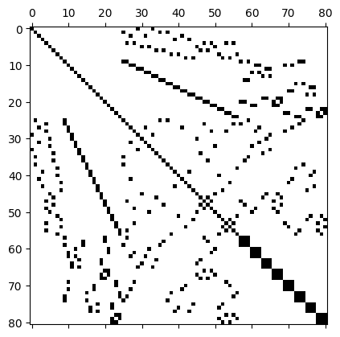

# Sparse matrix representations
The stiffness matrices we obtain from out finite element discretisation contain a lot of zero entries. Consider, for example, the $81\times 81$ matrix that is obtained for a piecewise linear discretisation on a $8\times 8$ grid:

Of the $81\times 81 = 6561$ entries of this matrix, only $n_{\text{nz}}=497$ or $7.6\%$ are nonzero, which corresponds to an average number of around $\overline{n}_{\text{nz}} = 6.14$ nonzeros per row. For large $n$, the number of non-zeros per row will remain roughly the same, leading to an even poorer fill-ratio.

Clearly, it is very inefficient to store all these zero entries if only $\mathcal{O}(n)$ entries are in fact required to encode the data stored in the matrix.

## Compressed Sparse Row storage
A matrix $A$ with $n_{\text{nz}}\ll n$ nonzero entries is often called *sparse*. To store sparse matrices, we can proceed as follows:

1. Store all non-zero entries in a long array $V$ of length $n_{\text{nz}}$, going throw the matrix row by row
2. For each non-zero entry also store the column index in an array $J$ of the same length
 
We could now also store the corresponding row-indices in an array $I$ of the same length. With this, it would then be possible to reconstruct all non-zero entries of $A$:

#### Algorithm: Reconstruction of matrix 
1. Set $A\gets 0$
2. for $\ell=0,1,2,\dots,n_{\text{nz}}$ **do**
3. $~~~~$ Set $A_{I_\ell,J_\ell} \gets V_{\ell}$
4. **end do**

However, there is a more efficient way of doing this: Since the arrays $V$ and $J$ are constructed by going through the matrix row by row, we only need to keep track of the positions where a new row starts. This can be encoded as follows:

3. Store an array $R$ of length $n+1$ such that $R_i$ describes the index in $V$, $J$ where a new row starts. For convenience, we also store $R_{n} = n_{\text{nz}}+1$.

The resulting storage format, consisting of the arrays $V$ (values), $J$ (column indices) and $R$ (row pointers) is known as Compressed Sparse Row storage (CSR)

#### Algorithm: Reconstruction of matrix in CSR
1. Set $A\gets 0$
2. Set $\ell\gets 0$
3. for $i=0,1,2,\dots,n-1$ **do**
4. $~~~~$ for $j=R_i,R_i+1,\dots,R_{i+1}-1$ **do**
5. $~~~~~~~~$ Set $A_{i,J_\ell} \gets V_{\ell}$
6. $~~~~~~~~$ Increment $\ell\gets \ell+1$
7. $~~~~$ **end do**
8. **end do**

#### Example
Consider the following $5\times 5$ matrix with $n_{\text{nz}}=9$ non-zero entries:

$$
\begin{pmatrix}
1 & 2 & 0 & 3 & 0 \\
4 & 0 & 0 & 0 & 3 \\
0 & 0 & 2 & 0 & 0 \\
0 & 0 & 0 & 0 & 0 \\
9 & 0 & 3 & 4 & 7
\end{pmatrix}
$$

We have the following arrays:

1. Values: $V=[1,2,3,4,3,2,9,3,7]$
2. Column indices: $J=[0,1,3,0,4,2,0,2,3,4]$
3. Row pointers: $R=[0,3,5,6,6,10]$

Note that one of the rows contains only zero entries.

### Matrix-vector multiplication

#### Algorithm: Matrix-vector multiplication $y = y + Ax$ in CSR storage
1. Set $\ell\gets 0$
2. for $i=0,1,2,\dots,n-1$ **do**
3. $~~~~$ for $j=R_i,R_i+1,\dots,R_{i+1}-1$ **do**
4. $~~~~~~~~$ Set $y_i \gets y_i + V_{\ell} x_{J_{\ell}}$
5. $~~~~~~~~$ Increment $\ell\gets \ell+1$
6. $~~~~$ **end do**
7. **end do**

## PETSc implementation

### Creating sparsity structure
### Inserting matrix entries
### Matrix-vector multiplication