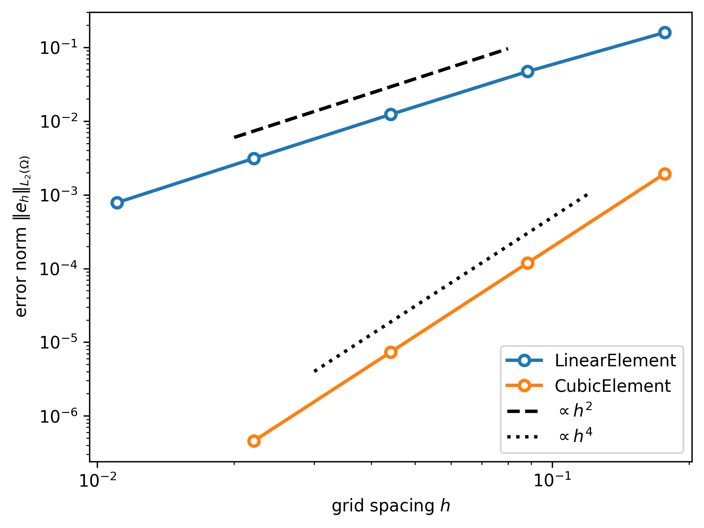

----

*&#169; Eike Mueller, University of Bath 2025. These notes are copyright of Eike Mueller, University of Bath. They are provided exclusively for educational purposes at the University and are to be downloaded or copied for your private study only. Further distribution, e.g. by upload to external repositories, is prohibited. html generated with [pandoc](https://pandoc.org/) using [easy-pandoc-templates](https://github.com/ryangrose/easy-pandoc-templates) under the [GPL-3.0.1 license](https://github.com/ryangrose/easy-pandoc-templates?tab=GPL-3.0-1-ov-file#readme)*

----

## Implementation
The complete code for computing the global $L_2$ error can be found in [algorithms.py](algorithms.py). The main program has been implemented in [driver.py](driver.py). Obviously, there is an outer loop over all cells $K$ of the mesh. In each cell we perform the following operations:

#### Extract coordinate dof-vector
Let $\nu^{\times}$ be the number of local basis functions of the finite element used for discretising the coordinate field. To extract the cell-local dof-vector $\overline{\boldsymbol{X}}\in \mathbb{R}^{\nu^{\times}}$ from the global coordinate dof-vector $\boldsymbol{X}$ in the cell with index $\alpha$, we first need to work out the $\nu^{\times}$ indices $\ell^\times_\text{global}(\alpha,0),\ell^\times_\text{global}(\alpha,1),\dots,\ell^\times_\text{global}(\alpha,\nu^\times-1)$. This is done by using the `local2global()` method of the coordinate function space `fs_coord` in the current cell. If we pass the list $[0,1,2,\dots,\nu^{\times}-1]$ to this method it will return the list of global indices $\boldsymbol{\ell}^\times_\text{global}$ which is stored in `ell_g_coord`. Since the global coordinate dof-vector $\boldsymbol{X}$ is stored in the function `mesh.coordinates`, we can obtain $\overline{\boldsymbol{X}}$ by indexing the `data` attribute of `mesh.coordinates` with `ell_g_coord`, i.e. $\boldsymbol{\ell}^\times_\text{global}$:

```Python
ell_coord = range(element_coord.ndof)
ell_g_coord = fs_coord.local2global(alpha, ell_coord)
x_dof_vector = mesh.coordinates.data[ell_g_coord]
```

#### Extract solution dof-vector
The same approach can be used to extract the cell-local dof-vector $\overline{\boldsymbol{u}}\in\mathbb{R}^{\nu}$ from the global dof-vector `u_numerical.data`. Here we use the `local2global` map of the function space `fs` of the numerical solution $u_{h}$:

```Python
ell = range(element.ndof)
ell_g = fs.local2global(alpha, ell)
u_numerical_K = u_numerical.data[ell_g]
```

#### Evaluate exact solution
Next, we compute the $n_q\times 2$ tensor $x_K$ which contains the global points that correspond to the $n_q$ quadrature points in the reference cell. For this, we contract the vector $\overline{\boldsymbol{X}}$ with the tabulated basis functions $T^\times$ of the coordinate space:

$$
(x_K^{(q)})_a = \sum_{\ell^\times=0}^{\nu^{\times}-1} T^\times_{q\ell^\times a} \overline{X}_{\ell^\times} \qquad\text{for $a\in\{0,1\}$ and $q\in\{0,1,2,\dots,n_q-1\}$.}
$$
For this, we first use the `tabulate()` method of the coordinate element and then use `np.einsum()` to carry out the contraction.

```Python
zeta = np.asarray(quad.nodes)
w_q = quad.weights
T_coord = element_coord.tabulate(zeta)
x_global = np.einsum("qla,l->qa", T_coord, x_dof_vector)
```

We can now evaluate the function $u_{\text{exact}}$ at the $n_q$ positions $x_K^{(q)}$ by passing the tensor `x_global` to the function $u_{\text{exact}}$. Since `u_exact` accepts two-dimensional vectors or rank 2 tensors of shape $(2,n)$, we need to transpose `x_global` first:

```Python
u_exact_K = u_exact(x_global.T)
```

The result is a vector $\boldsymbol{u}^{\text{(exact)}}\in \mathbb{R}^{n_q}$.

#### Compute error at quadrature points
We extract the $n_q\times \nu$ matrix $T$ which contains the values of the $\nu$ basis functions at the quadrature points by calling the `tabulate()` method of the finite element. With this we compute the vector

$$
\boldsymbol{e} = \boldsymbol{u}^{\text{(exact)}} - T \overline{\boldsymbol{u}}\in\mathbb{R}^{N_q},
$$

such that the entry $e_q$ is the error at quadrature point $q$.

```Python
T = element.tabulate(zeta)
error_K = u_exact_K - T @ u_numerical_K
```
#### Jacobian
The Jacobian as the quadrature points is represented as a $n_q\times 2\times 2$ tensor $J$ with

$$
J_{ab}(\xi^{(q)}) = \sum_{\ell^\times} \overline{X}_{\ell^\times} T^{\times\partial}_{q\ell^\times ab}
$$

After extracting the tabulation tensor $T^{\times\partial}$ with `tabulate_gradient()`, the required contraction is implemented with `np.einsum()` as

```Python
T_coord_partial = element_coord.tabulate_gradient(zeta)
jac = np.einsum("l,qlab->qab", x_dof_vector, T_coord_partial)
```
We can also compute the determinant $\boldsymbol{D}\in \mathbb{R}^{n_q}$ (=`det_jac`) at the quadrature points with $D_q = \text{det}(J(\xi^{(q)}))$ by applying the [`np.linalg.det()` method](https://numpy.org/doc/2.2/reference/generated/numpy.linalg.det.html), which automatically vectorises over all but the last two dimensions.

```Python
det_jac = np.abs(np.linalg.det(J))
```

#### Final result
Finally, we combine the vectors $\boldsymbol{w}$ (quadrature weights), $\boldsymbol{e}$ (error at quadrature points) and $\boldsymbol{D}$ (determinant of Jacobian at quadrature points) and increment the squared $L_2$ error as

$$
S\gets S + \sum_q w_q e_q^2 D_q
$$

While this could be done with `np.einsum()` as well, multiplying the vectors component-wise and then adding everything up with `np.sum()` makes the code somewhat easier to read:

```Python
error_nrm_2 += np.sum(w_q * error_K**2 * det_jac)
```

## Numerical experiments

### Runtime
The following table shows the time spent in different parts of the code for increasing problem size (all times are given in seconds):

| $n_{\text{ref}}$ | number of unknowns $n_{\text{dof}}$ | assemble $\boldsymbol{b}^{(h)}$ | assemble $A^{(h)}$  | Linear solve |
| --- | :---: | :---: | :---: | :----: |
| 3 | 81 | $3.59\cdot 10^{-3}$ | $4.90\cdot 10^{-3}$ | $7.07\cdot 10^{-5}$ |
| 4 | 289 | $1.34\cdot 10^{-2}$ | $1.97\cdot 10^{-2}$ | $4.65\cdot 10^{-4}$ |
| 5 | 1089 | $5.21\cdot 10^{-2}$ | $7.84\cdot 10^{-2}$ | $9.48\cdot 10^{-3}$ |
| 6 | 4225 | $2.06\cdot 10^{-1}$ | $3.24\cdot 10^{-1}$ | $5.95\cdot 10^{-1}$ |
| 7 | 16641 | $8.57\cdot 10^{-1}$ | $1.45$ | $43.0$ |

The time spent in the assembly of the stiffness matrix $A^{(h)}$ and the right-hand side vector $\boldsymbol{b}^{(h)}$ increases in proportion to the number of unknowns: incrementing $n_{\text{ref}}$ by one results is an increase of the problem size by a factor of approximately 4 and the time grows by roughly the same factor for the larger problem sizes.

The growth in the time spent in the linear solve is much more rapid: changing $n_{\text{dof}} = 1089 \rightarrow 4225$ results in a $62$-fold increase in runtime while increasing the problem size further to $n_{\text{dof}}=16641$ results in a growth in the runtime by another factor of $72$. Since $62$ and $72$ are close to $64=4^3$, it is reasonable to conjecture that the time spent in the linear solve grows in proportion to the third power of the problem size:
$t_{\text{solve}}\propto n_{\text{dof}}^3$. As we will see, this is consistent with a theoretical complexity analysis.

### Convergence
The following figure shows the $L_2$ error $\|e_h\|_{L_2(\Omega)}$ as a function of the grid spacing $h$ for both the `LinearElement` and `CubicElement`.



Assuming

$$
\|e_h\|_{L_2(\Omega)} \approx C h^\alpha
$$

with the constant $C$ independent of $h$, we see from the plot that the empirical order of convergence is $\alpha=2$ for linear elements and $\alpha=4$ for cubic elements.