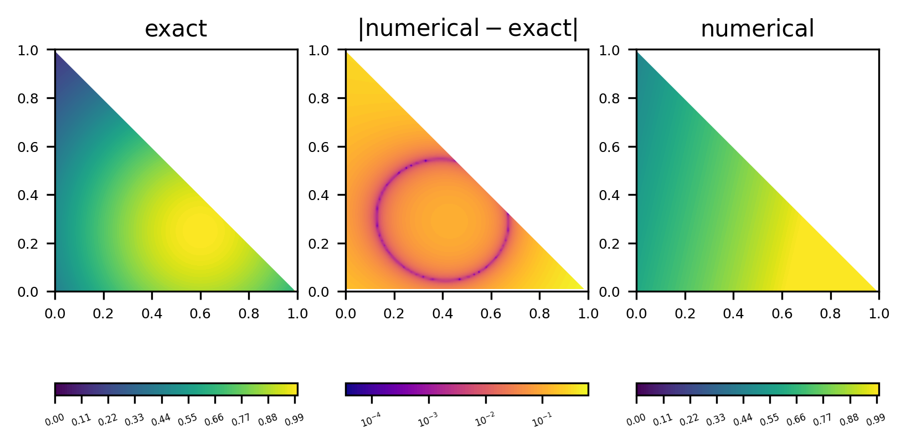
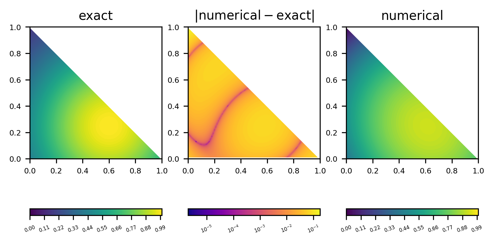
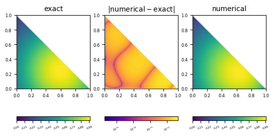

----

*&#169; Eike Mueller, University of Bath 2025. These notes are copyright of Eike Mueller, University of Bath. They are provided exclusively for educational purposes at the University and are to be downloaded or copied for your private study only. Further distribution, e.g. by upload to external repositories, is prohibited. html generated with [pandoc](https://pandoc.org/) using [easy-pandoc-templates](https://github.com/ryangrose/easy-pandoc-templates) under the [GPL-3.0.1 license](https://github.com/ryangrose/easy-pandoc-templates?tab=GPL-3.0-1-ov-file#readme)*

----
## Implementation
The complete code for assembling the stiffness matrix and right hand side vector can be found in [assembly.py](assembly.py) and the code for computing the $L_2$ error can be found in [error.py](error.py) in the directory `ma32070/exercise3`. The main program has been implemented in [driver.py](driver.py).

As the following discussion shows, the implementation can be made very compact by implementing tensor contractions with the [`np.einsum()` method](https://numpy.org/doc/stable/reference/generated/numpy.einsum.html).

### Stiffness matrix
First consider the assembly of the stiffness matrix $A^{(h)}_{\ell k}$ in `assemble_lhs()`. From the lectures we know that

$$
\begin{aligned}
A^{(h)}_{\ell k} &=  \kappa \sum_{q=0}^{N_q-1}\sum_{a=0}^{d-1} w_q  T^\partial_{qk a} T^\partial_{q\ell a} 
+\omega \sum_{q=0}^{N_q-1} w_qT_{qk} T_{q\ell}\qquad\text{where $d=2$}
\end{aligned}
$$

with the quadrature weights $w_q$ and the tensors $T$, $T^\partial$ of shapes $(N_q,\nu)$, $(N_q,\nu,2)$ respectively. More explicitly, the tensor components are $T_{q\ell} = \phi_\ell(\zeta^{(q)})$ and $T_{q\ell a}^{\partial} = \frac{\partial\phi_\ell}{\partial x_a}(\zeta^{(q)})$ where $\{\zeta^{(q)}\}_{q=0}^{N_q-1}$ are the quadrature points.

In the code, we start by constructing a quadrature rule and extract the vector $\boldsymbol{w}\in\mathbb{R}^{N_q}$ which holds the weights $w_q$:
```Python
quad = GaussLegendreQuadratureReferenceTriangle(n_q)
w_q = quad.weights
```
The quadrature points are stored in an array `zeta_q` of shape $(N_q,2)$, which can be passed to the `tabulate()` and `tabulate_gradient()` methods of the finite element:

```Python
zeta_q = np.asarray(quad.nodes)
phi = element.tabulate(zeta_q)
grad_phi = element.tabulate_gradient(zeta_q)
```

As a result, we obtain an array `phi` of shape $(N_q,\nu)$ which stores the rank-2 tensor $T$ and an array `grad_phi` of shape $(N_q,\nu,2)$ which stores the rank-3 tensor $T^\partial$. The stiffness matrix $A^{(h)}_{\ell k}$ is then constructed with two suitable tensor contractions involving `phi`, `grad_phi` and `w_q` and using [`np.einsum()`](https://numpy.org/doc/stable/reference/generated/numpy.einsum.html):

```Python
stiffness_matrix = kappa * np.einsum("q,qik,qjk->ij", w_q, grad_phi, grad_phi) 
                 + omega * np.einsum("q,qi,qj->ij", w_q, phi, phi)
```

### Right hand side vector
To construct the right hand side vector $\boldsymbol{b}^{(h)}$ given by

$$
\begin{aligned}
b^{(h)}_\ell &= \sum_{q=0}^{N_q-1} w_q f_q(\boldsymbol{\zeta}) T_{q\ell}(\boldsymbol{\zeta}) + \sum_{\text{facets}\;F_\rho} \sum_{q=0}^{n_q-1 }w_{F_\rho,q} g_{q}(\boldsymbol{\zeta}_{F_\rho})T_{q\ell}(\boldsymbol{\zeta}_{F_\rho})
\end{aligned}
$$


we again extract the quadrature points `zeta_q` and weights `w_q` from the quadrature rule. 
```Python
quad = GaussLegendreQuadratureReferenceTriangle(n_q)
zeta_q = np.asarray(quad.nodes)
w_q = quad.weights
```
We also construct a vector $\boldsymbol{f}\in\mathbb{R}^{N_q}$ whose components are given by evaluating the function $f$ at the quadrature points:
```Python
f_q = f(zeta_q.T)
```
Note that the function $f$ will work both for a single point $\boldsymbol{x}\in \mathbb{R}^2$ and for a collection of $n$ points, i.e. a rank 2 tensor $X$ of shape $(2,n)$. In the latter case, the code will evaluate the function at each point and return a vector with these point evaluations. We need to be careful, however, to transpose the argument that is passed to $f$ first since the quadrature points `zeta_q` are stored in an array of shape $(n,2)$. Consider in particular this line:

```Python
x_sq = (x[0] - x0[0]) ** 2 + (x[1] - x0[1]) ** 2
```
which is equivalent to 
```Python
x_sq = (x[0,...] - x0[0]) ** 2 + (x[1,...] - x0[1]) ** 2
```
If `x` represents a tensor $X$ of shape $(2,n)$, `x[0]` or `x[0,...]` will return the vector $\widetilde{\boldsymbol{X}}\in\mathbb{R}^n$ with $\widetilde{X}_j = X_{0,j}$. Hence, depending on whether `x` has shape $(2,)$ or $(2,n)$, the result `x_sq` will either be a scalar $S = \sqrt{(x_0-x^{(0)}_0)^2+(x_1-x^{(0)}_1)^2}$ or a vector $\boldsymbol{S}\in\mathbb{R}^n$ with $S_j=\sqrt{(X_{0,j}-x^{(0)}_0)^2+(X_{1,j}-x^{(0)}_1)^2}$.

After tabulating the basis functions and storing the matrix $T$ as `phi`, we can compute the contribution $\sum_{q=0}^{N_q-1} w_q f_q(\boldsymbol{\zeta}) T_{q\ell}(\boldsymbol{\zeta})$ to $b^{(h)}_\ell$ as
```Python
phi = element.tabulate(zeta_q)
r = np.einsum("q,q,qi->i", w_q, f_q, phi)
```
and store the result in the variable `r`.

The other term in the expression for $b^{(h)}_\ell$ has contributions from the three facets of $\widehat{K}$. Each facet $F_\rho$ is defined by a line segment $\overline{v_a,v_b}$ where the points $v_a,v_b\in\mathbb{R}^{2}$ are $v_a=\begin{pmatrix}1\\0\end{pmatrix},v_b=\begin{pmatrix}0\\1\end{pmatrix}$ for facet $F_0$, $v_a=\begin{pmatrix}0\\1\end{pmatrix},v_b=\begin{pmatrix}0\\0\end{pmatrix}$ for facet $F_1$ and $v_a=\begin{pmatrix}0\\0\end{pmatrix},v_b=\begin{pmatrix}1\\0\end{pmatrix}$ for facet $F_2$. We thus loop over the three possible tuples $(v_a,v_b)$ and construct a quadrature rule `quad_facet` of type `GaussLegendreQuadratureLineSegment` for each of them.
```Python
for v_a, v_b in [[(1, 0), (0, 1)], [(0, 1), (0, 0)], [(0, 0), (1, 0)]]:
    quad_facet = GaussLegendreQuadratureLineSegment(v_a, v_b, n_q)
```
For each facet $F_\rho$ we then compute $\sum_{q=0}^{n_q-1 }w_{F_\rho,q} g_{q}(\boldsymbol{\zeta}_{F_\rho})T_{q\ell}(\boldsymbol{\zeta}_{F_\rho})$ with [`np.einsum()`](https://numpy.org/doc/stable/reference/generated/numpy.einsum.html). The code for this has the same structure as the above code for computing $\sum_{q=0}^{N_q-1} w_q f_q(\boldsymbol{\zeta}) T_{q\ell}(\boldsymbol{\zeta})$ in the interior of the cell but with $\boldsymbol{w}\mapsto \boldsymbol{w}_{F_{\rho}}$ (=`w_facet_q`), $\boldsymbol{\zeta} \mapsto \boldsymbol{\zeta}_{F_{\rho}}$ (=`zeta_facet_q`), $\boldsymbol{f}\mapsto \boldsymbol{g}$ (=`g_q`) with components $g_q=q(\zeta_{F_\rho}^{(q)})$. We also tabulate the basis functions at the quadrature points $\boldsymbol{w}_{F_\rho}$ to obtain $T(\boldsymbol{\zeta}_{F_{\rho}})$ (=`phi_facet`).
```Pythom
    w_facet_q = quad_facet.weights
    zeta_facet_q = np.asarray(quad_facet.nodes)
    g_q = g(zeta_facet_q.T)
    phi_facet = element.tabulate(zeta_facet_q)
    r += np.einsum("q,q,qi->i", w_facet_q, g_q, phi_facet)
```
Again, the function $g$ has been implemented to accept both a single two-dimensional vector or a rank 2 tensor of shape $(n,2)$.
### $\boldsymbol{L_2}$-error
The computation of the $L_2$ error according to

$$
\begin{aligned}
\|e_h\|_{L_2(\widehat{K})}^2 &=  \sum_{q=0} ^{N_q-1} w_q e_q^2\quad\text{with}\;\; e_q := u^{(\text{exact})}_q - \sum_{\ell=0}^{\nu-1} u^{(h)}_\ell T_{q\ell},\;u^{(\text{exact})}_q := u_{\text{exact}}(\zeta^{(q)}).
\end{aligned}
$$

is straightforward. Again, we start by constructing quadrature points `zeta_q` and weights `w_q` and tabulate the basis functions at the quadrature points in `phi`:

```Python
quad = GaussLegendreQuadratureReferenceTriangle(n_q)
zeta_q = np.asarray(quad.nodes)
w_q = quad.weights
phi = element.tabulate(zeta_q)
```

We also construct the vector $\boldsymbol{u}^{(\text{exact})}$ (=`u_q`) by evaluating the function $u_{\text{exact}}$ at the quadrature points

```Python
u_q = u_exact(zeta_q.T)
```
The vector $\boldsymbol{e}$ (=`e_q`) is then given by $\boldsymbol{e}=\boldsymbol{u}^{(\text{exact})}-T \boldsymbol{u}^{(h)}$:
```Python
e_q = u_q - phi @ u_numerical
```
To compute the $L_2$ error, we need to square the components of this vector, multiply elementwise with $\boldsymbol{w}$ and sum over the resulting vector before taking the square root:
```Python
nrm = np.sqrt(np.sum(w_q * e_q**2))
```

## Numerical experiments

### Error norm
The following table shows the $L_2$ norm of the error for polynomial degrees $p=1,2,3,4$:

| degree $p$ | error norm $\|\|e_h\|\|_{L_2(\widehat{K})}$ |
| ---------- | ---------------------------- |
|         1  |          $9.06\cdot 10^{-2}$ |
|         2  |          $2.75\cdot 10^{-2}$ |
|         3  |          $8.38\cdot 10^{-3}$ |
|         4  |          $2.82\cdot 10^{-3}$ |

Using cubic instead of linear finite elements reduces the error by approximately one order of magnitude.

### Plot of solution and error
The following plots visualise the solution and error for polynomial degrees $p=1,2,3,4$. Again, they demonstrate that the error is substantially smaller for finite elements with higher polynomial degrees.

#### Solution and error for $p=1$


#### Solution and error for $p=2$


#### Solution and error for $p=3$


#### Solution and error for $p=4$
