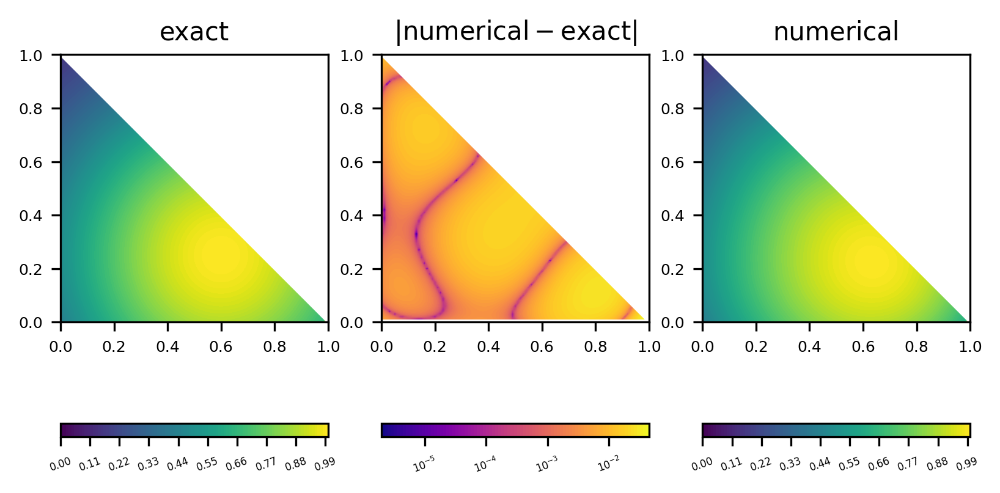

  
MA32070 Exercise 2: Model solution

----

*&#169; Eike Mueller, University of Bath 2025. These notes are copyright of Eike Mueller, University of Bath. They are provided exclusively for educational purposes at the University and are to be downloaded or copied for your private study only. Further distribution, e.g. by upload to external repositories, is prohibited. html generated with [pandoc](https://pandoc.org/) using [easy-pandoc-templates](https://github.com/ryangrose/easy-pandoc-templates) under the [GPL-3.0.1 license](https://github.com/ryangrose/easy-pandoc-templates?tab=GPL-3.0-1-ov-file#readme)*

----

## Error norm
The following table shows the $L_2$ norm of the error for polynomial degrees $p=1,2,3,4$

| degree $p$ | error norm $\|e_h\|_{L_2(\widehat{K})}$ |
| ---------- | ---------------------------- |
|         1  |          $9.06\cdot 10^{-2}$ |
|         2  |          $2.75\cdot 10^{-2}$ |
|         3  |          $8.38\cdot 10^{-3}$ |
|         4  |          $2.82\cdot 10^{-3}$ |

## Plot of solution and error
The following plots visualise the solution and error for polynomial degrees $p=1,2,3,4$

#### Solution and error for $p=1$

#### Solution and error for $p=2$

#### Solution and error for $p=3$

#### Solution and error for $p=4$
