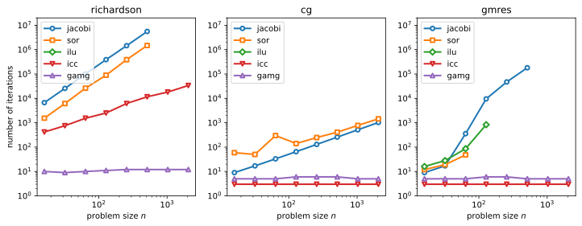
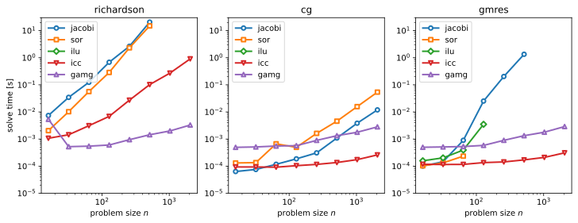
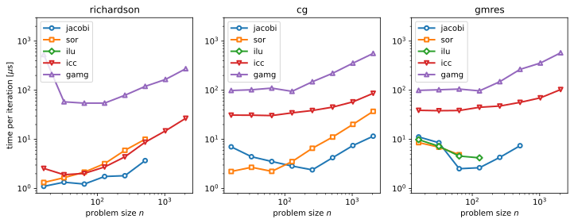

----

*&#169; Eike Mueller, University of Bath 2025. These notes are copyright of Eike Mueller, University of Bath. They are provided exclusively for educational purposes at the University and are to be downloaded or copied for your private study only. Further distribution, e.g. by upload to external repositories, is prohibited. html generated with [pandoc](https://pandoc.org/) using [easy-pandoc-templates](https://github.com/ryangrose/easy-pandoc-templates) under the [GPL-3.0.1 license](https://github.com/ryangrose/easy-pandoc-templates?tab=GPL-3.0-1-ov-file#readme)*

----

# PETSc solver options

## Implementation
The full source code is available in [linear_solve.py](linear_solve.py).

The matrix $A$ is constructed by using the [`createAIJWithArrays()` function](https://petsc.org/release/petsc4py/reference/petsc4py.PETSc.Mat.html#petsc4py.PETSc.Mat.createAIJWithArrays):

```Python
A = PETSc.Mat().createAIJWithArrays(size=(n, n), csr=(row_start, col_indices, values))
```

Next, we set up the KSP object, set its operator and call `setFromOptions()` to parse the command line options
```Python
ksp = PETSc.KSP().create()
ksp.setOperators(A)
ksp.setFromOptions()
```
For this to work, it is important that

```Python
import sys
import petsc4py
petsc4py.init(sys.argv)
```
has been called at the beginning of the script.

The vectors $\boldsymbol{b}, \boldsymbol{u}\in\mathbb{R}^n$ are created with

```Python
rng = np.random.default_rng(seed=1241773)
b = PETSc.Vec().createWithArray(rng.normal(size=n))
u = PETSc.Vec().createWithArray(np.zeros(n))
```
Finally, we solve the linear system by calling
```Python
with measure_time("solve"):
    ksp.solve(b, u)
```

## Numerical experiments

### Gauss Seidel iteration
The problem $(D+L)\boldsymbol{z} = \boldsymbol{r}$ can be written in matrix form as

$$
\begin{pmatrix}
A_{00} & 0 & 0 & 0 &\dots & 0 \\
A_{10} & A_{11} & 0 &0 & & 0 \\
A_{20} & A_{21} & A_{22} &0 & & 0 \\
\vdots & & & & \ddots & \vdots\\ 
A_{n-1,0} & A_{n-1,1} & A_{n-1,2} & A_{n-1,3} & \dots & A_{n-1,n-1}
\end{pmatrix}
\begin{pmatrix}
z_0 \\ z_1 \\ z_2 \\\vdots \\ z_{n-1}
\end{pmatrix}
=
\begin{pmatrix}
r_0 \\ r_1 \\ r_2 \\\vdots \\ r_{n-1}
\end{pmatrix}
$$

The $i$-th equation is given by:

$$
\sum_{j=0}^{i-1} A_{ij}z_j + A_{ii} z_i = r_i
$$

Hence, if we know $z_0,z_1,\dots,z_{i-1}$ we can compute $z_i$ as

$$
z_i = \frac{1}{A_{ii}}\left(r_i-\sum_{j=0}^{i-1} A_{ij}z_j\right).
$$

Starting with $z_0 = r_0/A_{00}$, this can be used to compute $z_1,z_2,\dots,z_{n-1}$ recursively.

## Number of solver iterations for Jacobi and SOR
The following table shows the number of iterations required to solve the linear problem $A\boldsymbol{u}=\boldsymbol{b}$ to a tolerance of $10^{-6}$ for the Richardson iteration, preconditioned with Jacobi and SOR.

| problem size $n$ | number of iterations (Jacobi) | number of iterations (SOR) |
| ---:             | ---:                          | ---:                       |
| 16               |                         6 686 |                      1 538 |
| 32               |                        25 712 |                      6 147 |
| 64               |                      100 763  |                    26 117  |
| 128              |                       387 726 |                     89 239 |
| 256              |                     1 450 776 |                    387 421 |
| 512              |                     5 568 289 |                  1 478 886 |

For both preconditioners the number of iterations increases by a factor of approximately $4\times$ when the problem size is doubled. The absolute number of iterations is smaller for SOR than for Jacobi. However, as we will see below, a single application of the SOR preconditioner is significantly more expensive than applying the Jacobi method.

#### Number of solver iterations

For the Richardson iteration, the number of solver iterations increases in proportion the the square of the problem size unless the GAMG preconditioner is used. As already observed above, the Jacobi preconditioner requires more iterations than SOR. For the ICC method the number of iterations also increases with problem size but not quite as strongly as for Jacobi and SOR. The ILU preconditioner does not work in this setup.

The CG solver reduces the number of iterations dramatically, but it still grows for Jacobi and SOR. For ICC and GAMG the number of iterations is independent of the problem size. Again ILU does not work as a preconditioner and this is not very surprising since CG requires a symmetric preconditioner, which ILU is not.

ICC and GAMG perform very similarly when used with GMRES instead of CG. For this solver, SOR and ILU can be used, but only for smaller problem sizes. In both cases, the number of iterations increases with problem size. Using the Jacobi method results in a rapid increase in the number of iterations.

As far as the number of iterations in concerned, the best setup appears to be a combination of CG or GMRES with either ICC or GAMG.
#### Total solution time

in all cases the total solution time increases with problem size, and this can be attributed to a combination of the increase in number of iterations (previous section) and the growing cost per iteration (next section). The use of CG or GMRES dramatically improves overall performance, in particular when combined with the ICC preconditioner. Although both ICC and GMRES require comparable numbers of iterations, ICC is faster overall since an application of a single GAMG solve is relatively expensive. Observe also that when used with the CG solver, the Jacobi iteration can be competitive, in particular for smaller problems size. The reason for this is that the Jacobi preconditioner only requires division by the diagonal of $A$, which is a very cheap operation.

#### Time per solver iteration

For sufficiently large $n$, the cost per iteration grows in direct proportion to the problem size. While for a given preconditioner the time per iteration depends on the iterative solver, this dependence is relatively weak. This implies that the majority of time is spent in the preconditioner application. As expected, a single application of simple preconditioners such as Jacobi and SOR is relatively cheap, but this is counteracted by the large number of iterations required to achieve convergence. The more powerful preconditioners (GAMG and ICC) are significantly more expensive but result in the smallest overall solution time since they require only a small number of iterations to converge.